# 机器学习

[TOC]

## 3  支持向量机SVM

关于 SVM 的介绍，其中前1,2 两节为约束优化的基础，3,4,5 三节主要是 SVM 的建模与求解，第 6 节是从经验风险最小化的方式去考虑 SVM。

### 3.1 约束优化方法之拉格朗日乘子法与KKT条件

#### 3.1.1 引言

在求解最优化问题中，**拉格朗日乘子法**（`Lagrange Multiplier`）和**KKT**（`Karush Kuhn Tucker`）**条件**是两种最常用的方法。在有等式约束时使用拉格朗日乘子法，在有不等约束时使用KKT条件。这里提到的最优化问题通常是指对于给定的某一函数，**求其在指定作用域上的全局最小值(因为最小值与最大值可以很容易转化，即最大值问题可以转化成最小值问题)**。提到KKT条件一般会附带的提一下拉格朗日乘子。二者均是求解最优化问题的方法，不同之处在于应用的情形不同。

本节将详解带有约束条件的最优化问题，约束条件分为等式约束与不等式约束，对于等式约束的优化问题，可以直接应用拉格朗日乘子法去求取最优值；对于含有不等式约束的优化问题，可以转化为在满足 KKT 约束条件下应用拉格朗日乘子法求解。拉格朗日求得的并不一定是最优解，只有在凸优化的情况下，才能保证得到的是**最优解**，所以本节称拉格朗日乘子法得到的为**可行解**，其实就是局部极小值。

#### 3.1.2 无约束优化

考虑不带任何约束的优化问题：
$$
\tag{3.1-1}
\text{for x }\in \mathbb{R}^N,\  f(x),
\text{ Find the value: }\\
\min_x{f(x)}
$$
根据`Fermat`定理，找到是目标函数导数为0的点，验证这些点为极大或极小既可。可表示为：
$$
\tag{3.1-2}
\frac{\mathrm{d}f(x)}{\mathrm{d}x} = 0\ \\\ or \ \ \frac{\partial f}{\partial x}\ =\ 0\ \\\ or \ \ \triangledown_xf(x)\ =\ 0
$$
如果没有解析解的话，可使用梯度下降或牛顿等方法迭代使`x`沿负梯度方向逐步逼近极小值点。

#### 3.1.3 等式约束优化

当目标函数加上约束条件之后，问题变为如下形式：
$$
\min_x f(x)\\ \tag{3.1-3}
s.t.\ \ \ h_i(x)=0,\ \ i\ =\ 1,2,\cdots,m
$$
约束条件会将解限制在一个可行域内，此时不一定能找到使`f'`为零的点。我们的目的变为了在可行域中找到`f`最小的值既可。常用的方法为拉格朗日乘子法或者消元法。消元法比较简单不在赘述。拉格朗日乘子法法首先引入了`Lagrange Multiplier`，后面提到的KKT条件是对拉格朗日乘子法的一种泛化。：
$$
\alpha \in \mathbb{R}^m \tag{3.1-4}
$$
构建`Lagrangian`如下：
$$
L(x,\alpha)\ =\ f(x)+\sum_{i=0}^{m}{\alpha_i h_i(x)} \tag{3.1-5}
$$
求解方法如下： 

* 对`Lagrangian`关于`alpha`和`x`求：

  $$
  \triangledown_x L(x,\alpha)\ =\ 0 \\ \tag{3.1-6}
  \triangledown_{\alpha} L(x,\alpha)\ =\ 0
  $$
  
* 求解出`alpha`和`x`的值后，将`x`带入`f(x)`即为约束条件下`h_i(x)`的可行解。

如果有m个约束条件，就有m+1个方程，求解后将结果带回原方程验证就可以得到解。这样做的意义是什么呢？

接下来看一个直观的示例，对于二维情况下的目标函数是 `f(x,y)`，在平面中画出 `f(x,y) `的等高线。如下图的虚线所示， 并只给出一个约束等式 `h(x,y)=0` ，如下图的绿线所示。目标函数` f(x,y)`与约束 `h(x,y)` 只有三种情况，相交、相切或者没有交集。没交集肯定不是解,只有相交或者相切可能是解，但相交得到的一定不是最优值。因为相交意味着肯定还存在其它的等高线在该条等高线的内部或者外部，使得新的等高线与目标函数的交点的值更大或者更小，这就意味着只有等高线与目标函数的曲线相切的时候，才可能得到可行解。

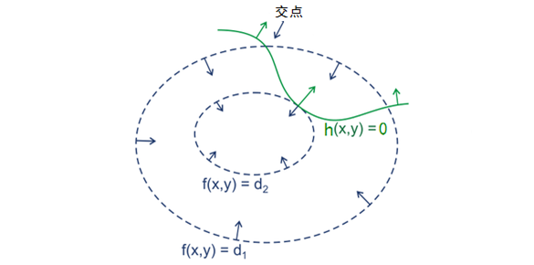

图3.1-1 函数等高线

因此给出结论：拉格朗日乘子法取得极值的必要条件是目标函数与约束函数相切，这时两者的法向量是平行的，即:
$$
\triangledown_x f(x) -\alpha\triangledown_xh(x)\ =\ 0 \tag{3.1-7}
$$
所以只要满足上述等式，且满足之前的约束 :

$$
\tag{3.1-8}
h_i(x)=0,\ \ \ i=1,2,…,m
$$

即可得到解，联立起来，正好得到就是拉格朗日乘子法。简单的说，在`L(x,λ)`取得最优化解的时候，即`L(x,λ)`取极值（导数为0，`▽[f(x,y)+a(h(x)−c)]=0`）的时候，`f(x)`与`h(x) `梯度共线，此时就是在条件约束`h(x)`下，`f(x)`的最优化解。这里只是直观展示了一下拉格朗日乘子法的几何推导 ，并没有给出详细的证明。

#### 3.1.4 不等式约束优化

当约束加上不等式之后，情况变得更加复杂，首先来看一个简单的情况，给定如下不等式约束问题：
$$
\tag{3.1-9}
\min_x f(x)\\s.t.\ \ \ h_j(x)= 0,\ \ j=1,2,\cdots,m   \\
\quad \quad \ \ g_k(x) \leq 0, \ \ k=1,2,\cdots,n
$$

  对应的`Lagrangian` 与图形分别如下所示：
$$
\tag{3.1-10}
L(x,\lambda,\mu)=f(x)+\lambda h(x)+\mu g(x)\\
= f(x) +\sum_{j=1}^{m}{\lambda_j h_j(x)}+\sum_{k=1}^{n}{\mu_k g_k(x)}
$$
其中`f(x)`是原目标函数，`h_j(x)`是第`j`个等式约束条件，`λ_j`是对应的约束系数，`g_k(x)`是不等式约束，`u_k`是对应的约束系数。

这里我们先不考虑等于0的这些约束条件。这时的可行解必须落在约束区域` g(x)`之内，下图给出了目标函数的等高线与约束：
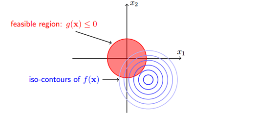

图3.1-2 不等约束下的函数等高线

由图可见可行解 `x` 只能在 `g(x)<0` 或者 `g(x)=0`  的区域里取得：

- 当可行解 `x` 落在 `g(x)<0` 的区域内，此时直接极小化 `f(x)` 即可；
- 当可行解 `x` 落在 `g(x)=0` 即边界上，此时等价于等式约束优化问题。

当约束区域包含目标函数原有的的可行解时，此时加上约束可行解扔落在约束区域内部，对应 `g(x)<0` 的情况，这时约束条件不起作用；当约束区域不包含目标函数原有的可行解时，此时加上约束后可行解落在边界 `g(x)=0` 上。下图分别描述了两种情况，右图表示加上约束可行解会落在约束区域的边界上。
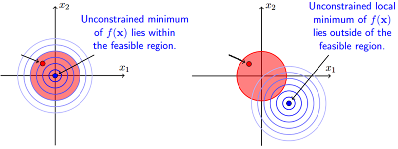

图3.1-3 解在约束区域和不在约束区域示意图

以上两种情况就是说，要么可行解落在约束边界上即得 `g(x)=0`，要么可行解落在约束区域内部，此时约束不起作用，另 `λ=0` 消去约束即可，所以无论哪种情况都会得到：
$$
\tag{3.1-11}
λg(x)=0
$$
还有一个问题是 `λ`的取值，在等式约束优化中，约束函数与目标函数的梯度只要满足平行即可，而在不等式约束中则不然，若 `λ≠0`，这便说明 可行解 `x` 是落在约束区域的边界上的，这时可行解应尽量靠近无约束时的解，所以在约束边界上，目标函数的负梯度方向应该远离约束区域朝向无约束时的解，此时正好可得约束函数的梯度方向与目标函数的负梯度方向应相同：
$$
\tag{3.1-12}
−∇xf(x)=λ∇xg(x)
$$
上式需要满足的要求是拉格朗日乘子 `λ>0` ，这个问题可以举一个形象的例子，假设你去爬山，目标是山顶，但有一个障碍挡住了通向山顶的路，所以只能沿着障碍爬到尽可能靠近山顶的位置，然后望着山顶叹叹气，这里山顶便是目标函数的可行解，障碍便是约束函数的边界，此时的梯度方向一定是指向山顶的，与障碍的梯度同向，下图描述了这种情况 :

图3.1-4 解在约束区域求解示意图

可见对于不等式约束，只要满足一定的条件，依然可以使用拉格朗日乘子法解决，这里的条件便是 KKT 条件。接下来给出形式化的 `KKT` 条件 首先给出形式化的不等式约束优化问题：
$$
\min_x f(x) \tag{3.1.13} \\ 
s.t. \quad   h_i(x)=0,\ \ \  i=1,2,\cdots,m \\
\quad \quad\ \ \ g_j(x)≤0,\ \ \ j=1,2,\cdots,n
$$
列出 `Lagrangian` 得到无约束优化问题：
$$
\tag{3.1-14}
L(x,α,β)=f(x)+\sum_{i=1}^m{α_ih_i(x)}+\sum_{j=1}^{n}{β_ig_i(x)}
$$
经过之前的分析，便得知加上不等式约束后可行解 `x` 需要满足的就是以下的 `KKT `条件：
$$
\ \ \ \ \ \\ \ \ \ ∇_xL(x,α,β) = 0 \\ \\ \tag{3.1.15}
 \quad \quad \quad β_jg_j(x)=0,\ \ \ j=1,2,...,n,  \\
\quad \quad \quad \ \ \  h_i(x)=0,\ \ \ i=1,2,...,m,  \\
\quad \quad \quad \ \ g_j(x)\leq0,\ \ \ j=1,2,...,n,  \\
\quad \quad \quad\quad \quad β_j\geq0,\ \ \  j=1,2,...,n\quad
$$

**满足 `KKT` 条件后极小化 `Lagrangian` 即可得到在不等式约束条件下的可行解。** `KKT` 条件看起来很多，其实很好理解:

(1) ：拉格朗日取得可行解的必要条件；

(2) ：这就是以上分析的一个比较有意思的约束，称作松弛互补条件；

(3) ∼ (4) ：初始的约束条件；

(5) ：不等式约束的 `Lagrange Multiplier` 需满足的条件。

主要的`KKT`条件便是 (3) 和 (5) ，只要满足这俩个条件便可直接用拉格朗日乘子法， `SVM` 中的支持向量便是来自于此，需要注意的是 `KKT` 条件与对偶问题也有很大的联系。

推导过程如下：

$$
\begin{equation}
\tag{3.1-16}
\text{let }\ L(x,\beta) = f(x)+\sum_{j=1}^{n}{\beta_j g_j(x)}
\\s.t.\ \  \beta_j\geq0, \ g_j(x)\leq 0 \\
\\ \ \\ 
\because \ \
\left\{
\begin{array}{ll}
\beta_j\ \ \ \  \geq0 \\
g_j(x)\leq 0
\end{array}
\right.
\ \  \Rightarrow \beta_j g_j(x)\leq 0 \\ \ \\ \ \\
\therefore\ \  \max_\beta{\ L(x,\beta) = f(x)}\quad \quad\quad\quad\quad\quad\quad   (1)\\ \  \\
\therefore\ \  \min_x{f(x)} = \min_x{\max_{\beta}{\ L(x,\beta)}}\quad  \ \  \quad\quad (2)\\ \ \\ \ \\
\min_x{f(x)} = \min_x{\max_{\beta}{L(x,\beta)}}=\max_\beta{\min_x{L(x,\beta)}}\\
=\max_\beta{[\min_x{f(x)}+\min_x{\beta g(x)}]}\\
=\max_\beta{\min_x{f(x)}} + \max_\beta{\min_x{\beta g(x)}} \\
=\min_x{f(x)}+\max_\beta{\min_x{\beta g(x)}} \\
\because \ \
\left .
\begin{array}{ll}
\beta_j\ \ \ \  \geq0 \\
g_j(x)\leq 0 
\end{array}
\right \}
\ \\  \Rightarrow\ \  \min_x{\beta g(x)}=
\left \{
\begin{array}{ll}
0 \ \ \ \ \ \ \ \ \ \ \ if\ \beta=0 \ or\ g(x)=0\ \\
-\infty\ \ \ \ \ \  if\ \beta > 0 \ and\ g(x)<0\ 
\end{array}
\right . \\
\therefore\ \ \max_\beta\min_x{\beta g(x) = 0} \\
\text{s.t.}\ \ \beta = 0 \ \ or \ \ g(x) =0 \\ \ \\
\therefore\ \ \max_{\beta}\min_x{L(x,\beta)} = \min_x{f(x)} + \max_\beta\min_x{\beta g(x)}\\ = \min_x{f(x)}\quad  \ \  \quad\quad  (3) \\ 
\text{s.t.}\ \ \beta = 0 \ \ or \ \ g(x) =0 \\ \ \\

(2),(3) \ \  \Rightarrow\ \ \min_x\max_\beta{L(x,\beta)}\ =\ \max_\beta\min_x{L(x,\beta)} \\
\text{That is to say:}
\left .
\begin{array}{rl}
L(x,\beta)=f(x)+\sum_{j=1}^{n}{\beta_j g_j(x)} \\
\beta_j\geq 0 \\
g_j(x)\leq 0
\end{array}
\right \}
\\ \  \Rightarrow\ \   
\min_x\max_\beta{L(x,\beta)}\ =\ \max_\beta\min_x{L(x,\beta)}
\ =\ \min_x{f(x)}
\\\ \\ \text{The Dual Problem:} \  \min_x\max_\beta{L(x,\beta)}\ =\ \max_\beta\min_x{L(x,\beta)}\\ =\ \min_x{f(x)} \\ \ \\
\text{Dual problems, original problems and} \min_x{f(x)}\text{ have the same}\\
\text{solution. Suppose } x^* \text{ is its optiaml soltion, then:}\\
\ \ \beta = 0 \ \ or \ \ g(x^*) =0 
\end{equation}\\ \ \\ 
\text{Substitution of } x^* \text{ into the (1) equation, Then}\\
\max_{\beta}{L(x^*,\beta)=f(x^*)} \\
(3) \ \  \Rightarrow\ \ \max_\beta\min_x{L(x,\beta) = f(x^*)}
\\ \text{then}\ \ \min_x{L(x,\beta)}=L(x^*,\beta) \\
\Rightarrow\ \ x^*\text{ is the }L(x^*,\beta)\text{'s extreme point, that is to say:}\\ \ 
\frac{\partial{L(x,\beta)}}{\partial x}\vert_{x=x^*}=0
\\ \ \\
\text{Hence:}\\
\\
L(x,\beta)=f(x)+\sum_{j=1}^{n}{\beta_j g_j(x)}
\\ \text{s.t. } \ \ \ \ \beta_j  \geq\ 0 \\
\ \ \ \  \ \ \ \ \  \ \ \ \ \ \  g_j(x)  \leq\ 0
\\  \Rightarrow\ 
\min_x\max_\beta{L(x,\beta)}=\max_\beta\min_x{L(x,\beta)}
=\min_x{f(x)}=f(x^*)\\
\text{s.t. } \ \ \ \ \beta_j g_j(x^*) = 0 \\
 \ \ \ \  \ \ \ \  \ \ \ \  \ \ \ \ \frac{\partial{L(x,\beta)}}{\partial x}\vert_{x=x^*}=0
\\ 

\\ \ \\ \ \\
\text{KKT's condition is the generalization of Lagrange Multiplier} 
\\ \text{method, if we include equality constraints and inequality } 
\\\text{constraints together, then}
\\ \     
\\
L(x,\alpha,\beta)=f(x)+\sum_{i=1}^{m}{\alpha_i h_i(x)}+\sum_{j=1}^{n}{\beta_j g_j(x)}\\
\text{s.t. } \quad \ \alpha_i \neq\ 0 \\
\quad\quad\quad\quad h_i(x)=0\\
\quad\quad\quad \beta_j\geq0\\
\quad\quad\quad\quad g_j(x)\leq0
\\ \ \\
\\  \Rightarrow\ 
\min_x\max_\beta{L(x,\alpha,\beta)}=\max_\beta\min_x{L(x,\alpha,\beta)}
=\min_x{f(x)}=f(x^*)\\
\text{s.t. } \quad\beta_j g_j(x^*) = 0 \\
\quad\quad\quad\quad\quad\quad\frac{\partial{L(x,\alpha,\beta)}}{\partial x}\vert_{x=x^*}=0
\\  \ \\
\text{Note: x, }\alpha\text{, }\beta\text{ are vectors.}
\\ \ \\
\frac{\partial{L(x,\alpha,\beta)}}{\partial x}\vert_{x=x^*}=0 \text{ show that the gradient of f(x) at the extreme}\\\text{point }x^*
\text{ is a linear combination of } h_i(x^*) \text{'s and } g_j(x^*)\text{'s gradient.}
$$

### 3.2 拉格朗日对偶

本节继续上一节 [约束优化方法之拉格朗日乘子法与KKT条件](#title3.1)，将详解一些拉格朗日对偶的内容。

在优化理论中，目标函数`f(x)`会有多种形式：如果目标函数和约束条件都为变量 `x`的线性函数, 称该问题为**线性规划**； 如果目标函数为二次函数, 约束条件为线性函数, 称该最优化问题为**二次规划**; 如果目标函数或者约束条件均为非线性函数, 称该最优化问题为**非线性规划**。每个线性规划问题都有一个与之对应的**对偶问题**，对偶问题有非常良好的性质，以下列举几个：

- 对偶问题的对偶是原问题；
- 无论原始问题是否是凸的，对偶问题都是凸优化问题；
- 对偶问题可以给出原始问题一个下界；
- 当满足一定条件时，原始问题与对偶问题的解是完全等价的。

比如下边这个例子，虽然原始问题非凸，但是对偶问题是凸的：
$$
\tag{3.2-1}
\min_{x}{(x^4-50 x^2+100x)}\\
\text{subject to   } x\geq4.5
$$
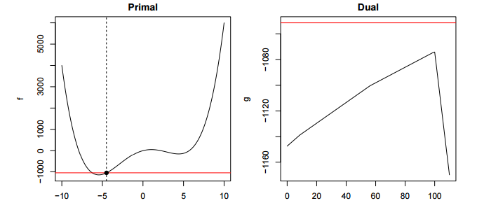

 
图3.2-1 对偶函数的图像

#### 3.2.1 原始问题

首先给出不等式约束优化问题：
$$
\tag{3.2-2}
\min_x{f(x)}\\
\text{s.t.     }\ \ h_i(x)=0,\ \ i=1,2,\cdots,m\\
\ \ \ \  \  \  \ \ g_j(x)\leq0,\ \ j=1,2,\cdots,n
$$
定义`Lagrangian`如下：
$$
\tag{3.2-3}
\mathbb{L}(x,\alpha,\beta)=f(x)+\sum_{i=1}^{m}{\alpha_i h_i(x)}
+\sum_{j=1}^{n}{\beta_j g_j(x)}
$$
根据`Lagrangian`有如下结论：
$$
\tag{3.2-4}
f(x)=\max_{\alpha,\beta;\beta_i\geq0}{\mathbb{L}(x,\alpha,\beta)}>\mathbb{L}(x,\alpha,\beta)
$$
(3.2-4)式容易验证：因为满足约束条件的`x`会使

$$
h_i(x) = 0 \tag{3.2-5}
$$

因此第二项可以消除掉。而
$$
\ g_j(x)\leq0,\ \ \beta_j\geq0 \\
\therefore\ \ \beta_jg_j(x)\leq0\\
\tag{3.2-6}
$$
所以最大值只能在它们都为零时得到，这时候就只剩下`f(x)`了。反之如果有任意一个约束条件不满足，则只需令其相应的乘子趋近正无穷，则会得到`L`趋近于正无穷，这样将导致问题无解，因此必须满足约束条件。经过变换之后，所有的约束都融合在一起，从而得到下面的无约束优化目标：
$$
\min_x f(x) =\min_x{\max_{\alpha,\beta;\beta_i\geq0}{\mathbb{L}(x,\alpha,\beta)}}
\tag{3.2-7}
$$

#### 3.2.2 对偶问题

式（3.2-7）与原优化目标等价，将之称为原始问题，将原始问题的解记作`p*`, 如此便把带约束问题转化为了无约束的原始问题，其实只是一个形式上的重写，方便找到其对应的对偶问题，首先为对偶问题定义一个对偶函数**`（dual function）`** ：
$$
D(\alpha,\beta) = \min_x{\mathbb{L}(x,\alpha,\beta)} \tag{3.2-8}
$$
有了对偶函数就可给出对偶问题了，与原始问题的形式非常类似，只是把 `min `和 `max` 交换了一下：
$$
\tag{3.2-9}
\max_{\alpha,\beta;\beta_i\geq0}\min_x{{\mathbb{L}(x,\alpha,\beta)}} \\ \ \\
\text{Then defined: }\ \ d^* = \max_{\alpha,\beta;\beta_i\geq0}D(\alpha,\beta)
$$
对偶问题和原始问题的最优解并不相等，而是满足的如下关系：
$$
\tag{3.2-10}
d^* \leq p^*
$$
直观地，可以理解为最小的里最大的那个要比最大的中最小的那个要大。证明过程如下：
$$
\text{Firstly, the constraints here should be fully satisfied. }\\
\text{The relationship between original  problem and dual problem }\\ \text{is as follows:}\\ \ \\
D(\alpha,\beta) = \min_x{\mathbb{L}(x,\alpha,\beta)} \leq\mathbb{L}(x,\alpha,\beta)\leq\max_{\alpha,\beta;\beta_i\geq0}{\mathbb{L}(x,\alpha,\beta)} = f(x)\\ \ \\
\therefore \ \ D(\alpha,\beta)\leq f(x)
\\ \ \\
\Rightarrow \ d^*=\max_{\alpha,\beta;\beta_i\geq0}{D(\alpha,\beta)}\leq \min_x f(x) =p^*
\tag{3.2-11}\\
$$
即现在通过对偶性，为**原始问题引入一个下界**。这个性质便叫做**弱对偶性（weak duality）**，对于所有优化问题都成立，即使原始问题非凸。这里还有两个概念： `f(x)–D(α,β)`叫做对偶间隔（`duality gap`）， `p∗–d∗`叫做最优对偶间隔（`optimal duality gap`）。

之前提过无论原始问题是什么形式，对**偶问题总是一个凸优化的问题**，这样对于那些难以求解的原始问题 （甚至是 `NP` 问题），均可以通过转化为偶问题，通过优化这个对偶问题来得到原始问题的一个下界， 与弱对偶性相对应的有一个**强对偶性（`strong duality`）** ，强对偶即满足：
$$
\tag{3.2-12}
d^*=p^*
$$
强对偶是一个非常好的性质，**因为在强对偶成立的情况下，可以通过求解对偶问题来得到原始问题的解**，在 SVM 中就是这样做的。当然并不是所有的对偶问题都满足强对偶性 ，在 SVM 中是直接假定了强对偶性的成立，其实只要满足一些条件，强对偶性是成立的，比如说 **Slater 条件与KKT条件。**

#### 3.2.3 Slater 条件

若原始问题为凸优化问题，且存在严格满足约束条件的点`x` ，这里的“严格”是指 `g_i(x)≤0 `中的“≤”严格取到“<”，即存在` x `满足 `g_i(x)<0`, `i=1,2,…,n`，则存在 `x∗`,`α∗`,`β∗`使得 `x∗`x∗ 是原始问题的解， `α∗`,`β∗`是对偶问题的解，且满足：
$$
\tag{3.2-13}
p^*=d^*=\mathbb{L}(x^*,\alpha^*,\beta^*)
$$
也就是说如果原始问题是凸优化问题并且满足 `Slater `条件的话，那么强对偶性成立。需要注意的是，这里只是指出了强对偶成立的一种情况，并不是唯一的情况。例如，对于某些非凸优化的问题，强对偶也成立。`SVM `中的原始问题 是一个凸优化问题（二次规划也属于凸优化问题），`Slater `条件在` SVM `中指的是存在一个超平面可将数据分隔开，即数据是线性可分的。当数据不可分时，强对偶是不成立的，这个时候寻找分隔平面这个问题本身也就是没有意义了，所以对于不可分的情况预先加个` kernel `就可以了。

#### 3.2.4 KKT条件

假设`x∗` 与 `α∗,β∗` 分别是原始问题（并不一定是凸的）和对偶问题的最优解，且满足强对偶性，则相应的极值的关系满足：
$$
\tag{3.2-14}
\begin{align*}
f(x^*) &= d^*=p^*=D(\alpha^*,\beta^*)\\
&=\min_x{f(x)}+\sum_{i=1}^{m}{\alpha_i^*  h_i(x)}+\sum_{j=i}^{n}{\beta_j^* g_j(x)}\\
&\leq f(x^*)+\sum_{i=1}^{m}{\alpha_i^*  h_i(x^*)}+\sum_{j=i}^{n}{\beta_j^* g_j(x^*)}\\
&\leq f(x^*)
\end{align*}
$$
这里第一个不等式成立是因为` x∗`为 `L(x,α∗,β∗)`的一个极大值点，最后一个不等式成立是因为 `h_i(x∗)=0`,且 `g_j(x∗)≤0,β_j≥0`，（`β_j≥0`是 (3.2-4) 式的约束条件）因此这一系列的式子里的不等号全部都可以换成等号。根据公式还可以得到两个结论：

1. 第一个不等式成立是因为 `x∗`为 `L(x,α∗,β∗)`的一个极大值点，由此可得:

$$
\tag{3.2-15}
\mathrm{\nabla}_{x^*}\mathbb{L}(x,\alpha^*,\beta^*) = 0
$$

2. 第二个不等式其实就是(3.2-4)  式，`β^∗_j g_j(x^∗)`都是非正的，所以这里有：
$$
\tag{3.2-16}
   \beta^*_j \mathbb{g}_j(x^*)=0, \ \ i=1,2,\cdots,m
$$

 也就是说如果 `β^∗_j>0`，那么必定有` g_j(x^∗)=0`；反过来，如果 `g_j(x^∗)<0` 那么可以得到` β^∗_j=0` ，即：
$$
\tag{3.2-17}
\begin{equation}
\left\{
\begin{array}{ll}
\beta^*_j>0\ \ \ \ \  \ \Rightarrow g_j^*(x)=0\\
g_j^*(x)<0 \ \   \Rightarrow \beta^*_j=0
\end{array}
\right.
\end{equation}
$$
这些条件即为` KKT (Karush-Kuhn-Tucker) `条件:
$$
\tag{3.2-18}
\begin{align}
\mathrm{\nabla}_{x}\mathbb{L}(x,\alpha,\beta) &= 0\\
\beta_jg_j(x)&=0, \ \ j=1,2,\cdots,n\\ 
h_i(x)&=0, \ \ i=1,2,\cdots,m\\
g_j(x)&\leq 0, \ \ j=1,2,\cdots,n\\
\beta_j&\geq 0, \ \ j=1,2,\cdots,n
\end{align}
$$
总结来说**任何满足强对偶性的优化问题，只要其目标函数与约束函数可微，任一对原始问题与对偶问题的解都是满足 KKT 条件的**。即满足强对偶性的优化问题中，若 `x∗` 为原始问题的最优解，`α∗,β∗`为对偶问题的最优解，则可得` x∗,α∗,β∗` 满足` KKT`条件。

>   To summarize, for `any` optimization problem with differentiable objective and constraint functions for which strong duality obtains, any pair of primal and dual optimal points must satisfy the **KKT** conditions (5.49).
>
> ​												                   ---Stephen Boyd, Convex Optimization

上面只是说明了必要性，当满足原始问题为凸优化问题时，必要性也是满足的，也就是说当原始问题是凸优化问题,且存在 `x∗,α∗,β∗` 满足` KKT` 条件，那么它们分别是原始问题和对偶问题的极值点并且强对偶性成立，证明如下：

首先原始问题是凸优化问题，固定` α∗,β∗`之后对偶问题 `D(α∗,β∗)`也是一个凸优化问题，`x∗`是 `L(x,α∗,β∗)` 的极值点：
$$
\tag{3.2-19}
\begin{align}
D(\alpha^*,\beta^*) &= \min_x\mathbb{L}(x,\alpha^*,\beta^*)\\
&=\mathbb{L}(x^*,\alpha^*,\beta^*)\\ 
&= f(x^*)+\sum_{i=1}^{m}{\alpha_i^*  h_i(x^*)}+\sum_{j=i}^{n}{\beta_j^* g_j(x^*)}\\
&= f(x^*)\\
\end{align}
$$
最后一个式子是根据` KKT `条件中的 `h_i(x)=0`与 `β_j g_j(x)=0`得到的。这样一来，就证明了对偶间隔为零，也就是说，强对偶成立。 所以当原始问题为凸优化问题时:

> summary, for any `conver` optimization problem with differentiable objective and constraint functions, any points that satisfy the KKT conditions are primal and dual optimal, and have zero duality gap.
>
> ​												                   ---Stephen Boyd, Convex Optimization

关于对偶的问题到此为止，其实都是很优化方法中比较简单的内容。总结一下。本文介绍了对偶的基本概念，对于一个约束优化问题，找到其对偶问题，当弱对偶成立时，可以得到原始问题的一个下界。而如果强对偶成立，则可以直接求解对偶问题来解决原始问题。 `SVM` 就是这样的。对偶问题由于性质良好一般比原始问题更容易求解，在 `SVM` 中通过引入对偶问题可以将问题表示成数据的内积形式从而使得 `kernel trick `的应用更加自然）。此外，还有一些情况会同时求解对偶问题与原始问题 ，比如在迭代求解的过程中，通过判断对偶间隔的大小，可以得出一个有效的迭代停止条件。

### 3.3 支持向量机SVM

#### 3.3.1 Introduction

支持向量机（`Support Vector Machine，SVM`）是定义在特征空间中的最大间隔线性分类器，对于非线性可分的数据，`SVM`引入核方法（`kernel trick`）使它实质上成为非线性分类器。`SVM` 有两种解释:
- 求解间隔最大的分类平面，这种情况可以转化为一个求解凸二次规划的问题，一般转换为对偶问题求解；
- `Hinge Loss`，通过经验风险最小化，采取 `Hinge Loss` 来求得损失函数，最终对损失函数求极值即可。

本节主要讲解的是二次规划转对偶求解的方式，`Hinge Loss`解释参考[支持向量机之Hinge Loss 解释](#title3.6)，首先引入线性可分的概念。

#### 3.3.2 线性可分

给定`N`个数据的集合:
$$
\{(x_i,y_i)\}_{i=1}^{N}\\ \ \\
\text{s.t.}\ \ \  x_i\in\mathbb{R}^n \\
\ \ \ \ \ \ \ y_i\in \mathbb{R}
\tag{3.3-1}
$$
其中` x_i`为样本点， `y_i`为类标签, 每个` (x_i,y_i)` 的组合为一个训练样例，线性可分意味着即存在一个超平面 `w⋅x+b=0`，可以将这两类数据分开，使得超平面一边的数据点所对应的标签 `y` 全是+1 ，另一边对应的标签 `y `全为-1。需要注意，当训练数据线性可分时，存在无穷多超平面可以将两类数据正确分开，`SVM` 的思想是利用几何间隔最大来求解最优分类超平面，这个解是**唯一**的。

#### 3.3.3 最大化几何间隔

一般来说，训练样本距离分类超平面的远近可以表示分类预测的确信程度，下图中点 C 的类别为-1 确信程度要明显高于点 A 。

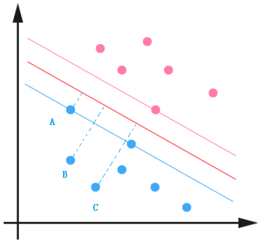

图3.3-1 几何间隔示意图

该确信程度可以用样本到超平面的距离来表示，该距离便是常说的几何距离（点到直线的距离）。样本点` x_i ` 到分类平面 `w⋅x_i+b=0`的几何距离如下所示：    
$$
\gamma_i = \frac{|w\cdot x_i +b|}{||w||}
\tag{3.3-2}
$$
分子要取绝对值，分母为 `L2`范数： 
$$
||w|| = \sqrt{w_1^2 + w_2^2+\cdots +w_n^2}
\tag{3.3-3}
$$
训练样例中若 `w⋅x_i+b>0` ,则对应的标签为 `y_i=1` ， 反之，若 `w⋅x_i+b<0` ，则有 `y_i=−1` ，所以将几何间隔写作如下形式：
$$
\tag{3.3-4}
\gamma_i=y_i(\frac{w}{||w||}x_i+\frac{b}{||w||})
$$
对于整个个训练集的几何距离，可表示为所有`N`个训练样本中的最小的几何距离：
$$
\gamma = \min_{i=1\cdots N}{\gamma_i}
\tag{3.3-5}
$$
有了训练数据的几何间隔，根据最大间隔超平面思想，可以得到以下约束最优化问题：
$$
\tag{3.3-6}
\max_{w,b}{\gamma} \\
\text{s.t. }\ \  y_i(\frac{w}{||w||}x_i+\frac{b}{||w||})\geq\gamma, \ \ i=1,2,\cdots,N
$$
约束条件的意思是使得训练集合中所有样本的几何间隔至少要大于最小的几何间隔 `γ`. 这里在引入一个逻辑概念，叫做函数间隔，样本 `(x_i,y_i)` 的函数间隔如下：
$$
\gamma_i = y_i(w\cdot x_i +b)
\tag{3.3-7}
$$
进而可得整个数据集的函数间隔为：
$$
\tag{3.3-8}
\widehat{\gamma} = \min_{i=1\cdots N}\widehat{\gamma_i}
$$
与几何间隔的关系分别由以下两个公式给出: 
$$
\gamma_i = \frac{\widehat{\gamma_i}}{||w||},\ \ \gamma= \frac{\widehat{\gamma}}{||w||}
\tag{3.3-9}
$$
根据以上函数间隔，可以使用函数间隔代替几何间隔来对 `SVM` 目标函数进一步化简：
$$
\tag{3.3-10}
\max_{w,b}{\frac{\widehat{\gamma} }{||w||}} \\
\text{s.t. }\ \  y_i(w\cdot  x_i+b)\geq\widehat{\gamma} , \ \ i=1,2,\cdots,N
$$
这里之所以引入函数间隔，是因为其可以自由缩放大小的，比如对于分类超平面 `w⋅x+b=0` , 若左右同时扩大 `λ` 倍，`λw⋅x+λb=0` ，分类平面不会发生任何改变，但是对于点 `x_i` 的函数间隔为：
$$
\lambda \gamma_i = y_i\lambda(w\cdot x_i+b)\tag{3.3-11}
$$
在函数间隔也扩大了 `λ` 倍的情况下，分类超平面没与几何间隔却没变，所以并不会对我们的优化函数产生一丝影响，因为优化目标是最小化几何间的，也就是说缩放分类超平面参数不会对最终的结果产生影响，所以可以令数据集的函数间隔 `γˆ`. 最终只需极大化：
$$
\tag{3.3-12}
\max_{w,b}{\frac{1 }{||w||}} \\
\text{s.t. }\ \  y_i(w\cdot  x_i+b)\geq 1 , \ \ i=1,2,\cdots,N
$$
以上极大不等式约束问题等价于以下极小凸二次规问题：
$$
\tag{3.3-13}
\min_{w,b}{\frac{1 }{2}||w||^2} \\
\text{s.t. }\ \  y_i(w\cdot  x_i+b)\geq 1 , \ \ i=1,2,\cdots,N
$$
综上，提炼出线性可分情况下` SVM` 的学习算法，

**算法1.1**：

> 输入：线性可分数据集
> $$
> \{(x_i,y_i)\}_{i=1}^{N}
> $$
>
> 1. 构造约束最优化问题：
>    $$
>    \min_{w,b}{\frac{1 }{2}||w||^2} \\
>    \text{s.t. }\ \  y_i(w\cdot  x_i+b)\geq 1 , \ \ i=1,2,\cdots,N
>    $$
>
> 2. 求解得到`w∗,b∗`，分类超平面即为 `w∗⋅x+b∗=0`;
>
> 3. 对于新的观测数据 `x`，  根据` f(x)=sign(w∗⋅x+b∗)`判断其类别 `y` 即可.

线性可分 `SVM `中到分类超平面的距离为 `1/||w||`，因为之前我们在不影响结果的情况下，人为设定函数间隔`γˆ=1`, 也就是说离超平面最近的点函数间隔为 1，这些点也就是之后要提到的支持向量。

#### 3.3.4 转化为对偶问题

本节主要讲解如何求解算法1.1中的不等式约束二次规划问题。二次规划是一个凸优化问题，求解该问题需要许多最优化算法的知识，前两节为 SVM 的基础，有看不明白的地方可以认真阅读这两节：

- [约束优化方法之拉格朗日乘子法与KKT条件](#title3.1)
- [拉格朗日对偶](#title3.2)

这里将引入对偶问题来进行求解，关于对于偶问题与 `KKT` 条件在这里真的非常重要，而且在`SVM`中引入对偶的好处为：

- 对偶问题必为凸优化问题.；
- 对偶问题是原始问题的下界，当满足一定条件，两者等价；
- 引入对偶问题之后，可以自然而然的引入核函数。

现在回到之前的优化目标，也即**原始问题**：

$$
\tag{3.3-14}
\min_{w,b}{\frac{1 }{2}||w||^2} \\
\text{s.t. }\ \  -(y_i(w\cdot  x_i+b)-1)\leq 0 , \ \ i=1,2,\cdots,N
$$
这里把不等式约束优化写成了常见的 `g(x)≤0` 的形式，接下来首先构造拉格朗日函数：
$$
\tag{3.3-15}
\mathbb{L}(w,b,\alpha) = \frac{1}{2}||w||^2-\sum_{i=1}^{N}{\alpha_i(y_i(w*x_i+b)-1)}
$$
接下来需要转换为对偶问题求解，首先根据拉格朗日函数写出一个原始问题，拉格朗日函数满足如下性质：
$$
\max_{w,b}{\mathbb{L}(w,b,\alpha)}=\frac{1}{2}||w||^2
\tag{3.3-16}
$$
因为满足约束时，拉格朗日函数的第二项是为 0 的，因此 `SVM` 的求解的原始问题的最优解 `p∗`为 ：
$$
p^*=\min_{\alpha_i\geq0}\max_{w,b}{\mathbb{L}(w,b,\alpha)}
\tag{3.3-17}
$$
对偶问题及其最优解 `d∗` 为：
$$
\tag{3.3-18}
d^* =\max_{w,b}\min_{\alpha_i\geq0}{\mathbb{L}(w,b,\alpha)}
$$
由于对偶问题为原始问题的下界，即 `p∗≥d∗`，而且原始问题是满足 `Salter` 条件，也就是说：存在 `w∗,b∗,a∗`分别是原始问题与对偶问题的解, 且满足：
$$
\tag{3.3-19}
p^*=d^*=\mathbb{L}{(w^*,b^*\alpha^*)}
$$

由于满足 `Salter` 条件（即满足强对偶），可知每对满足原始问题与对偶问题的解都满足` KKT` 条件，即：
$$
\begin{align*}
\tag{3.3-20}
\mathrm{\nabla}_{w}\mathbb{L}(w^*,b^*,\alpha^*) =w^*-\sum_{i=1}^{N}{\alpha_i^* y_i x_i}&= 0\\
\mathrm{\nabla}_{b}\mathbb{L}(w^*,b^*,\alpha^*) =-\sum_{i=1}^{N}{\alpha_i^*y_i} &= 0\\
\alpha_i^*(y_i(w^*\cdot x+b^*)-1)&=0\\
y_i(w^*\cdot x+b^*)-1&\geq0 \\
\alpha_i&\geq0,\ \ i=1,2,\cdots,N
\end{align*}
$$
这里至少存在一个 `a^∗_j>0`，使得 `y_j(w⋅x_j+b)−1=0`，这便是支持向量，然后根据` KKT `条件，可得：
$$
\begin{align*}
\tag{3.3-21}
w^* &=\sum_{i=1}^{N}{\alpha_i^*y_ix_i} \\
b^*&=y_j-\sum_{i=1}^{N}{\alpha_i^*y_i(x_i\cdot x_j)}
\end{align*}
$$
最后来理清思路，对于原始问题，首先构造容易求解的对偶问题，由于原始问题满足` Slater `条件，可知强对偶性成立且原始问题与对偶问题有共同的最优解，根据强对偶性可知每对原始问题与对偶问题的最优解是满足` KKT `条件的，求得对偶问题的解 `a∗` 之后根据 `KKT` 条件便可得到 `w∗,b∗`, 而且对偶问题的解即为原始问题的解，要先从对偶问题下手:
$$
\max_{w,b}\min_{\alpha_i\geq0}\mathbb{L}{(w,b,\alpha)}
\tag{3.3-22}
$$

1. **min部分**: 假定`alpha`为定值, 求解`L`关于`w,b`的极小值，直接对`w,b`求偏导，即：
$$
\begin{align*}
  
\frac{\partial\mathbb{L}(w,b,\alpha)}{\partial w} &= 0 \ \  &\Rightarrow \ \ w-\sum_{i=1}^{N}{\alpha_iy_ix_i} &= 0\\
   \frac{\partial\mathbb{L}(w,b,\alpha)}{\partial b} &= 0 \ \  &\Rightarrow \ \ -\sum_{i=1}^{N}{\alpha_iy_i} = 0
   \end{align*}\\
   \tag{3.3-23}
$$
   注意上式相当于产生一个约束条件 `\sum{a_i y_i}=0` ,将以上结果带入 `L(w,b,a)`会有：
$$
\begin{align*}
   \mathbb{L}(w,b,\alpha) &=\frac{1}{2}||w||^2-\sum_{i=1}^{N}{\alpha_i(y_i(w^Tx_i+b)-1)} \\
   &=\frac{1}{2}w^Tw - \sum_{i=1}^{N}{\alpha_i y_i w^T x_i}- \sum_{i=1}^{N}{\alpha_i y_i  b}+ \sum_{i=1}^{N}{\alpha_i}\\
   &=\frac{1}{2}w^T\sum_{i=1}^{N}{\alpha_i y_i x_i} - \sum_{i=1}^{N}{\alpha_i y_i w^T x_i}- \sum_{i=1}^{N}{\alpha_i y_i  b}+ \sum_{i=1}^{N}{\alpha_i}\\
   &=\frac{1}{2}w^T\sum_{i=1}^{N}{\alpha_i y_i x_i} - w^T\sum_{i=1}^{N}{\alpha_i y_i  x_i}- \sum_{i=1}^{N}{\alpha_i y_i  b}+ \sum_{i=1}^{N}{\alpha_i}\\
   &=-\frac{1}{2}w^T\sum_{i=1}^{N}{\alpha_i y_i x_i} -  \sum_{i=1}^{N}{\alpha_i y_i  b}+ \sum_{i=1}^{N}{\alpha_i}\\
   &=-\frac{1}{2}w^T\sum_{i=1}^{N}{\alpha_i y_i x_i} -  b\sum_{i=1}^{N}{\alpha_i y_i}+ \sum_{i=1}^{N}{\alpha_i}\\

   &=-\frac{1}{2}(\sum_{i=1}^{N}{\alpha_i y_i x_i})^T\sum_{i=1}^{N}{\alpha_i y_i x_i} -  b\sum_{i=1}^{N}{\alpha_i y_i}+ \sum_{i=1}^{N}{\alpha_i}\\
   &=-\frac{1}{2}\sum_{i=1}^{N}{\alpha_i y_i (x_i)^T}\sum_{i=1}^{N}{\alpha_i y_i x_i} -  b\sum_{i=1}^{N}{\alpha_i y_i}+ \sum_{i=1}^{N}{\alpha_i}\\

   &=-\frac{1}{2}\sum_{i,j=1}^{N}{\alpha_i y_i (x_i)^T\alpha_j y_j x_j} -  b\sum_{i=1}^{N}{\alpha_i y_i}+ \sum_{i=1}^{N}{\alpha_i}\\

   \tag{3.3-24}
   \end{align*}
$$

2. **max部分**：`min`部分得到解之后，现在求关于`alpha`的极大即可，那么现在的优化函数变为：
   $$
   \tag{3.3-25}
   \max_{\alpha_i\geq0}{-\frac{1}{2}\sum_{i=1}^{N}\sum_{j=1}^{N}{\alpha_i \alpha_j y_i y_j(x_i\cdot x_j)}}+ \sum_{i=1}^{N}{\alpha_i}\\
   \text{s.t. } \ \sum_{i=1}^{N}{\alpha_iy_i} = 0
   $$
   现在大功告成，只要求解对偶问题得到` a∗` ，然后根据 KKT 条件得到 `w∗,b∗` ,就可以完美的解得原始问题的最优解了，经过以上几步，便得到了最终的线性可分支持向量机学习算法，

   **算法1.2：**

   >输入： 线性可分数据集
   >$$
   >\{(x_i,y_i)\}_{i=1}^{N}
   >$$
   >
   >1. 构造约束最优化问题：
   >$$
   >\max_{\alpha_i\geq0}{-\frac{1}{2}\sum_{i=1}^{N}\sum_{j=1}^{N}{\alpha_i \alpha_j y_i y_j(x_i\cdot x_j)}}+ \sum_{i=1}^{N}{\alpha_i}\\
   >\text{s.t. } \ \sum_{i=1}^{N}{\alpha_iy_i} = 0
   >$$
   >
   >2. 求解得到 
   >$$
   >\alpha^* = (\alpha^*_1,\alpha^*_2,\cdots,\alpha^*_N,)^T
   >$$
   >求解一般采用**SMO算法**;
   >
   >3. 根据之前的`KKT` 条件，`a∗`求得 `w∗,b∗`，首先选择 `a^∗_j>0` 的支持向量 `(x_j,y_j)`；
   >   $$
   >   \begin{align*}
   >   w^* &=\sum_{i=1}^{N}{\alpha_i^*y_ix_i}\\
   >   b^* &= y_j-\sum_{i=1}^{N}{\alpha_i y_i(x_i \cdot x_j)}
   >   \end{align*}
   >   $$
   >
   >4. 求得超平面 `w^∗⋅x+b^∗=0`, 对于新的观测数据 `x` ,根据 `f(x)=sign(w^∗⋅x+b^∗)` 判断其类别 `y`.
   >        

这里顺便明确给出**支持向量的定义**，根据`KKT`条件 
$$
\alpha^∗_i(y_i(w^∗⋅x_i+b^∗)−1)=0
$$

- `a^∗_i>0` 的样本点` (x_i,y_i)` 即为间隔边界上的支持向量，且 `y_i(w^∗⋅x_i+b^∗)−1=0`；
- 对于**非支持向量**，即 `y_i(w^∗⋅x_i+b^∗)−1>0`，一定有 `a_i=0`.

至此，关于线性可分情况下的二分类 `SVM` 全部推到完成，但是有一个问题：当数据中存在一些异常值（outlier），去除这些 outlier 后数据是线性可分的，这种情况下要引入关于异常值的处理。

#### 3.3.5 outlier 的处理
给定数据集 
$$
\{(x_i,y_i)\}_{i=1}^N
$$
，当样本数据大部分为线性可分的，存在少量异常值使得数据线性不可分，或者导致分离超平面被挤压，可以通过一些方法仍然按照线性可分的方式处理，异常值的情况如下图所示：
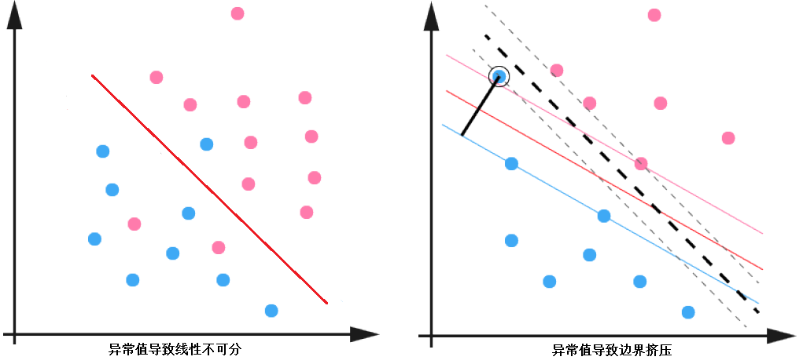

图3.3-2 异常点影响示意图

以上情况意味着某些样本点的函数间隔并不满足大于 1 的要求。为了解决这个问题，为每个样本引入一个松弛变量`ξ_i≥0`  , 使得函数间隔可以小于 1 ，即满足 `y_i(w⋅x_i+b)≥1–ξ_i` ,这里显然 `ξ_i` 不能任意大，因为那会导致任意样本点都满足要求，所以要把优化目标改成如下的形式：
$$
\tag{3.3-26}
\begin{align*}
&\min_{w,b,\xi} \frac{1}{2}||w||^2+C\sum_{i=1}^{N}\xi_i \\
\text{s.t. }\ \ &-y_i(w\cdot x_i+b)-\xi_i+1\leq0,\ \ i=1,2,\cdots,N \\
&-\xi_i\leq0,\ \ i=1,2,\cdots,N
\end{align*}
$$
这里 `C>0` 叫做惩罚参数，上述的不等式约束记做` g(x)≤0`的形式，同样通过对偶的形式求解，首先构造拉格朗日函数： 
$$
\begin{align*}
\tag{3.3-27}
\mathbb{L}(w,b,\xi,\alpha,\gamma)&=\frac{1}{2}||w||^2\\&+C\sum_{i=1}^{N}{\xi_i} -\sum_{i=1}^{N}{\alpha_i(y_i(w\cdot x_i+b)-1+\xi_i)}-\sum_{i=1}^{N}{\gamma_i\xi_i}
\end{align*}
$$
拉格朗日函数中的乘子 `a_i≥0`， 且  `γ_i≥0` ，很明显的有：
$$
\tag{3.3-28}
\max_{w,b,\xi}{\mathbb{L}(w,b,\xi,\alpha,\gamma)}=\frac{1}{2}||w||^2+C\sum_{i=1}^{N}{\xi_i}
$$
因此原始问题转化为：
$$
\tag{3.3-29}
\min_{\alpha,\gamma}\max_{w,b,\xi}{\mathbb{L}(w,b,\xi,\alpha,\gamma)}
$$
对于上述问题应用对偶可得：
$$
\tag{3.3-30}
\max_{w,b,\xi}\min_{\alpha,\gamma}{\mathbb{L}(w,b,\xi,\alpha,\gamma)}
$$
接下来求解对偶问题，对于极小部分的参数 `w,b,ξ_i` 求导：

$$
\begin{align*}
  
\mathrm{\nabla}_{w}\mathbb{L}(w,b,,\xi,\alpha,\gamma) &= 0 \ \  &\Rightarrow \ \ w-\sum_{i=1}^{N}{\alpha_iy_ix_i} &= 0\\
   \mathrm{\nabla}_{b}\mathbb{L}(w,b,,\xi,\alpha,\gamma)  &= 0 \ \  &\Rightarrow \ \ -\sum_{i=1}^{N}{\alpha_iy_i} &= 0\\
    \mathrm{\nabla}_{\xi}\mathbb{L}(w,b,,\xi,\alpha,\gamma)  &= 0 \ \  &\Rightarrow \ \ C-\alpha_i-\gamma_i&=0
   \end{align*}\\
   \tag{3.3-31}
$$

将以上结果带入对偶问题，极小部分便得到一个关于 `a` 的函数：
$$
\tag{3.3-32}
\max_{\alpha}\ \{-\frac{1}{2}\sum_{i=1}^{N}\sum_{j=0}^{N}\alpha_i\alpha_jy_iy_j(x_i\cdot x_j)+\sum_{i=1}^{N}{\alpha_i} \}\\
\text{s.t. }\ \ 0\leq\alpha_i\leq C,\ \ i=1,2,\cdots,N \\
 \ \ \ \ \ \ \ \ \ \  \sum_{i=1}^{N}\alpha_iy_i=0, ,\ \ i=1,2,\cdots,N
$$
注意这里根据 `C–a_i–γ_i=0` 与` γ_i≥0` 消去了 `γ_i` ,同样由于原始问题满足 `Slater `条件，因此存在 `w^∗,b^∗,ξ^∗_i` 为原始问题的解，`γ^∗,a^∗` 为对偶问题的解，且强对偶条件成立，并且每对解均满足 `KKT `条件：
$$
\begin{align*}
\mathrm{\nabla}_{w}\mathbb{L}(w,b,,\xi,\alpha,\gamma) &= 0 \ \  \Rightarrow \ \ w-\sum_{i=1}^{N}{\alpha_iy_ix_i} = 0\\
   \mathrm{\nabla}_{b}\mathbb{L}(w,b,,\xi,\alpha,\gamma)  &= 0 \ \  \Rightarrow \ \ -\sum_{i=1}^{N}{\alpha_iy_i} = 0\\
    \mathrm{\nabla}_{\xi}\mathbb{L}(w,b,,\xi,\alpha,\gamma)  &= 0 \ \  \Rightarrow \ \ C-\alpha_i-\gamma_i=0 \\ \ \\
    \alpha_i^*(y_i(w^*\cdot x_i +b^*)-1+\xi^*) &=0\\
    y_i(w^*\cdot x_i +b^*)-1+\xi^*&\geq 0 \\
    \gamma_i^*\xi_i^*&=0\\
    \alpha_i^*&\geq0\\
    \xi_i^* &\geq0\\
    \gamma_i^*&\geq0
\end{align*}
\tag{3.3-33}
$$
根据` KKT` 条件，求得 `a∗` 后，便可带入求解` w∗`与 `b∗`，首先由式(3.3-33)的(1)等式可得：
$$
\tag{3.3-34} 
w=\sum_{i=1}^{N}{\alpha_iy_ix_i}
$$
根据式(3.3-33)的(3) (4) (6) (9)可知若 `γ^∗_j>0`，则 `ξ^∗j=0` ,且存在 `0<a^∗_j<C`，使得：
$$
y_j(w^*\cdot x_j +b^*)-1= 0
\tag{3.3-35}
$$
因此便可求得 `b^∗` ：
$$
b^* = y_i -\sum_{i=1}^{N}{y_i  \alpha_i^* (x_i\cdot x_j)}
\tag{3.3-36}
$$
至此，可以总结出带有异常值的线性可分`SVM`的**算法1.3**：

>输入：线性可分数据集
>$$
>\{(x_i,y_i)\}_{i=1}^{N}
>$$
>,数据集中伴有异常值.
>
>1. 构造约束最优化问题：
>   $$
>   \min_\alpha\{\frac{1}{2}\sum_{i=1}^{N}{}\sum_{j=1}^{N}{\alpha_i\alpha_jy_iy_j(x_i\cdot x_j)}-\sum_{i=1}^{N}{\alpha_i}\}\\
>   \text{s.t. }\ \ 0\leq\alpha_i\leq C,\ \ i=1,2,\cdots,N\\
>   \ \ \ \ \ \ \ \  \sum_{i=1}^{N}{\alpha_i y_i}=0,\ \ i=1,2,\cdots,N
>   $$
>
>2. 求解得到 `a^∗=(a^∗_1,a^∗_2,…,a^∗_N) `，求解一般采用**SMO算法;**　
>
>3. 根据 `a^∗`得到 `w^∗,b^∗`，选择满足` 0<a^∗_j<C` 的分量`(x_j,y_j)`
>   $$
>   w^*=\sum_{i=1}^{N}{\alpha_i^* y_i x_i}\\
>   b^*=y_j-\sum_{i=1}^{N}{y_i \alpha_i^*(x_i\cdot x_j)}
>   $$
>4. 求得超平面 `w^∗⋅x+b=0`, 对于新的观测数据`x` ，根据 `f(x)=sign(w^∗⋅x+b^∗) `判断其类别即可.
>

图(3.3-3)中实线为分离超平面，虚线为间隔边界，且有间隔边界与分离超平面的函数距离为1，几何距离为 `1/||w||`|。在线性不可分的情况下，求借得到 `a^∗=(a^∗_1,a^∗_2,…,a^∗_N)`的分量 `a^∗_i` 对应的样本实例 `(x_i,y_i)`中的 `x_i` 称为支持向量，这时的支持向量要比线性可分复杂一些，图(3.3-3)的点，以下支持向量点到间隔边界的几何距离均已标注出为 `ξ_i/||w||`。这个几何距离是这样计算的，点 `x_i` 到分离超平面的函数距离为` y_i(w⋅x_i+b)=1−ξ_i`, 而分离超平面与间隔边界的函数距离为 1 ，所以点 `x_i`  到间隔边界的距离为 `1−(1−ξ_i)` ,几何距离只需除以 `||w||`即可得到结果。

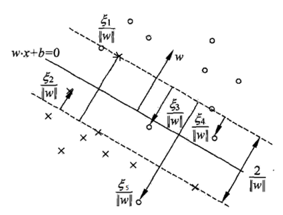

图3.3-3 支持向量机含义

可见这时候的支持向量或者分布在**间隔边界上**，或者在**间隔边界与超平面之间**，或者在**分离超平面误分的一侧**。 根据式(3.3-33)可以得出一些很有意思的结论，当 `γ_i>0` 时，根据式(3.3-33)的公式 (3) 可得` C−a_i=γ_i>0`，即`a_i<C`，又由于 `γ_i ξ_i=0`可得 `ξ=0` ，根据式(3.3-33)的公式 (4) 可得 `a_i(y_i(w⋅x+b)−1)=0` ，所以当 `0<a_i<C` 时，可得`y_i(w⋅x+b)=1`，这时样本便为支持向量，且落在间隔边界上；当 `a_i=0`时可得 `ξ_i=0` ，这时便为分类正确的且落在间隔边界之后的点，至于`a_i=C` 的情况，根据 `ξ_i` 的不同取值，可分为不同的情况，总结起来便有：

> 当 `0<a^∗_i<C`：
>
> 1. `ξ_i=0`      这是 `x_i`  为支持向量，且恰好落在间隔边界上.
>
> 若 `a^∗_i=C` ：
>
> 1.  当` 0<ξ_i<1`时， 则分类正确 ，`x_i` 落在间隔边界与分离超平面之间;
>
> 2.  当  `ξ_i=1` 时，则 `x_i`在分离超平面上;
>
> 3. 当 `ξ_i>1` 时 ， 则 `x_i` 位于分离超平面误分的一侧.

至此，带有异常值的非线性可分的情况也解决了，但是还需要注意的是数据集是完全非线性可分的。这时便需要引入核方法了。核方法并不是 `SVM` 的专利，其可以解决一系列机器学习问题。

至于 `K` 分类问题 (`K>2`) ,最简单的方式便是 `**one-vs-all**` 的方法，如下图所示，该方法共训练 `K `个分类器，对于待分类样本点，分别使用这` K` 个分类器进行分类，对于样本 `x` 分类的计算如下：` f(x)=sign(w⋅x+b)`，若只有一个 `+1 `出现，则其为样本对应类别` k` ；但实际情况下构造的决策函数总是有误差的，此时输出不只一个` +1` (不只一类声称它属于自己)，或者没有一个输出为` +1 `(即没有一个类声称它属于自己)，这时比较则比较 `w⋅x+b` 输出值，最大者对应类别为样本 `x `的类别` k` 。
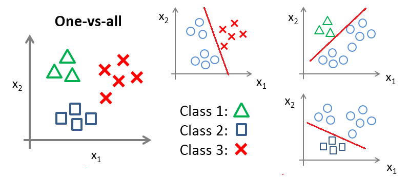

图3.3-4 K分类问题

或者采用` LIBSVM` 中` one-vs-one `的方法，其做法是在任意两类样本之间设计一个`SVM`，因此 `k `个类别的样本就需要设计` k(k−1)/2 `个`SVM`。当对一个未知样本 进行分类时，最后得票最多的类别即为该未知样本的类别。比如说 `A,B,C `四类。在训练的时候针对` (A,B) (A,C) (B,C) `所对应的样本作为训练集，然后得到六个模型，在测试的时候，对应的分别对三个模型进行测试，然后采取投票形式得到最后的结果，如下图所示：

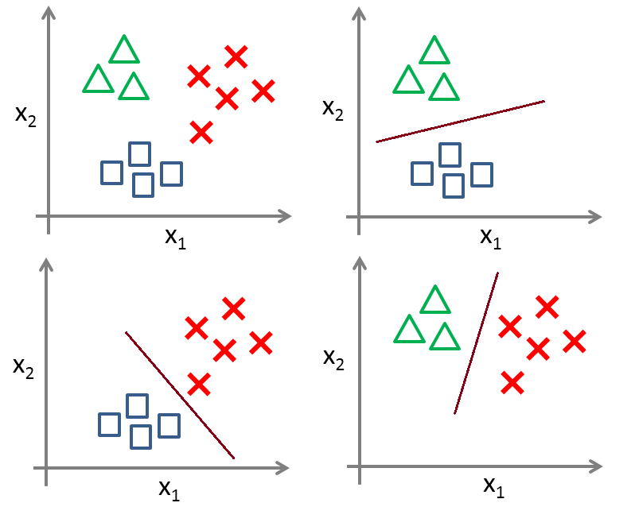

图3.3-5 多个SVM示意图

 再就是直接使用`Hinge Loss`进行多分类了，参考3.6节。

### 3.4  SVM 核方法 

#### 3.4.1 Kernel Trick

在`SVM`中引入核方法便可使得`SVM`变为非线性分类器，给定非线性可分数据集 `{(x_i,y_i)}^N_{i=1}`，如图3.4-1所示，此时找不到一个分类平面来将数据分开，核方法可以将数据投影到新空间，使得投影后的数据线性可分，下图给出一个`R^2→R^2`的映射，原空间为 `x=(x^(1),x^(2))` ,新空间为 `z=ϕ(x)={(x^(1))^2,(x^(2))^2}` ，根据图可以看出映射后样本点的变化，此时样本便为线性可分的了，直接用 `w_1⋅z^(1)+w_2⋅z^(2)+b=0 `分类即可。

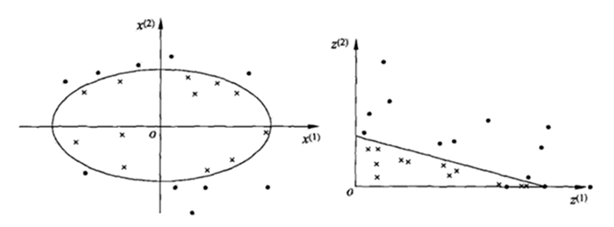

图3.4-1 相同维度的映射

上图是一个`R^2→R^2`的映射，但一般情况下，特征空间的选取往往是很高维度的`R^2→R^n`,如下为一个`R^2→R^3`的映射：

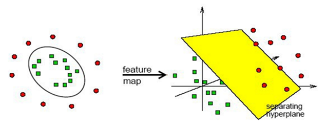

图3.4-2 映射到高维度示意图

下面给核函数一个正式定义，设 `χ `为输入空间，`ω` 为特征空间，如果存在一个 `χ `到` ω` 的映射 ` ϕ(x):χ→ω` ，对所有的 `x,z∈χ`，函数` K(x,z)` 满足` K(x,z)=ϕ(x)⋅ϕ(z)` ,则称 `ϕ(x) `为输入空间到特征空间的映射函数，`K(x,z) `为核函数。

核函数常用的技巧是不计算映射函数 `ϕ(x)` ，因为特征空间` ω` 通常是高维的，甚至无穷维，所以 `ϕ(x)` 计算并不容易，而计算核函数` K(x,z)` 却相对简单。映射 `ϕ(x)` 取法多种多样，可以取不同的特征空间，即使在同一特征空间也可以取不同的映射。映射后的样本一般是线性可分带有异常值的，这时考虑 `SVM` 的优化目标：

$$
\tag{3.4-1}
\min_\alpha\{\frac{1}{2}\sum_{i=1}^{N}{}\sum_{j=1}^{N}{\alpha_i\alpha_jy_iy_j (x_i\cdot x_j)}-\sum_{i=1}^{N}{\alpha_i}\}\\
\text{s.t. }\ \ 0\leq\alpha_i\leq C,\ \ i=1,2,\cdots,N\\
   \ \ \ \ \ \ \ \  \sum_{i=1}^{N}{\alpha_i y_i}=0,\ \ i=1,2,\cdots,N
$$

由于在输入空间计算的是` xi,xj` 的内积，所以经过映射后分别为 `ϕ(xi) `与` ϕ(xj)` ，现在只需修改目标函数为 ` ϕ(xi)` 与` ϕ(xj)`` 的内积即可，又由于 ϕ(xi)⋅ϕ(xj)=K(xi,xj)`，所以不需要定义映射函数` ϕ(x) `，只需要定义核函数便可得到高维空间中内积的结果，而这便是 `Kernel Trick`。所以线性不可分的数据集的优化目标变为：

$$
\tag{3.4-2}
\min_\alpha\{\frac{1}{2}\sum_{i=1}^{N}{}\sum_{j=1}^{N}{\alpha_i\alpha_jy_iy_j \mathbb{K}(x_i, x_j)}-\sum_{i=1}^{N}{\alpha_i}\}\\
\text{s.t. }\ \ 0\leq\alpha_i\leq C,\ \ i=1,2,\cdots,N\\
   \ \ \ \ \ \ \ \  \sum_{i=1}^{N}{\alpha_i y_i}=0,\ \ i=1,2,\cdots,N
$$

也就是说给定核函数`K(x,z)` ，即可用求解线性` SVM` 的方法来求解非线性问题，核技巧的好处在**于不需要显式的定义特征空间与映射函数，只需要选择一个合适的核函数即可**。综上核函数是用来免去显式计算高维变换的，直接用低维度的参数带入核函数来等价计算高维度的向量的内积。

#### 3.4.2 核函数的选择

什么样的函数`K(x,z)`可以作为一个有效核函数呢？答案是只要满足**`Mercer`定理**即可，即如果函数 `K(x,z) `是 `R^n×R^n→R` 上的映射（ 也就是两个n 维向量映射到实数域 ）。那么如果 `K(x,z) `是一个有效核函数（也称为`Mercer`核函数），那么当且仅当其训练样本` {x_1,x_2…,x_N} `相应的核函数矩阵是对称半正定的，这里先解释一下**正定矩阵**：

>首先来定义**奇异矩阵**，若` n` 阶矩阵 `A`为奇异阵，则其行列式为零，即  `|A|=0` 。
>设 `M` 是 `n` 阶方阵，如果对任何非零向量 `z `，都有` z^TMz>0 `，其中` z^T` 表示 `z` 的转置，就称 `M` 为正定矩阵。
>正定矩阵性质如下：
>
>1. 正定矩阵一定是非奇异的;
>2. 正定矩阵的任一主子矩阵也是正定矩阵;
>3. 若 `A` 为 `n` 阶正定矩阵，则` A` 为 `n` 阶可逆矩阵。

对于 `N` 个训练样本，每一个样本 `x_i` 对应一个训练样例。那么，我们可以将任意两个 `x_i`和 `x_j` 带入核函数中，计算 `K_{ij}=K(x_i,x_j) `。这样可以把 `K_{ij}` 表示为一个 `m×m` 的 `Gram` 矩阵，只要 `Gram` 矩阵为对称半正定的，则 `K(x,z) `即为一个有效的核函数，`Gram`矩阵如下：

$$
\tag{3.4-3}
\left[
\begin{matrix}
 K_{11}      &  K_{12}      & \cdots &  K_{1m}      \\
  K_{21}      &  K_{22}      & \cdots &  K_{2m}      \\
 \vdots & \vdots & \ddots & \vdots \\
  K_{m1}      &  K_{m2}      & \cdots &  K_{mm}      \\
\end{matrix}
\right]
$$

显然对于自己定义的核函数判定是否为正定核不太容易，所以在工业生产中一般使用一些常用的核函数，下面给出几个：

1. **线性核**：线性核其实就是不采用非线性分类器，认为样本是线性可分的；
$$
\tag{3.4-4}
\mathbb{K}(x,z)=x\cdot z+c
$$
2. **多项式核**：该核函数对应的是一个 `p` 次多项式的分类器，这时需要额外调节的参数为` cp `；
$$
\tag{3.4-5}
\mathbb{K}(x,z)=(x\cdot z+c)^p
$$
3. **高斯核**：或者叫做径向基核，该核函数甚至可以将特征空间映射为无穷维，这时需要额外调节的参数为 `δ `，
$$
\tag{3.4-6}
\mathbb{K}(x,z)=\exp(-\frac{||x-z||^2}{2\delta^2})
$$
如果 `δ` 选得很大的话，高次特征上的权重实际上衰减得非常快，所以实际上（数值上近似一下）相当于一个低维的子空间；反过来，如果` δ` 选得很小，则可以将任意的数据映射为线性可分，当然，这并不一定是好事，因为随之而来的可能是非常严重的过拟合问题。总的来说，通过调控参数` δ `，高斯核实际上具有相当高的灵活性，也是使用最广泛的核函数之一。

综上，给出**非线性可分支持向量机的学习算法1.4**：
>输入：给定非线性可分数据集
>$$
>\{(x_i,y_i)\}_{i=1}^{N}
>$$
>
>1. 构造约束最优化问题：
>
>$$
>\min_\alpha\{\frac{1}{2}\sum_{i=1}^{N}{}\sum_{j=1}^{N}{\alpha_i\alpha_jy_iy_j \mathbb{K}(x_i, x_j)}-\sum_{i=1}^{N}{\alpha_i}\}\\
>\text{s.t. }\ \ 0\leq\alpha_i\leq C,\ \ i=1,2,\cdots,N\\
>   \ \ \ \ \ \ \ \  \sum_{i=1}^{N}{\alpha_i y_i}=0,\ \ i=1,2,\cdots,N
>$$
>2. 求解得到 `a^∗=(a^∗_1,a^∗_2,…,a^∗_N) `，求解一般采用**SMO算法;**　
>
>3. 根据 `a^∗`得到`w^∗,b^∗`，选择满足`0<a^∗_j<C`的分量`(x_j,y_j)`
>$$
>w^*=\sum_{i=1}^{N}{\alpha_i^* y_i x_i}\\
>b^*=y_j-\sum_{i=1}^{N}{y_i \alpha_i^*\mathbb{K}(x_i,x_j)}
>$$
>  4. 求得超平面 `w^∗⋅x+b=0`, 对于新的观测数据`x` ，判断其类别:
>
>$$
>f(x)=sign(\sum_{i=1}^{N}{\alpha_i^* y_i \mathbb{K}(x,x_i)+b^*})
>$$
>

### 3.5 Sequential Minimal Optimization (SMO) 算法

#### 3.5.1 SMO算法推导

`SVM` 最终关于`a`目标函数为凸优化问题，该问题具有全局最优解，许多最优化算法都可以解决该问题，但当样本容量相对很大时，通常采用`SMO`算法（比如 `LIBSVM`），该算法为启发式算法，考虑在约束优化问题中，目标函数的最优解 `a^∗` 是需要满足 `KKT` 条件的，因为对偶问题有解的充要条件就是 `a^∗`的所有分量都满足 `KKT` 条件，若满足那么这时`a^∗`便是最优解了，否则应该找到两个分量，固定其余分量，针对这两个分量构建一个二次规划问题，目标函数关于这两个变量的解更接近原始的二次规划问题，且这时**两个分量的子问题有解析解**，会大大提高运算速度，两个变量的选取是首先选择违反 `KKT` 条件最严重的一个，另一个由约束条件确定下来，通过迭代不断选取两个分量使之满足 `KKT` 条件，从而使得求得原始的目标函数的最优解，这里`a`每个分量 `a_i` 均对应一个样本 `(x_i,y_i)`， 对偶问题的目标函数如下：
$$
\tag{3.5-1}
\max_{\alpha}\ \{-\frac{1}{2}\sum_{i=1}^{N}\sum_{j=0}^{N}\alpha_i\alpha_jy_iy_j(x_i\cdot x_j)+\sum_{i=1}^{N}{\alpha_i} \}\\
\text{s.t. }\ \ 0\leq\alpha_i\leq C,\ \ i=1,2,\cdots,N \\
 \ \ \ \ \ \ \ \ \ \  \sum_{i=1}^{N}\alpha_iy_i=0, ,\ \ i=1,2,\cdots,N
$$
针对选取的两个分量 `a_i,a_j` 构建二次规划问题，使得二次规划关于这两个变量的解更接近于原始的二次规划问题，不失一般性，假设选择的两个变量为 `a_1,a_2`，固定其余分量，则最优化的子问题可以写作如下：
$$
\begin{align*}
\tag{3.5-2}
\min_{\alpha_1,\alpha_2} f(\alpha_1,\alpha_2) = &\frac{1}{2}K_{11}\alpha_1^2 +\frac{1}{2}K_{22}\alpha_2^2 +y_1 y_2 K_{22}\alpha_1\alpha_2 \\
&-(\alpha_1+\alpha_2) + y_1\alpha_1\sum_{i=3}^{N}{y_i\alpha_i K_{i1}}+ y_2\alpha_2\sum_{i=3}^{N}{y_i\alpha_i K_{i2}}\\
\text{s.t.}\ \ \  &\alpha_1 y_1+\alpha_2 y_2=-\sum_{i=3}^{N}{\alpha_iy_i }=\zeta \\
&0\leq \alpha_i \leq C
\end{align*}
$$
这里 `K_{ij`}为核函数 `K(x_i,x_j)` ，`ζ` 为常量，根据约束条件可以很明显看出 `a_1,a_2` 中只要确定一个，另一个也就随之确定了，这里最后省略掉了与 `a_1,a_2` 无关的常量。现在只需要求的满足约束条件下的新的 `a_1,a_2` 即可，为了便于表示，用 `a^{old}_1,a^{old}_2` 表示更新前的值，`a^{new}_1,a^{new}_2` 表示更新后的值，另 `a^{new.unc}_1,a^{new,unc}_2` 为未考虑约束时的解，可以先考虑求解 `a^{new}_2` ，然后根据 `a^{new}_2 `与约束条件确定` a^{new}_1` 即可。首先为 `a_2^{new} `确定一个界，即` a^{new}_2`需要满足的约束，假设为 `L≤a^{new}_2≤H `，根据约束条件，可以得到如下的` bound` ：

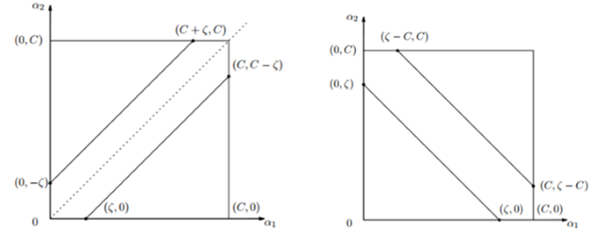

图3.5-1 约束边界

* 当` y1≠y2` 时，根据
  
$$
a^{new}_1 y_1+a^{new}_2 y_2=a^{old}_1 y_1+a^{old}_2 y_2=ζ
$$

* 可得 `a^{old}_1−a^{old}_2=ζ`, 如图3.5-1左所示当该线位于对角线以下时，`a^{new}_2` 的最小值 `L=0` ，最大值为 `H=C−ζ` ；当该线位于对角线以上时，`a^{new}_2` 的最小值` L=−ζ` ，最大值为` H=C`. 所以 `a^{new}_2` 的取值范围是：
$$
\tag{3.5-3}
L =\max{(1,\alpha_2^{old}-\alpha_1^{old})},\ \  H =\min{(C,C+\alpha_2^{old}-\alpha_1^{old})}
$$

* 当 `y_1=y_2` 时， 可得 `a^{old}_1−a^{old}_2=ζ` ，根据以上分析，同样可得 `a^{new}_2` 的取值范围：
  $$
  \tag{3.5-4}
  L =\max{(0,\alpha_2^{old}-\alpha_1^{old}-C)},\ \  H =\min{(C,\alpha_2^{old}-\alpha_1^{old})}
  $$

确定了为了叙述简单，首先引入以下符号公式：
$$
\tag{3.5-5}
g(x)=\sum_{i=1}^{N}{\alpha_i y_i K(x_i,x) +b }\\
E_i= g(x_i)-y_i=(\sum_{i=1}^{N}{\alpha_i y_i K(x_i,x) +b })-y_i,\ \ \ i=1,2\\
v_i=\sum_{i=3}^{N}{\alpha_j y_j K(x_i,x_j)}=g(x_i)-\sum_{j=1}^{2}{\alpha_j y_j K(x_i,x_j)-b},\ \ \ i=1,2
$$
这里 `E_i` 为函数`g(x)` 对输入` x_i` 的预测值与真实输出 `y_i` 的差，接下来根据约束条件 `a_1 y_1+a_2 y_2=ζ` ，可得 `a_1=(ζ–a_2 y_2)y_1` ，将 `a_1` 与 `v_i` 带入原优化目标：
$$
\tag{3.5-6}
\min_{\alpha_2}=f(\alpha_2)=\frac{1}{2}K_{11}(\zeta-\alpha_2 y_2)^2+\frac{1}{2}K_{22}\alpha_2^2+y_2 K_{12}(\zeta-\alpha_2 y_2)\alpha_2 \\
-(\zeta-\alpha_2 y_2)y_1-\alpha_2+v_1(\zeta-\alpha_2 y_2)+v_2\alpha_2 y_2
$$
对 `a2` 求导，得到
$$
\tag{3.5-7}
\frac{\partial f}{\partial{\alpha_2}} =K_{11}\alpha_2+K_{22}\alpha_2-2K_{12}\alpha_2-K_{11}\zeta y_2+K_{12}\zeta y_2 \\
+ y_1 y_2 -1 -v_1 y_2+v_2 y_2
$$
接下来另导数为 0 求解析解即可：
$$
\tag{3.5-8}
\begin{align*}
(K_{11}+K_{22}-2K_{12})\alpha_2&=y_2(y_2 -y_1+\zeta K_{11}-\zeta K_{12}+v_1-v_2)\\ \ \\
&=y_2 \lbrack y_2 -y_1 +\zeta K_{11} - \zeta K_{12} \\&+(g(x_1)-\sum_{j=1}^{2}{\alpha_j y_j K_{1j}}-b)\\&-(g(x_2)-\sum_{j=1}^{2}{\alpha_j y_j K_{2j}}-b)\rbrack
\end{align*}
$$
将 `ζ=a^{old}_1 y_1+a^{old}_2 y_2` 带入，便得到：
$$
\tag{3.5-9}
\begin{align*}
(K_{11}+K_{22}-2K_{12})\alpha_2^{new,unc}
&=y_2 \lbrack(K_{11}+K_{22}-2K_{12})\alpha_2^{old} y_2 \\&+y_2 -y_1 =g(x_1)-g(x_2)\rbrack \\
&=(K_{11}+K_{22}-2K_{12})\alpha_2^{old}\\& +y_2(E_1-E_2)
\end{align*}
$$
另 `η=K_11+K_22−2 K_12`  ,得到无约束的解：
$$
\tag{3.5-10}
\alpha_2^{new,unc} = \alpha_2^{old} + \frac{y_2(E_1-E_2)}{\eta}
$$
最后加上之前求得的`bound` ，得到了最终的 `a^{new}_2` 的解：
$$
\tag{3.5-11}
\alpha_2^{new}=
\begin{equation}
\left\{
\begin{array}{ll}
H,\ \ \ \ \ \ \  \ \ \ \ \ \ \alpha_2^{new,unc}>H\\
\alpha_2^{new,unc},\ \ \  L\leq\alpha_2^{new,unc}\leq H\\
L,\ \ \ \ \ \ \ \  \ \ \ \ \ \ \alpha_2^{new,unc}<L
\end{array}
\right.
\end{equation}
$$
进一步可求得 `a^{new}_1` 的解为：
$$
\tag{3.5-12}
a_1^{new} = a_1^{old}+y_1y_2(\alpha_2^{old}-\alpha_2^{new})
$$

#### 3.5.2 SMO算法中的变量选择

`SMO` 每次迭代求解两个分量的过程中，每次选择两个变量，其中至少有一个是违反 `KKT` 条件的，选择第一个变量` a_1` 的过程叫做外层循环，外层循环选择训练样本中违反`KKT`条件的最严重的样本，对于样本` (x_i,y_i)` ，检验其是否满足` KKT` 条件:
$$
\tag{3.5-13}
\begin{align*}
\alpha_i &=0\  &\Leftrightarrow\ \ \ \ \ y_ig(x_i)&\geq 1\\
0<\alpha_i&<C\  &\Leftrightarrow\ \ \ \ \ y_ig(x_i)&=1\\
\alpha_i &=C\  &\Leftrightarrow\ \ \ \ \ y_ig(x_i)&\leq 1
\end{align*}
$$

这里` g(x_i)`为：
$$
\tag{3.5-14}
g(x_i)=\sum_{j=1}^N{\alpha_j y_j K(x_i,x_j)}+b
$$
该检验的精度范围为` ε`  ，`ε`为人工指定，遍历的先后顺序是首先遍历 `0<a_i<C`的点，即在间隔边界上的支持向量点，如果支持向量满足 KKT 条件，接下来遍历整个训练集。

第二个变量选择的循环叫做内层循环，在选择好 `a_1` 后 `a_2`的选择标准为希望 `a_2` 有足够大的变化，根据式 (3.5-10) 可知 `a^{new}_2` 是依赖于` |E_1−E_2|`的，`a_1` 确定了`E_1` 也为定值，为了加快计算，可以选择使得 `|E_1–E_2|`最大的 `a——2` ，因为这时 `a_1` 是确定的，导致 `E_1`也是确定的了，为了节省计算时间，可以将所有的 `E_i` 都保存在一张表中。特殊情况下，如果 `a_2` 使得目标函数有足够下降，则遍历间隔边界上的支持向量点，若还不行则遍历整个数据集来寻找 `a_2`，若此时仍无法使得目标函数有足够的下降的话，则丢弃当前的` a_1` ，通过外层循环重新选择一个 `a_1` 。

优化两个变量后，需重新计算阈值` b `，当 `0<a^{new}_1<C` 时，由 `0<a_i<C ⇔ y_i g(x_i)=1` 可知：
$$
\tag{3.5-15}
\sum_{i=1}^N \alpha_i y_i K_{i1} +b = y_1
$$
于是有：
$$
\tag{3.5-16}
b_1^{new} = y_1-\sum_{i=3}^{N}\alpha_i y_i k_{i1} - \alpha_1^{new}y_1K_{11}-\alpha_2^{new}y_2 K_{21}
$$
根据之前 `E_i=g(x_i)–y_i` 的定义，可得：
$$
\tag{3.5-17}
E_i=\sum_{i=3}^{N}\alpha_i y_i k_{i1} + \alpha_1^{old}y_1K_{11}-\alpha_2^{old}y_2 K_{21}+b^{old}-y_1
$$
因此式(3.5-16)的前两项可改写为：
$$
\tag{3.5-18}
y_1-\sum_{i=3}^{N}\alpha_i y_i k_{i1} = -E_1+\alpha^{old}_1 y_1 K_{11} +\alpha^{old}_2 y_2 K_{21} + b^{old}
$$
将式(3.5-18)带入式(3.5-16)式，可得：
$$
\tag{3.5-19}
b_1^{new}=-E_1 -y_1K_{11}(\alpha^{new}_1- \alpha^{old}_1) 
-y_2K_{21}(\alpha^{new}_2- \alpha^{old}_2) + b^{old}
$$
当` 0<a^{new}_2<C` 时:
$$
\tag{3.5-20}
b_2^{new}=-E_2 -y_1K_{12}(\alpha^{new}_1- \alpha^{old}_1) 
-y_2K_{22}(\alpha^{new}_2- \alpha^{old}_2) + b^{old}
$$
如果 `a^{new}_1` 与 `a^{new}_2`满足 `0<a^{new}_i<C `, 那么 `b^{new}_1=b^{new}_2` ,如果不满足，则 `b^{new}_1` 与 `b^{new}_2` 之间的数都符合 `KKT `条件的阈值，取他们的中点 即可，如下所示：
$$
\tag{3.5-21}
b^{new}=
\begin{equation}
\left\{
\begin{array}{ll}
b_1^{new}, \ \ \ \ \ \  \ \ \ \ \ \ 0<\alpha_1^{new}<C\\
b_2^{new},\ \ \ \ \ \  \ \ \ \ \ \ 0<\alpha_2^{new}<C\\
\frac{b_1^{new} +b_2^{new}}{2}, \ \ \ \ \ \ \ otherwise
\end{array}
\right.
\end{equation}
$$
对应的 `E_i` 也要做出更新，另 `S={x_j}`  为支持向量集合，
$$
\tag{3.5-22}
E_i^{new}=\sum_S{\alpha_j y_j K(x_i,x_j)}+b^{new} - y_i
$$
综上，最终给出完整的`SMO`算法。
>Input:  数据集 
>$$
>{(x_i,y_i)}^N_{i=1}
>$$
>精度`ε` ;
>output：近似解
>$$
>\widehat{a}.
>$$
>
>1. 取初始值 `a^(0)=0`， 另` k=0 `;
>2. 选取最优变量` a^(k)_1`,`a^(k)_2`，用两个目标变量最优化以下目标，求解最优的  `a^(k+1)_1`,`a^(k+1)_2`， 更新` a^(k)` 为 `a^(k+1)`.
>$$
>\min_{\alpha_1,\alpha_2} f(\alpha_1,\alpha_2)\\
>\text{s.t. }\ \ \alpha_1y_1 +\alpha_2y_2 =-\sum_{i=3}^{N}{\alpha_i y_i}=\zeta \\
>o\leq \alpha_i\leq C
>$$
>3. 若在精度` ε` 范围内满足停止条件:
>$$
>\sum_{i=1}^{N}{\alpha_i y_i}=0 \\
>0\leq \alpha_i\leq C, \ \ \ i=1,2,\cdots,N \\ \ \\
>y_i \cdot g(x_i) = 
>\begin{equation}
>\left\{
>\begin{array}{ll}
>\geq 1 \ \ \ \ \ \ \{x_i|\alpha_i=0\} \\
>= 1 \ \ \ \ \ \ \{x_i|0<\alpha_i<C\} \\
>\leq 1 \ \ \ \ \ \ \{x_i|\alpha_i=C\} \\
>\end{array}
>\right.
>\end{equation}
>$$
>其中：
>$$
>g(x_i)=\sum_{j=1}^{N}{\alpha_j y_j K(x_i,x_j)}+b
>$$
>则转(4)，否则 `k=k+1` ,转(2);
>
>4. 得到最终结果
>
>$$
>\widehat{\alpha} = a^{k+1}
>$$
>

### 3.6  支持向量机之Hinge Loss 解释

`SVM` 求解使通过建立二次规划原始问题，引入拉格朗日乘子法，然后转换成对偶的形式去求解，这是一种理论非常充实的解法。这里换一种角度来思考，在机器学习领域，一般的做法是经验风险最小化 `ERM` ，即构建假设函数为输入输出间的映射，然后采用损失函数来衡量模型的优劣。求得使损失最小化的模型即为最优的假设函数，采用不同的损失函数也会得到不同的机器学习算法，比如这里的主题 `SVM` 采用的是 `Hinge Loss` ，`Logistic Regression` 采用的则是负`log`损失
$$
\tag{3.6-1}
L(Y,P(Y|X))=-\log{P(Y|X)}
$$
从二项分布的角度来考虑 `Logistic` 回归： 
$$
\tag{3.6-2}
P(Y=1|X)=\frac{1}{1+e^{-\theta x}}\\
P(Y=0|X)=1-P(Y=1|X)
$$

这里另`z=θ^T x `, ` δ `为 `sigmod` 映射，则： 
$$
\tag{3.6-3}
E(\mathcal{z})=-\log(\delta(z))
$$
`E(z)` 的图形如下图的红色曲线，可见 `z` 越接近` 1` ， `E(z)` 的取值越小，即损失越小。反之另：
$$
\tag{3.6-4}
E(z)=1-\log{(\delta(z))}
$$
此时得到的图像应该为关于 `E(z)` 对称的红色的线（没画出），此时 `z` 越接近 -1，`E(z)` 的取值越小，即损失越小。

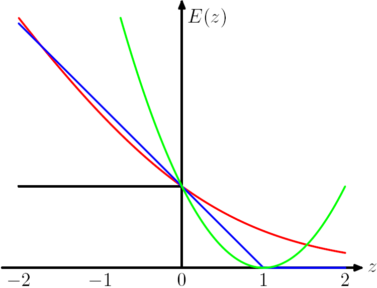

图3.6-1 损失函数曲线

注： 图中绿色的线为 `square loss` ，蓝色的线为 `hinge loss`， 红的的线为负 `log` 损失。

#### 3.6.1  二分类问题

给定数据集  `T={(x_i,y_i)}^N_{i=1}` ， 要用这些数据做一个线性分类器，即求得最优分离超平面 `w⋅x+b=0` 来将样本分为正负两类，给定数据集后只需求得最优的参数  `w,b` 即可，为了解决这个问题，首先做出如下线性映射函数
$$
\tag{3.6-5}
y=w\cdot x+b
$$
根据经验风险最小化原则， 这里引入二分类的 `Hinge Loss` :
$$
\tag{3.6-6}
\max(0,1-y_i(w\cdot x_i+b))
$$
上图中对应的 `E(z)=max(0,1−z)` ，所以`SVM`可以通过直接最小化如下损失函数二求得最优的分离超平面：
$$
\tag{3.6-7}
\min_{w,b}\sum_{i=1}^{N}{\{\max(0,1-y_i(w\cdot x_i+b))+\lambda ||w||^2\}}
$$
#### 3.6.2  多分类问题
对于多分类问题，现在要用这些数据做一个 `k` 类的线性分类器 ,现在需要优化的参数变为 `W,b` ， 此时的 `W∈R^{k×n}`，为一个 `k×n `的矩阵，`b∈R^k` 为一个向量，现在的映射关系如下 ：`s=W x_i+b`，此时有 `s∈R^k`  ，`s `中的每个分量代表分类器在该类别的得分，样本 `x_i `的标签  `y_i∈R^k` , 这里若 `x_i` 属于类别 `k` ，则 `y_i` 中除了第 `k` 个分量外其余元素全为 0 ，比如 5 分类问题，` x_i`  属于第 3 类，则有 ` y_i=[0,0,1,0,0] ` , 用 `s_j` 表示得分向量 `s` 中的第` j` 个分量 ，` s_{y_i} `表示对应` y_i=1` 的分量，则单个样本多分类的`Hinge Loss`可表示为：
$$
\tag{3.6-8}
\sum_{j\neq y_i}\max(0,s_j-s_{y_i}+1)
$$
分类线性分类`SVM` 的 `Hinge Loss`表示为：
$$
\tag{3.6-9}
\min_{W,b}\sum_{i=1}^{N}\sum_{j\neq y_i}\max(0,s_j-s_{y_i}+1)+\lambda\sum_{k}\sum_{n}W^2_{k,n}
$$

