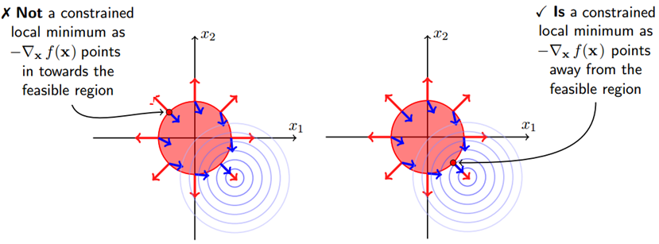
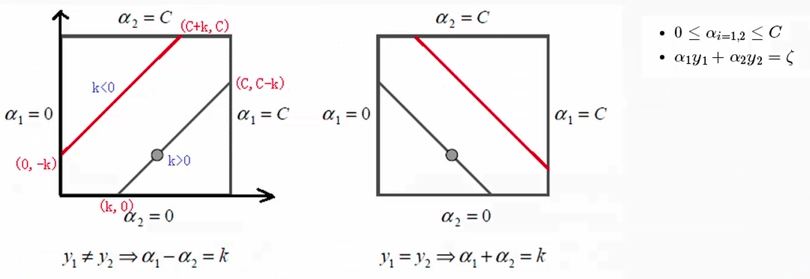

# 机器学习

[TOC]

## 2 课程内容

### 2.1 线性回归

#### 2.1.1 原理

对于一组样本，可以分为两部分，一部分用于训练，一部分用于检验。
$$ {math_1}
\tag{2.1-1}
h_\theta(x) = \theta_0 +\theta_1x_1+\theta_2x_2+...+\theta_nx_n
$$
当用于训练时，我们已知`X`和`y`，求`theta`。当`y`的值域为连续时，称其为线性回归，若其为离散值集合，则称其为分类。

为了便于表达，设`x_0 = 1`，那么
$$
\tag{2.1-2} h_\theta(x) = \theta_0x_0+\theta_1x_1+\theta_2x_2+...+\theta_nx_n\\= \sum_{i=0}^{n}{\theta_ix_i} = \theta^T.X
$$
那么怎么求`theta`呢？如何评价我们求出来的`theta`最好呢？
$$
y_i = \theta^Tx^{(i)}+\xi^{(i)}
y_i = \theta^Tx^{(i)}+\xi^{(i)} \tag{2.1-3}
$$
上式中的`y`表示真实值，`\xi`表示误差，显然误差`\xi^i`独立且同分布，它们都服从均值为0,方差为`delta^2`的高斯分布。
$$
y_i=h_\theta(x)+\xi^{(i)} \tag{2.1-4}
\\p(\xi^{(i)})=\frac{1}{\sqrt{2\pi}\delta}e^{(-\frac{(\xi^{(i)})^2}{2\delta^2})}
$$
可以表示误差为上式，使`y`最成为真实值得概率最大可表示为
$$
p(y^{(i)}|x^{(i)};\theta) =\frac{1}{\sqrt{2\pi}\delta}e^{(-\frac{(y^{(i)}-\theta^Tx^{(i)})^2}{2\delta^2})} \tag{2.1-5}
$$
其的似然函数为
$$
L(\theta)=\prod_{i=1}^{m}{p(y^{(i)}|x^{(i)};\theta)}
\\=\prod^{m}_{i=1}{\frac{1}{\sqrt{2\pi}\delta}e^{(-\frac{(y^{(i)}-\theta^Tx^{(i)})^2}{2\delta^2})}} \tag{2.1-6}
$$
要使`L\theta`最大，但是连乘比较难以计算，可以使用对数似然函数来代替。
$$
l(\theta)=\log{L(\theta)} \tag{2.1-7}
\\=\log{\prod^{m}_{i=1}{\frac{1}{\sqrt{2\pi}\delta}e^{(-\frac{(y^{(i)}-\theta^Tx^{(i)})^2}{2\delta^2})}}}
\\=\sum_{i=0}^{m}{\log{\frac{1}{\sqrt{2\pi}\delta}e^{(-\frac{(y^{(i)}-\theta^Tx^{(i)})^2}{2\delta^2})}}}
\\=m\log{\frac{1}{\sqrt{2\pi}\delta}} - \frac{1}{\delta^2}\cdot\frac{1}{2}
\sum^{m}_{i=1}{(y^{(i)}-\theta^Tx^{(i)})^2}
$$
上述公式的前半部分为固定值，后面部分为减去一个正值。我们在上式的后半部分找到目标函数`J\theta`，使其最小既可。下式也可以这么理解，使我们求出来的值和实际的值误差最小。
$$
J(\theta) =\frac{1}{2}\cdot\sum_{i=1}^{m}{(h_\theta(x^{(i)})-y^{(i)})^2}
\\ =\frac{1}{2}(X\theta-y)^T(X\theta-y)
\\
\\ \frac{\partial J(\theta)}{\partial\theta}=\nabla_{\theta}J(\theta)
\\ = \nabla_\theta(\frac{1}{2}(X\theta-y)^T(X\theta-y))
\\ = \nabla_\theta(\frac{1}{2}(\theta^TX^T-y^T)(X\theta-y))
\\ = \nabla_\theta(\frac{1}{2}(\theta^TX^TX\theta-\theta^TX^Ty-y^TX\theta+y^Ty))
\\ = \frac{1}{2}(2X^TX\theta-X^Ty-(y^TX)^T)
\\ = X^TX\theta-X^Ty \tag{2.1-8}
$$
对J求导，找到其极值的点，那么
$$
\mathbf{\theta} =\mathbf{(X^TX)^{-1}X^Ty} \tag{2.1-9}
$$
需要注意的是，不是所有的`X`的逆都存在，很多情况下，需要使用迭代方法能求解，例如下面的梯度下降算法。

#### 2.1.2 实现

```python
import matplotlib.pyplot as plt
import numpy as np
from sklearn import datasets

class LinearRegression():
    def __init__(self):
        self.w = None

    def fit(self, X, y):
        X = np.insert(X, 0, 1, axis=1)
        print (X.shape)        
        X_ = np.linalg.inv(X.T.dot(X))
        self.w = X_.dot(X.T).dot(y)
        

    def predict(self, X):
        # Insert constant ones for bias weights
        X = np.insert(X, 0, 1, axis=1)
        y_pred = X.dot(self.w)
        return y_pred

```

使用python的类来定义线性回归算法，`w`为`theta`，`fit`函数学习、训练，`predict`函数给出预测值。我们使用`mean_squared_error`函数来统计误差。

```python
def mean_squared_error(y_true, y_pred):
    mse = np.mean(np.power(y_true - y_pred, 2))
    return mse
```

下面给出`main`函数：

```python
def main():
    # Load the diabetes dataset
    diabetes = datasets.load_diabetes()

    # Use only one feature
    X = diabetes.data[:, np.newaxis, 2]
    print (X.shape)
    # Split the data into training/testing sets
    x_train, x_test = X[:-20], X[-20:]

    # Split the targets into training/testing sets
    y_train, y_test = diabetes.target[:-20], diabetes.target[-20:]

    clf = LinearRegression()
    clf.fit(x_train, y_train)
    y_pred = clf.predict(x_test)

    # Print the mean squared error
    print ("Mean Squared Error:", mean_squared_error(y_test, y_pred))

    # Plot the results
    plt.scatter(x_test[:,0], y_test,  color='black')
    plt.plot(x_test[:,0], y_pred, color='blue', linewidth=3)
    plt.show()
    
main()
```

数据集采用相同默认的数据集，运行结果如下：

```
(442, 1)
(422, 2)
Mean Squared Error: 2548.072398725972
```


 <p align="center">图2.1-1 Linear Regression</p>

#### 2.1.3 使用逻辑回归进行分类的原理

  利用`Sigmoid`函数进行分类：
$$
g(z)=\frac{1}{1+e^{-z}}\\ \tag{2.1-10}
=>  g'(x) =(\frac{1}{1+e^{-x}})'\\
=\frac{e^{-x}}{(1+e^{-x})^2} \\
= \frac{1}{1+e^{-x}}\cdot\frac{e^{-x}}{1+e^{-x}} \\
= \frac{1}{1+e^{-x}}\cdot(1-\frac{1}{1+e^{-x}}) \\
= g(x)\cdot(1-g(x))
$$
结合逻辑回归的公式可以得到：
$$
h_\theta(x) = g(\theta^T.X) = \frac{1}{1+e^{-\theta^T.X}} \tag{2.1-11}
$$
当我们将其分为两类时，就有：
$$
\begin{equation} \tag{2.1-12}
\left\{
\begin{array}{rl}
p(y=1|x;\theta) = h_\theta(x)\\
p(y=0|x;\theta) = 1-h_\theta(x)
\end{array}
\right.
\end{equation}
\\
=>p(y|x;\theta) = (h_\theta(x))^y + (1-h_\theta(x))^{1-y}
$$
同样，为了求其极值，其似然函数如下：
$$
L(\theta) = p(\overrightarrow{y}|X;\theta)\\
=\sum_{i=1}^{m}{p(y^{(i)}|x^{(i)};\theta)} \\
=\sum_{i=1}^{m}{(h_\theta(x^{(i)}))^{y^{(i)}}(1-h_\theta(x^{(i)}))^{1-y^{(i)}}} \tag{2.1-13}
$$
对上式求导之后，对数似然函数为：
$$
l(\theta) = \log{L(\theta)} \\
\ \ \ \ \ \ =\sum_{i=1}^{m}{y^{(i)}\log{h(x^{(i)})} +(1-y^{(i)})\log{1-h(x^{(i)})}} \tag{2.1-14}
$$
很多时候偏导很难求，我们需要使用下面的算法来解决这个问题。

### 2.2 梯度下降

#### 2.2.1 原理

在对数据进行处理时，一般需要现对数据进行归一化处理，即减去均值然后除以标准差。一组值得均值、方差和标准差计算公式如下：
$$
mean(X) = \frac{1}{n}\sum_{i=1}^{n}{x_i} \\
var(X) = \frac{1}{n}\sum_{i=1}^{n}{(x_i - mean(X))^2} \\
std(X) = \sqrt{var(X)}  \tag{2.2-1}
$$
梯度：对于一个点`L`，其偏导函数带入`L`的值就为该点的梯度。梯度为该点的最大下降方向，矢量，有方向和值。
$$
h_\theta(x) = \theta_1x+\theta_0 \\ \tag{2.2-2}
J(\theta_0,\theta_1)=\frac{1}{2m}\sum_{i=1}^{m}{(h_\theta(x)-y_i)^2} \\
\frac{\partial J(\theta_0,\theta_1)}{\partial(\theta_0)}=\frac{1}{m}\sum_{i=1}^{m}{(h_\theta(x)-y_i)} \\
\frac{\partial J(\theta_0,\theta_1)}{\partial(\theta_1)}=\frac{1}{m}\sum_{i=1}^{m}{(h_\theta(x)-y_i)*x_i} \\
$$
那么可以给出`\theta`的步进，迭代公式：
$$
\theta_1=\theta_1-\alpha\cdot\frac{\partial J(\theta_0,\theta_1)}{\partial(\theta_0)} \\ \tag{2.2-3}
\theta_0=\theta_0-\alpha\cdot\frac{\partial J(\theta_0,\theta_1)}{\partial(\theta_1)}
$$
根据`\theta`的变换，不断计算`cost`函数的大小，即J的结果，直至满足一定条件退出。

#### 2.2.2 实现

加载原始数据，做归一化处理：

```python
import pandas
import matplotlib.pyplot as plt

# Read data from csv
pga = pandas.read_csv("pga.csv")


# Normalize the data
pga.distance = (pga.distance - pga.distance.mean()) / pga.distance.std()
pga.accuracy = (pga.accuracy - pga.accuracy.mean()) / pga.accuracy.std()
print(pga.head())

plt.scatter(pga.distance, pga.accuracy)
plt.xlabel('normalized distance')
plt.ylabel('normalized accuracy')
plt.show()

```


 <p align="center">图2.2-1 归一化后的原始数据</p>

使用线性回归做对照试验，其结果如下所示：

```python
# accuracyi=θ1distancei+θ0+ϵ

from sklearn.linear_model import LinearRegression
import numpy as np

# We can add a dimension to an array by using np.newaxis
print("Shape of the series:", pga.distance.shape)  # Shape of the series: (197,)
print("Shape with newaxis:", pga.distance[:, np.newaxis].shape) # Shape with newaxis: (197, 1)

# The X variable in LinearRegression.fit() must have 2 dimensions
lm = LinearRegression()
lm.fit(pga.distance[:, np.newaxis], pga.accuracy)
theta1 = lm.coef_[0]
print (theta1) # -0.607598822715
```

下面给出梯度下降的代码实现，首先给出其`cost` 函数实现，并在给定`theta0`的前提下，从-3到2给出100个`theta1`来计算`cost`结果。

```python
# The cost function of a single variable linear model
def cost(theta0, theta1, x, y):
    # Initialize cost
    J = 0
    # The number of observations
    m = len(x)
    # Loop through each observation
    for i in range(m):
        # Compute the hypothesis 
        h = theta1 * x[i] + theta0
        # Add to cost
        J += (h - y[i])**2
    # Average and normalize cost
    J /= (2*m)
    return J

# The cost for theta0=0 and theta1=1
print(cost(0, 1, pga.distance, pga.accuracy))

theta0 = 100
theta1s = np.linspace(-3,2,100)
costs = []
for theta1 in theta1s:
    costs.append(cost(theta0, theta1, pga.distance, pga.accuracy))

plt.plot(theta1s, costs)
plt.show()
```


 <p align="center">图2.2-2 cost的实现与测试</p>

上面的示例中，我们固定`theta0`，下面同时在两个区间内观察`theta0`和`theta1`对`cost`值得影响，下图中图一为测试数据。
```python
import numpy as np
from mpl_toolkits.mplot3d import Axes3D

# Example of a Surface Plot using Matplotlib
# Create x an y variables
x = np.linspace(-10,10,100)
y = np.linspace(-10,10,100)

# We must create variables to represent each possible pair of points in x and y
# ie. (-10, 10), (-10, -9.8), ... (0, 0), ... ,(10, 9.8), (10,9.8)
# x and y need to be transformed to 100x100 matrices to represent these coordinates
# np.meshgrid will build a coordinate matrices of x and y
X, Y = np.meshgrid(x,y)
#print(X[:5,:5],"\n",Y[:5,:5])

# Compute a 3D parabola 
Z = X**2 + Y**2 

# Open a figure to place the plot on
fig = plt.figure()
# Initialize 3D plot
ax = fig.gca(projection='3d')
# Plot the surface
ax.plot_surface(X=X,Y=Y,Z=Z)

plt.show()

# Use these for your excerise 
theta0s = np.linspace(-2,2,100)
theta1s = np.linspace(-2,2, 100)
COST = np.empty(shape=(100,100))
# Meshgrid for paramaters 
T0S, T1S = np.meshgrid(theta0s, theta1s)
# for each parameter combination compute the cost
for i in range(100):
    for j in range(100):
        COST[i,j] = cost(T0S[0,i], T1S[j,0], pga.distance, pga.accuracy)

# make 3d plot
fig2 = plt.figure()
ax = fig2.gca(projection='3d')
ax.plot_surface(X=T0S,Y=T1S,Z=COST)
plt.show()
```


 <p align="center">图2.2-3  二维变量对cost的影响</p>

下面给出`theta0`和`theta1`沿最大梯度方向步进的算法：
```python
def partial_cost_theta1(theta0, theta1, x, y):
    # Hypothesis
    h = theta0 + theta1*x
    # Hypothesis minus observed times x
    diff = (h - y) * x
    # Average to compute partial derivative
    partial = diff.sum() / (x.shape[0])
    return partial

partial1 = partial_cost_theta1(0, 5, pga.distance, pga.accuracy)

print("partial1 =", partial1)
# Partial derivative of cost in terms of theta0
def partial_cost_theta0(theta0, theta1, x, y):
    # Hypothesis
    h = theta0 + theta1*x
    # Difference between hypothesis and observation
    diff = (h - y)
    # Compute partial derivative
    partial = diff.sum() / (x.shape[0])
    return partial

partial0 = partial_cost_theta0(1, 1, pga.distance, pga.accuracy)

```
即`J`对`theta`求偏导。
下面给出关键算法：

```python
# x is our feature vector -- distance
# y is our target variable -- accuracy
# alpha is the learning rate
# theta0 is the intial theta0 
# theta1 is the intial theta1
def gradient_descent(x, y, alpha=0.1, theta0=0, theta1=0):
    max_epochs = 1000 # Maximum number of iterations
    counter = 0      # Intialize a counter
    c = cost(theta1, theta0, pga.distance, pga.accuracy)  ## Initial cost
    costs = [c]     # Lets store each update
    # Set a convergence threshold to find where the cost function in minimized
    # When the difference between the previous cost and current cost 
    #        is less than this value we will say the parameters converged
    convergence_thres = 0.000001  
    cprev = c + 10   
    theta0s = [theta0]
    theta1s = [theta1]

    # When the costs converge or we hit a large number of iterations will we stop updating
    while (np.abs(cprev - c) > convergence_thres) and (counter < max_epochs):
        cprev = c
        # Alpha times the partial deriviative is our updated
        update0 = alpha * partial_cost_theta0(theta0, theta1, x, y)
        update1 = alpha * partial_cost_theta1(theta0, theta1, x, y)

        # Update theta0 and theta1 at the same time
        # We want to compute the slopes at the same set of hypothesised parameters
        #             so we update after finding the partial derivatives
        theta0 -= update0
        theta1 -= update1
        
        # Store thetas
        theta0s.append(theta0)
        theta1s.append(theta1)
        
        # Compute the new cost
        c = cost(theta0, theta1, pga.distance, pga.accuracy)

        # Store updates
        costs.append(c)
        counter += 1   # Count

    return {'theta0': theta0, 'theta1': theta1, "costs": costs}

print("Theta1 =", gradient_descent(pga.distance, pga.accuracy)['theta1'])
# ('Theta1 =', -0.60469831663796081)
descend = gradient_descent(pga.distance, pga.accuracy, alpha=.01)
plt.scatter(range(len(descend["costs"])), descend["costs"])
plt.show()
```
在上面的算法中，我们规定算法的迭代次数最多为`max_epochs`，或者当前计算的`cost`和上一次迭代时`cost`的差值小于`convergence_thres`时就结束迭代。在每次迭代中，更新(-=，下降；+=上升)`theta`，重新计算`cost`,直到推出迭代。


 <p align="center">图2.2-4  梯度下降中cost的变化</p>

### 2.3 决策树

决策树算法是一个分类算法，也可以回归。决策树算法分为两个阶段，构造决策树，即训练阶段，利用决策树决策，即分类阶段。在构造决策树时，为了避免异常值对决策树的影响、构造的决策树过拟合等问题，还需考虑剪枝，剪枝分为预剪枝和后剪枝。

#### 2.3.1 基本概念

##### 2.3.1.1 熵

使用熵来衡量信息的无序性或者不确定。假设事件`A`的全概率划分为： 
$$
(A_1,A_2,A_3,\cdots,A_n) \tag{2.3-1}
$$
每部分发生的概率为：
$$
(p_1,p_2,p_3,\cdots,p_n) \tag{2.3-2}
$$
那么信息熵的定义为：
$$
entropy(p_i) = entropy(p_1,p_2,p_3,\cdots,p_n) \\= - \tag{2.3-3} p_1\log_2{p_1}-p_2\log_2{p_2}-\cdots-p_n\log_2{p_n} \\
= - \sum_{i=1}^{n}{p_i\ln{p_i}}
$$

Tips： 熵值越大代表集合内的元素越混乱，我们可以考察`y=lnx`函数，其中
$$
x\in[0,1] =>  y\in[-\infty,0]\\  \tag{2.3-4}
 p(x,y) = p(x) \cdot p(y) \ \ \ \ \\ s.t. \  \ x\ and\ y\ are\ independent\ of\ each\ other.
$$
利用这个函数将概率值转换表达集合混乱程度的熵。

##### 2.3.1.2 `Gnin`系数`CART`算法

除了使用信息熵来表示集合的混论程度，还可以使用`Gnin`系数表示。
$$
Gnin(P) = \sum_{i=1}^{n}{p_i(1-p_i)} \tag{2.3-5}
\\ = 1- \sum_{i=1}^{n}{p_i^2}
$$
##### 2.3.1.3 信息增益`ID3`算法

假设我们将集合`A`的元素`a_i`,具有
$$
\{attr_1,attr_2,\cdots,attr_m\} \tag{2.3-6}
$$
共`m`个属性，做个划分，一般依赖某个属性进行划分，假设我们按照`attr_s`进行划分。划分之后对每一个A的真子集`A_i`，我们可以计算出其所有的子集针对`attr_t`属性的信息熵的和，记作

$$
\sum_{i\in{\{A[attr_s]\}}}^{}{entropy_{partition}(attr_t|i)} \tag{2.3-7}
$$

，原始集合中针对attr_t属性的信息熵记作
$$
entropy_{origin}(attr_t) \tag{2.3-8}
$$
，那么其信息增益为
$$
gain(attr_t|attr_s) = entropy_{origin}(attr_t) \\- \sum_{i\in{\{A[attr_s]\}}}^{}{entropy_{partition}(attr_t|i)}
\tag{2.3-9}
$$

即按照属性s对集合进行划分之后，信息熵的增加。这里需要说明的当属性s的取值很多时，或者对应的样本个数很少时，(考虑按照ID进行分类，那么划分之后的信息熵为0，信息增益很大，但这样的划分没有意义)。

##### 2.3.1.4 信息增益率C4.5算法

$$
gain_R(attr_t|attr_s) = \frac{gain(attr_t|attr_s)}{entropy(attr_s)} \tag{2.3-10}
$$


##### 2.3.1.5 评价函数

评价决策树好坏的评价函数，类似于损失函数，越小越好。
$$
C(T) = \sum_{t\in{leaf}}{N_t\cdot H(t)} \tag{2.3-11}
$$
即每个叶子节点元素的个数乘以节点的信息熵或者`Gini`系数之和，生成的决策树信息熵损失的最好，那么认为构造的决策树较好。
```
dot -Tpdf iris.dot -o iris.pdf
```

##### 2.3.1.6 随机森林模型

利用多棵决策树进行分类和回归。利用原始的训练集，每次随机选择部分样本和部分特征，构造多棵决策树。

`Bootstraping`:有放回采样。

`Bagging`:有放回采样n个样本一共建立n个分类器。


每一个决策树队对应一个分类器：
$$
T_1(x)\\ \tag{2.3-12}
T_2(x)\\
T_B(x)
$$
我们将需要分类的样本送入随机的多个分类器中，利用`sign`函数将其结果综合得到最终的结论。
$$
sign[\sum{T_b(x)}] \tag{2.3-13}
$$
#### 2.3.2 构造决策树

​	对于连续型属性，可先将其离散 化之后，在计算各个分离区间的`Giant`值。在构造时我们暂时忽略缺失值。

#### 2.3.3 决策树裁剪

​	构造决策树的基本想法是随着树的深度增加，节点的熵迅速降低，熵值降低的速度越快，构造的决策树就越矮。很多时候，构造的决策树的高度过于高，即节点的熵之和很小，但这样的决策树预测的结果并不好，这种情况称为过拟合，即将一些噪音点或者错误点也构造进入了你的决策树中。

##### 2.3.3.1 预剪枝

限制树高，或确定最少节点个数，在构建决策树的过程中提前终止。

##### 2.3.3.2 后剪枝

决策树构建之后再合并一些叶节点。 
$$
C_a(T) = C(T) + a\cdot|T_{leaf}| \tag{2.3-14}
$$
将损失函数增加对叶子节点过多时的惩罚，`a`为惩罚系数，`T_leaf`表示叶子节点个数。分别计算当前这个节点其作为树根节点时的损失函数，和若它本身为叶子节点时的损失函数。
#### 2.3.2 实现

##### 2.3.2.1 数据源介绍和基本知识

导入数据源，由于数据无表头，需要通过第三行语句处理一下。

```python
import pandas as pd

iris_data = pd.read_csv('iris.data')
iris_data.columns = ['sepal_length_cm', 'sepal_width_cm', 'petal_length_cm', 'petal_width_cm', 'class']
iris_data.head()
```
数据如下：
```
sepal_length_cm 	sepal_width_cm 	petal_length_cm 	petal_width_cm 	class
0 	4.9 	3.0 	1.4 	0.2 	Iris-setosa
1 	4.7 	3.2 	1.3 	0.2 	Iris-setosa
2 	4.6 	3.1 	1.5 	0.2 	Iris-setosa
3 	5.0 	3.6 	1.4 	0.2 	Iris-setosa
4 	5.4 	3.9 	1.7 	0.4 	Iris-setosa
```
也可使用如下语句展示原始数据中的统计信息。
```python
iris_data.describe()
````
```
sepal_length_cm 	sepal_width_cm 	petal_length_cm 	petal_width_cm
count 	149.000000 	149.000000 	149.000000 	149.000000
mean 	5.848322 	3.051007 	3.774497 	1.205369
std 	0.828594 	0.433499 	1.759651 	0.761292
min 	4.300000 	2.000000 	1.000000 	0.100000
25% 	5.100000 	2.800000 	1.600000 	0.300000
50% 	5.800000 	3.000000 	4.400000 	1.300000
75% 	6.400000 	3.300000 	5.100000 	1.800000
max 	7.900000 	4.400000 	6.900000 	2.500000
```
可以使用如下语句，展示一副图片：

```python
from PIL import Image
img=Image.open('test.jpg')
plt.imshow(img)
plt.show()
```


 <p align="center">图2.3-1  图片</p>

利用`seaborn`库来展示数据。若系统没有安装`seaborn`，可执行`pip install seanborn`来安装。
```python
%matplotlib inline

import matplotlib.pyplot as plt
import seaborn as sb

sb.pairplot(iris_data.dropna(), hue='class')

plt.figure(figsize=(10, 10))
for column_index, column in enumerate(iris_data.columns):
    if column == 'class':
        continue
    plt.subplot(2, 2, column_index + 1)
    sb.violinplot(x='class', y=column, data=iris_data)
```


 <p align="center">图2.3-2  数据源展示</p>
在图2.3-2中第一幅图为散点图，表示两个属性时类别的分布情况，对角线上位该属性自己的分布；第二部图为小提琴图，展示了不同类别下属性的分布情况。
注意，利用`pairplot`展示数据时，不能存在缺失值，此处我们使用`dropna`函数删除了缺失值，也可以采用数据清洗的方式补全或进行其它处理。

##### 2.3.2.2 使用决策树
**对数据做交叉验证**

```python
from sklearn.cross_validation import train_test_split

all_inputs = iris_data[['sepal_length_cm', 'sepal_width_cm',
                             'petal_length_cm', 'petal_width_cm']].values

all_classes = iris_data['class'].values

(training_inputs,
 testing_inputs,
 training_classes,
 testing_classes) = train_test_split(all_inputs, all_classes, train_size=0.75, random_state=1)
```
`train_test_split`函数用于将矩阵随机划分为训练子集和测试子集，并返回划分好的训练集测试集样本和训练集测试集标签。

格式：
```python
x_train,x_test, y_train, y_test =cross_validation.train_test_split(train_data,train_target,test_size=0.3, random_state=0)
```
参数解释：
`train_data`：被划分的样本特征集
`train_target`：被划分的样本标签
`test_size`：如果是浮点数，在0-1之间，表示样本占比；如果是整数的话就是样本的数量
`random_state`：是随机数的种子。
随机数种子：其实就是该组随机数的编号，在需要重复试验的时候，保证得到一组一样的随机数。比如你每次都填1，其他参数一样的情况下你得到的随机数组是一样的。但填0或不填，每次都会不一样。
随机数的产生取决于种子，随机数和种子之间的关系遵从以下两个规则：种子不同，产生不同的随机数；种子相同，即使实例不同也产生相同的随机数。
**构造决策树**

```python
from sklearn.tree import DecisionTreeClassifier
#  1.criterion: gini  or  entropy
#用gini系数或熵值构建决策树

#  2.splitter: best or random 
# 前者是在所有特征中找最好的切分点,后者是在部分特征中（数据量大的时候），对连续属性进行离散化

#  3.max_features: None（所有），log2，sqrt，N  
# 特征小于50的时候一般使用所有的,当特征多时，选择使用多少个特征构建决策树

#  4.max_depth  构造决策树使用，最大深度，限制值
# 数据少或者特征少的时候可以不管这个值，如果模型样本量多，特征也多的情况下，可以尝试限制下

#  5.min_samples_split  构造决策树使用，节点最小划分数，限制值
#  如果某节点的样本数少于min_samples_split，则不会继续再尝试选择最优特征来进行划分
#  如果样本量不大，不需要管这个值。如果样本量数量级非常大，则推荐增大这个值。

#  6.min_samples_leaf  构造决策树使用，节点的最小样本数，限制值
#  限制了叶子节点最少的样本数，如果某叶子节点数目小于样本数，则会和兄弟节点一起被
#  剪枝，如果样本量不大，不需要管这个值，大些如10W可是尝试下5

#  7.min_weight_fraction_leaf 
# 限制了叶子节点所有样本权重和的最小值，如果小于这个值，则会和兄弟节点一起
# 被剪枝默认是0，就是不考虑权重问题。一般来说，如果我们有较多样本有缺失值，
# 或者分类树样本的分布类别偏差很大，就会引入样本权重，这时我们就要注意这个值了。

#  8.max_leaf_nodes 构造决策树使用，节点最大划分数，限制值
# 通过限制最大叶子节点数，可以防止过拟合，默认是"None”，即不限制最大的叶子节点数。
# 如果加了限制，算法会建立在最大叶子节点数内最优的决策树。
# 如果特征不多，可以不考虑这个值，但是如果特征分成多的话，可以加以限制
# 具体的值可以通过交叉验证得到。

#  9.class_weight 
# 指定样本各类别的的权重，主要是为了防止训练集某些类别的样本过多
# 导致训练的决策树过于偏向这些类别。这里可以自己指定各个样本的权重
# 如果使用“balanced”，则算法会自己计算权重，样本量少的类别所对应的样本权重会高。

#  10.min_impurity_split 节点的不纯度
# 限制了决策树的增长，如果某节点的不纯度
#(基尼系数，信息增益，均方差，绝对差)小于这个阈值
#则该节点不再生成子节点。即为叶子节点 。

decision_tree_classifier = DecisionTreeClassifier()

# Train the classifier on the training set
decision_tree_classifier.fit(training_inputs, training_classes)

# Validate the classifier on the testing set using classification accuracy
decision_tree_classifier.score(testing_inputs, testing_classes)
# Output:  0.97368421052631582
```
上述参数的作用都是为了防止生成的决策树过拟合，太大太高.过拟合的具体表现为在测试数据中表现很好，实际数据表现很差。

```python
from sklearn.cross_validation import cross_val_score
import numpy as np
decision_tree_classifier = DecisionTreeClassifier()

# cross_val_score returns a list of the scores, which we can visualize
# to get a reasonable estimate of our classifier's performance
cv_scores = cross_val_score(decision_tree_classifier, all_inputs, all_classes, cv=10)
print (cv_scores)
# Output: [ 1.          0.93333333  1.          0.93333333  0.93333333  0.86666667   0.93333333  0.93333333  1.          1.        ]

#kde=False
sb.distplot(cv_scores)
plt.title('Average score: {}'.format(np.mean(cv_scores)))
```


 <p align="center">图2.3-3  默认参数决策树的效果</p>

若调整参数，将决策树的最大深度调整为1：
```python
decision_tree_classifier = DecisionTreeClassifier(max_depth=1)

cv_scores = cross_val_score(decision_tree_classifier, all_inputs, all_classes, cv=10)
print (cv_scores)
# Output: [ 0.66666667  0.66666667  0.66666667  0.66666667  0.66666667  0.66666667   0.66666667  0.66666667  0.66666667  0.64285714]

sb.distplot(cv_scores, kde=False)
plt.title('Average score: {}'.format(np.mean(cv_scores)))
```


 <p align="center">图2.3-4  决策树参数的影响效果</p>

 参数调优，对`max_depth`和`max_features`分别测试最优取值。
 ```python
 from sklearn.grid_search import GridSearchCV
from sklearn.cross_validation import StratifiedKFold

decision_tree_classifier = DecisionTreeClassifier()

parameter_grid = {'max_depth': [1, 2, 3, 4, 5],
                  'max_features': [1, 2, 3, 4]}

cross_validation = StratifiedKFold(all_classes, n_folds=10)

grid_search = GridSearchCV(decision_tree_classifier,
                           param_grid=parameter_grid,
                           cv=cross_validation)

grid_search.fit(all_inputs, all_classes)
print('Best score: {}'.format(grid_search.best_score_))
print('Best parameters: {}'.format(grid_search.best_params_))
# Output: Best score: 0.9664429530201343
# Best parameters: {'max_features': 3, 'max_depth': 5}
 ```
`max_depth`和`max_features`取值对分类效果的影响：
```python
grid_visualization = []

for grid_pair in grid_search.grid_scores_:
    grid_visualization.append(grid_pair.mean_validation_score)
    
grid_visualization = np.array(grid_visualization)
grid_visualization.shape = (5, 4)
sb.heatmap(grid_visualization, cmap='Blues')
plt.xticks(np.arange(4) + 0.5, grid_search.param_grid['max_features'])
plt.yticks(np.arange(5) + 0.5, grid_search.param_grid['max_depth'][::-1])
plt.xlabel('max_features')
plt.ylabel('max_depth')
```


 <p align="center">图2.3-5  调整参数影响的效果</p>
最佳决策树的详细参数：
```python
decision_tree_classifier = grid_search.best_estimator_
decision_tree_classifier
# Output : DecisionTreeClassifier(class_weight=None, criterion='gini', max_depth=5,
# max_features=3, max_leaf_nodes=None, min_impurity_split=1e-07,
#           min_samples_leaf=1, min_samples_split=2,
#            min_weight_fraction_leaf=0.0, presort=False, random_state=None,
#            splitter='best')
```
将生成的决策树导出，之后可利用其他工具将其可视化：
```python
import sklearn.tree as tree
from sklearn.externals.six import StringIO

with open('iris_dtc.dot', 'w') as out_file:
    out_file = tree.export_graphviz(decision_tree_classifier, out_file=out_file)
#http://www.graphviz.org/
```
使用命令行将之前生成的决策树可视化：`dot -Tpdf iris.dot -o iris.pdf`


 <p align="center">图2.3-6  决策树</p>

##### 2.3.2.3 随机森林
```python
from sklearn.ensemble import RandomForestClassifier

random_forest_classifier = RandomForestClassifier()

parameter_grid = {'n_estimators': [5, 10, 25, 50],
                  'criterion': ['gini', 'entropy'],
                  'max_features': [1, 2, 3, 4],
                  'warm_start': [True, False]}

cross_validation = StratifiedKFold(all_classes, n_folds=10)

grid_search = GridSearchCV(random_forest_classifier,
                           param_grid=parameter_grid,
                           cv=cross_validation)

grid_search.fit(all_inputs, all_classes)
print('Best score: {}'.format(grid_search.best_score_))
print('Best parameters: {}'.format(grid_search.best_params_))
# Output: Best score: 0.9664429530201343
# Best parameters: {'criterion': 'gini', 'n_estimators': 5, 'max_features': 1, 'warm_start': True}

grid_search.best_estimator_
# Output: RandomForestClassifier(bootstrap=True, class_weight=None, criterion='gini',
#            max_depth=None, max_features=1, max_leaf_nodes=None,
#            min_impurity_split=1e-07, min_samples_leaf=1,
#            min_samples_split=2, min_weight_fraction_leaf=0.0,
#            n_estimators=5, n_jobs=1, oob_score=False, random_state=None,
#            verbose=0, warm_start=True)
```

### 2.4 贝叶斯

#### 2.4.1 原理

贝叶斯（约1701~1761）`Thomas Bayes`，英国数学家。贝叶斯方法源于他解决了一个“逆概率”问题写的一篇 文章。

**正向概率**：假设袋子里面`N`个白球，`M`个黑球，任意取出一个，是黑球的概率是多少？
$$
p(M)=\frac{M}{N+M} \tag{2.4-1}
$$
**逆向概率**：若取出一个或多个球，观察取出球的颜色，那么我们可以对袋子内黑白球比例做出什么样的猜测呢？

在实际中`M`，`N`就是不确定的，我们观察的样本有限，所以才有了抽样统计。

**例**: 60%的男生，40%的女生，50%的女生的穿裙子。

那么 **正向概率**：随机一个学生，ta穿长裤的概率是多少？**逆向概率**：一个穿长裤的学生，那么ta是女生的概率是多少？

**解**：假设总数为`U`人，那么穿长裤男生的概率为：
$$
p = U \cdot P(Boy) \cdot P(Pants|Boy) \tag{2.4-2}
$$
其中：`P(Boy)`是男生的概率，60%。`P(Pants|Boy)`是条件概率，在是男孩的情况下穿长裤的概率，100%。

穿长裤的女生：
$$
p = U \cdot P(Girl) \cdot P(Pants|Girl) \tag{2.4-3}
$$
其中，女生概率40%，在是女孩的前提下，穿长裤的概率是50%。

那么穿长裤的总数为：
$$
U \cdot P(Boy) \cdot P(Pants|Boy) + U \cdot P(Girl) \cdot P(Pants|Girl)\tag{2.4-4}
$$
穿裤子是女生的概率为：
$$
P(Girl|Pants)\\ = \frac{U \cdot P(Girl) \cdot P(Pants|Girl)}{U \cdot P(Boy) \cdot P(Pants|Boy) + U \cdot P(Girl) \cdot P(Pants|Girl)} \\
 = \frac{P(Girl) \cdot P(Pants|Girl)}{P(Boy) \cdot P(Pants|Boy) + P(Girl) \cdot P(Pants|Girl)} \\
 = \frac{P(Pants, Girl)}{P(Pants)}\tag{2.4-5}
$$
从上式中可以发现，这个概率值和总人数无关，这就是抽样检测的合理之处。

**贝叶斯公式**：
$$
P(A|B) = \frac{P(B|A) \cdot P(A)}{P(B)} \tag{2.4-6}
$$

#### 2.4.2 贝叶斯拼写纠错

**问题**:用户输入一个单词，我们需要猜到底这家伙想输入什么单词？可以表示为：`P(我们猜测他想输入的单词|他实际输入的单词)`。首先，用户输入的单词记为`D`(`Data`, 即观测数据)，对于每个猜测单词可表示为：
$$
\forall  h_i \in Words\ \ \  P(h_i|D) \\  \tag{2.4-7}
P(h|D)
$$
这里统一用`P(h|D)`表示，但其很难求，利用：
$$
P(h|D)\ =\ \frac{P(h)\ \ast\ P(D|h)}{P(D)} \tag{2.4-8}
$$
对于每一我们猜测的单词，需要计算其`P(h_i|D)`，返回概率值最高的即我们纠错的结果。在上式中，对于不同的猜测`h_i`，`P(D)`都是一致的，那么在比较`P(h_i|D)`，就可以忽略这个常数。于是有：
$$
P(h_i|D)\ \varpropto\ P(h_i)\ \ast\ P(D|h_i) \tag{2.4-9}
$$
对于给定的观测数据，一个猜测的好坏，取决于“这个猜测本身独立的可能性大小(先验概率,` Prior`)” 和“这个猜测生成我们观测到数据的可能性的大小”。

**模型比较理论**：
	**最大似然**：最符合观测数据的(即`P(D|h)`最大的)，最有优势；
	**奥卡姆剃刀**:`P(h)`较大的模型有较大优势。

根据奥卡姆剃刀原则，约高阶的多项式越不常见。这就是很多时候我们使用线性规划或者线性拟合的原因。对于`n`的点，`n-1`阶的多项式能够完美的容纳这`n`个点。

​     当先验数据较少时，可能猜测的效果不好，并且我们需要考虑到，如果用户输入的单词并不在我们先验单词的集合时，如何处理？

**代码**

```python
import re, collections

# 把语料中的单词全部抽取出来, 转成小写, 并且去除单词中间的特殊符号
def words(text): return re.findall('[a-z]+', text.lower()) 

#要是遇到我们从来没有过见过的新词怎么办. 假如说一个词拼写完全正确, 但是语料库中没有包含这个词, 从而这个词也永远不会出现在训练集中. 于是, 我们就要返回出现这个词的概率是0. 这个情况不太妙, 因为概率为0这个代表了这个事件绝对不可能发生, 而在我们的概率模型中, 我们期望用一个很小的概率来代表这种情况. lambda: 1
def train(features):
    model = collections.defaultdict(lambda: 1)
    for f in features:
        model[f] += 1
    return model
 
NWORDS = train(words(open('big.txt').read()))
 
alphabet = 'abcdefghijklmnopqrstuvwxyz'
# 编辑距离:
#两个词之间的编辑距离定义为使用了几次插入(在词中插入一个单字母), 删除(删除一个单字母), 交换(交换相邻两个字母), 替换(把一个字母换成另一个)的操作从一个词变到另一个词. 
#返回所有与单词 w 编辑距离为 1 的集合
def edits1(word):
    n = len(word)
    return set([word[0:i]+word[i+1:] for i in range(n)] +                     # deletion
               [word[0:i]+word[i+1]+word[i]+word[i+2:] for i in range(n-1)] + # transposition
               [word[0:i]+c+word[i+1:] for i in range(n) for c in alphabet] + # alteration
               [word[0:i]+c+word[i:] for i in range(n+1) for c in alphabet])  # insertion
 
#与 something 编辑距离为2的单词居然达到了 114,324 个
#优化:在这些编辑距离小于2的词中间, 只把那些正确的词作为候选词,只能返回 3 个单词: ‘smoothing’, ‘something’ 和 ‘soothing’
#返回所有与单词 w 编辑距离为 2 的集合
#在这些编辑距离小于2的词中间, 只把那些正确的词作为候选词
def known_edits2(word):
    return set(e2 for e1 in edits1(word) for e2 in edits1(e1) if e2 in NWORDS)

def known(words): return set(w for w in words if w in NWORDS)

#正常来说把一个元音拼成另一个的概率要大于辅音 (因为人常常把 hello 打成 hallo 这样); 把单词的第一个字母拼错的概率会相对小, 等等.但是为了简单起见, 选择了一个简单的方法: 编辑距离为1的正确单词比编辑距离为2的优先级高, 而编辑距离为0的正确单词优先级比编辑距离为1的高.  
#如果known(set)非空, candidate 就会选取这个集合, 而不继续计算后面的 
def correct(word):
    candidates = known([word]) or known(edits1(word)) or known_edits2(word) or [word]
    return max(candidates, key=lambda w: NWORDS[w])

#appl #appla #learw #tess #morw
correct('morw')
# Output: 'more'
```

**求解：`arg max_c P(c|w) -> arg max_c P(w|c) P(c) / P(w) `**
$$
\arg \max_c{P(c|w)} \to \arg\max_c{\frac{P(w|c)P(c)}{P(w)}}
\tag{2.4-10}
$$


* `P(c)`, 文章中出现一个正确拼写词 c 的概率, 也就是说, 在英语文章中, c 出现的概率有多大
* `P(w|c)`, 在用户想键入 c 的情况下敲成 w 的概率. 因为这个是代表用户会以多大的概率把 c 敲错成 w
* `arg max_c`, 用来枚举所有可能的 c 并且选取概率最大的

#### 2.4.3 垃圾邮件过滤

**问题**:给定一封邮件，判定它是否属于垃圾邮件。`D`表示这封邮件，`D`由多个单词组成。我们用h+表示垃圾邮件，h-表示正常邮件：
$$
P(h+|D)\ =\ \frac{P(h+) \ \ast \ P(D|h+)}{P(D)} \\
P(h-|D)\ =\ \frac{P(h-) \ \ast \ P(D|h-)}{P(D)}\tag{2.4-11}
$$

**先验概率** : `P(h+)`和`P(h-)`这两个先验概率都很容易计算出来，只需统计邮件库中垃圾邮件和正常邮件的比例。

假设`D`中包含`N`个单词`d_i`，那么：
$$
P(D|h+)\ =\ P(d_1,d_2,\cdots,d_n|h+) \\
=\ P(d_1|h+)\ \ast\  P(d_2|d1,h+)\ \ast\  P(d_3|d_2,d_1,h+)\ \ast\cdots \tag{2.4-12}
$$
假设d_i于d_(i-1)是完全条件无关的(朴素贝叶斯假设特征之间相互独立)，那么：
$$
P(D|h+)\ =\ P(d_1|h+)\ \ast\  P(d_2|h+)\ \ast\  P(d_3|h+)\ \ast\cdots \tag{2.4-13}
$$
此时只需统计`d_i`这个单词在垃圾邮件中出现的频率既可。

### 2.5 支持向量机

#### 2.5.1 约束优化方法：拉格朗日乘子法与KKT条件

##### 2.5.1.1 引言

在求解最优化问题中，**拉格朗日乘子法**（`Lagrange Multiplier`）和**KKT**（`Karush Kuhn Tucker`）**条件**是两种最常用的方法。在有等式约束时使用拉格朗日乘子法，在有不等约束时使用KKT条件。这里提到的最优化问题通常是指对于给定的某一函数，**求其在指定作用域上的全局最小值(因为最小值与最大值可以很容易转化，即最大值问题可以转化成最小值问题)**。提到KKT条件一般会附带的提一下拉格朗日乘子。二者均是求解最优化问题的方法，不同之处在于应用的情形不同。

本节将详解带有约束条件的最优化问题，约束条件分为等式约束与不等式约束，对于等式约束的优化问题，可以直接应用拉格朗日乘子法去求取最优值；对于含有不等式约束的优化问题，可以转化为在满足 KKT 约束条件下应用拉格朗日乘子法求解。拉格朗日求得的并不一定是最优解，只有在凸优化的情况下，才能保证得到的是**最优解**，所以本节称拉格朗日乘子法得到的为**可行解**，其实就是局部极小值。

##### 2.5.1.2 无约束优化

考虑不带任何约束的优化问题：
$$
\tag{2.5-1}
\text{for x }\in \mathbb{R}^N,\  f(x),
\text{ Find the value: }\\
\min_x{f(x)}
$$
根据`Fermat`定理，找到是目标函数导数为0的点，验证这些点为极大或极小既可。可表示为：
$$
\tag{2.5-2}
\frac{\mathrm{d}f(x)}{\mathrm{d}x} = 0\ \\\ or \ \ \frac{\partial f}{\partial x}\ =\ 0\ \\\ or \ \ \triangledown_xf(x)\ =\ 0
$$
如果没有解析解的话，可使用梯度下降或牛顿等方法迭代使`x`沿负梯度方向逐步逼近极小值点。

##### 2.5.1.3 等式约束优化

当目标函数加上约束条件之后，问题变为如下形式：
$$
\min_x f(x)\\ \tag{2.5-3}
s.t.\ \ \ h_i(x)=0,\ \ i\ =\ 1,2,\cdots,m
$$
约束条件会将解限制在一个可行域内，此时不一定能找到使`f'`为零的点。我们的目的变为了在可行域中找到`f`最小的值既可。常用的方法为拉格朗日乘子法或者消元法。消元法比较简单不在赘述。拉格朗日乘子法法首先引入了`Lagrange Multiplier`，后面提到的KKT条件是对拉格朗日乘子法的一种泛化。：
$$
\alpha \in \mathbb{R}^m \tag{2.5-4}
$$
构建`Lagrangian`如下：
$$
L(x,\alpha)\ =\ f(x)+\sum_{i=0}^{m}{\alpha_i h_i(x)} \tag{2.5-5}
$$
求解方法如下： 

* 对`Lagrangian`关于`alpha`和`x`求：

  $$
  \triangledown_x L(x,\alpha)\ =\ 0 \\ \tag{2.5-6}
  \triangledown_{\alpha} L(x,\alpha)\ =\ 0
  $$
  
* 求解出`alpha`和`x`的值后，将`x`带入`f(x)`即为约束条件下`h_i(x)`的可行解。

如果有m个约束条件，就有m+1个方程，求解后将结果带回原方程验证就可以得到解。这样做的意义是什么呢？

接下来看一个直观的示例，对于二维情况下的目标函数是 `f(x,y)`，在平面中画出 `f(x,y) `的等高线。如下图的虚线所示， 并只给出一个约束等式 `h(x,y)=0` ，如下图的绿线所示。目标函数` f(x,y)`与约束 `h(x,y)` 只有三种情况，相交、相切或者没有交集。没交集肯定不是解,只有相交或者相切可能是解，但相交得到的一定不是最优值。因为相交意味着肯定还存在其它的等高线在该条等高线的内部或者外部，使得新的等高线与目标函数的交点的值更大或者更小，这就意味着只有等高线与目标函数的曲线相切的时候，才可能得到可行解。


<p align="center">图2.5-1 函数等高线</p>

因此给出结论：拉格朗日乘子法取得极值的必要条件是目标函数与约束函数相切，这时两者的法向量是平行的，即:
$$
\triangledown_x f(x) -\alpha\triangledown_xh(x)\ =\ 0 \tag{2.5-7}
$$
所以只要满足上述等式，且满足之前的约束 :

$$
\tag{2.5-8}
h_i(x)=0,\ \ \ i=1,2,…,m
$$


即可得到解，联立起来，正好得到就是拉格朗日乘子法。简单的说，在`L(x,λ)`取得最优化解的时候，即`L(x,λ)`取极值（导数为0，`▽[f(x,y)+a(h(x)−c)]=0`）的时候，`f(x)`与`h(x) `梯度共线，此时就是在条件约束`h(x)`下，`f(x)`的最优化解。这里只是直观展示了一下拉格朗日乘子法的几何推导 ，并没有给出详细的证明。

##### 2.5.1.4 不等式约束优化

当约束加上不等式之后，情况变得更加复杂，首先来看一个简单的情况，给定如下不等式约束问题：
$$
\tag{2.5-9}
\min_x f(x)\\s.t.\ \ \ h_j(x)= 0,\ \ j=1,2,\cdots,m   \\
\quad \quad \ \ g_k(x) \leq 0, \ \ k=1,2,\cdots,n
$$

  对应的`Lagrangian` 与图形分别如下所示：
$$
\tag{2.5-10}
L(x,\lambda,\mu)=f(x)+\lambda h(x)+\mu g(x)\\
= f(x) +\sum_{j=1}^{m}{\lambda_j h_j(x)}+\sum_{k=1}^{n}{\mu_k g_k(x)}
$$
其中`f(x)`是原目标函数，`h_j(x)`是第`j`个等式约束条件，`λ_j`是对应的约束系数，`g_k(x)`是不等式约束，`u_k`是对应的约束系数。

这里我们先不考虑等于0的这些约束条件。这时的可行解必须落在约束区域` g(x)`之内，下图给出了目标函数的等高线与约束：


<p align="center">图2.5-2 不等约束下的函数等高线</p>

由图可见可行解 `x` 只能在 `g(x)<0` 或者 `g(x)=0`  的区域里取得：

- 当可行解 `x` 落在 `g(x)<0` 的区域内，此时直接极小化 `f(x)` 即可；
- 当可行解 `x` 落在 `g(x)=0` 即边界上，此时等价于等式约束优化问题。

当约束区域包含目标函数原有的的可行解时，此时加上约束可行解扔落在约束区域内部，对应 `g(x)<0` 的情况，这时约束条件不起作用；当约束区域不包含目标函数原有的可行解时，此时加上约束后可行解落在边界 `g(x)=0` 上。下图分别描述了两种情况，右图表示加上约束可行解会落在约束区域的边界上。


<p align="center">图2.5-3 解在约束区域和不在约束区域示意图</p>

以上两种情况就是说，要么可行解落在约束边界上即得 `g(x)=0`，要么可行解落在约束区域内部，此时约束不起作用，另 `λ=0` 消去约束即可，所以无论哪种情况都会得到：
$$
\tag{2.5-11}
λg(x)=0
$$
还有一个问题是 `λ`的取值，在等式约束优化中，约束函数与目标函数的梯度只要满足平行即可，而在不等式约束中则不然，若 `λ≠0`，这便说明 可行解 `x` 是落在约束区域的边界上的，这时可行解应尽量靠近无约束时的解，所以在约束边界上，目标函数的负梯度方向应该远离约束区域朝向无约束时的解，此时正好可得约束函数的梯度方向与目标函数的负梯度方向应相同：
$$
\tag{2.5-12}
−∇xf(x)=λ∇xg(x)
$$
上式需要满足的要求是拉格朗日乘子 `λ>0` ，这个问题可以举一个形象的例子，假设你去爬山，目标是山顶，但有一个障碍挡住了通向山顶的路，所以只能沿着障碍爬到尽可能靠近山顶的位置，然后望着山顶叹叹气，这里山顶便是目标函数的可行解，障碍便是约束函数的边界，此时的梯度方向一定是指向山顶的，与障碍的梯度同向，下图描述了这种情况 :


<p align="center">图2.5-4 解在约束区域求解示意图</p>

可见对于不等式约束，只要满足一定的条件，依然可以使用拉格朗日乘子法解决，这里的条件便是 KKT 条件。接下来给出形式化的 `KKT` 条件 首先给出形式化的不等式约束优化问题：
$$
\min_x f(x) \tag{2.5.13} \\ 
s.t. \quad   h_i(x)=0,\ \ \  i=1,2,\cdots,m \\
\quad \quad\ \ \ g_j(x)≤0,\ \ \ j=1,2,\cdots,n
$$
列出 `Lagrangian` 得到无约束优化问题：
$$
\tag{2.5-14}
L(x,α,β)=f(x)+\sum_{i=1}^m{α_ih_i(x)}+\sum_{j=1}^{n}{β_ig_i(x)}
$$
经过之前的分析，便得知加上不等式约束后可行解 `x` 需要满足的就是以下的 `KKT `条件：
$$
\ \ \ \ \ \\ \ \ \ ∇_xL(x,α,β) = 0 \\ \\ \tag{2.5.15}
 \quad \quad \quad β_jg_j(x)=0,\ \ \ j=1,2,...,n,  \\
\quad \quad \quad \ \ \  h_i(x)=0,\ \ \ i=1,2,...,m,  \\
\quad \quad \quad \ \ g_j(x)\leq0,\ \ \ j=1,2,...,n,  \\
\quad \quad \quad\quad \quad β_j\geq0,\ \ \  j=1,2,...,n\quad
$$

**满足 `KKT` 条件后极小化 `Lagrangian` 即可得到在不等式约束条件下的可行解。** `KKT` 条件看起来很多，其实很好理解:

(1) ：拉格朗日取得可行解的必要条件；

(2) ：这就是以上分析的一个比较有意思的约束，称作松弛互补条件；

(3) ∼ (4) ：初始的约束条件；

(5) ：不等式约束的 `Lagrange Multiplier` 需满足的条件。

主要的`KKT`条件便是 (3) 和 (5) ，只要满足这俩个条件便可直接用拉格朗日乘子法， `SVM` 中的支持向量便是来自于此，需要注意的是 `KKT` 条件与对偶问题也有很大的联系。

推导过程如下：
$$
\begin{equation}
\tag{2.5-16}
\text{let }\ L(x,\beta) = f(x)+\sum_{j=1}^{n}{\beta_j g_j(x)}
\\s.t.\ \  \beta_j\geq0, \ g_j(x)\leq 0 \\
\\ \ \\ 
\because \ \
\left\{
\begin{array}{ll}
\beta_j\ \ \ \  \geq0 \\
g_j(x)\leq 0
\end{array}
\right.
\ \  \Rightarrow \beta_j g_j(x)\leq 0 \\ \ \\ \ \\
\therefore\ \  \max_\beta{\ L(x,\beta) = f(x)}\quad \quad\quad\quad\quad\quad\quad   (1)\\ \  \\
\therefore\ \  \min_x{f(x)} = \min_x{\max_{\beta}{\ L(x,\beta)}}\quad  \ \  \quad\quad (2)\\ \ \\ \ \\
\min_x{f(x)} = \min_x{\max_{\beta}{L(x,\beta)}}=\max_\beta{\min_x{L(x,\beta)}}\\
=\max_\beta{[\min_x{f(x)}+\min_x{\beta g(x)}]}\\
=\max_\beta{\min_x{f(x)}} + \max_\beta{\min_x{\beta g(x)}} \\
=\min_x{f(x)}+\max_\beta{\min_x{\beta g(x)}} \\
\because \ \
\left .
\begin{array}{ll}
\beta_j\ \ \ \  \geq0 \\
g_j(x)\leq 0 
\end{array}
\right \}
\ \\  \Rightarrow\ \  \min_x{\beta g(x)}=
\left \{
\begin{array}{ll}
0 \ \ \ \ \ \ \ \ \ \ \ if\ \beta=0 \ or\ g(x)=0\ \\
-\infty\ \ \ \ \ \  if\ \beta > 0 \ and\ g(x)<0\ 
\end{array}
\right . \\
\therefore\ \ \max_\beta\min_x{\beta g(x) = 0} \\
\text{s.t.}\ \ \beta = 0 \ \ or \ \ g(x) =0 \\ \ \\
\therefore\ \ \max_{\beta}\min_x{L(x,\beta)} = \min_x{f(x)} + \max_\beta\min_x{\beta g(x)}\\ = \min_x{f(x)}\quad  \ \  \quad\quad  (3) \\ 
\text{s.t.}\ \ \beta = 0 \ \ or \ \ g(x) =0 \\ \ \\

(2),(3) \ \  \Rightarrow\ \ \min_x\max_\beta{L(x,\beta)}\ =\ \max_\beta\min_x{L(x,\beta)} \\
\text{That is to say:}
\left .
\begin{array}{rl}
L(x,\beta)=f(x)+\sum_{j=1}^{n}{\beta_j g_j(x)} \\
\beta_j\geq 0 \\
g_j(x)\leq 0
\end{array}
\right \}
\\ \  \Rightarrow\ \   
\min_x\max_\beta{L(x,\beta)}\ =\ \max_\beta\min_x{L(x,\beta)}
\ =\ \min_x{f(x)}
\\\ \\ \text{The Dual Problem:} \  \min_x\max_\beta{L(x,\beta)}\ =\ \max_\beta\min_x{L(x,\beta)}\\ =\ \min_x{f(x)} \\ \ \\
\text{Dual problems, original problems and} \min_x{f(x)}\text{ have the same}\\
\text{solution. Suppose } x^* \text{ is its optiaml soltion, then:}\\
\ \ \beta = 0 \ \ or \ \ g(x^*) =0 
\end{equation}\\ \ \\ 
\text{Substitution of } x^* \text{ into the (1) equation, Then}\\
\max_{\beta}{L(x^*,\beta)=f(x^*)} \\
(3) \ \  \Rightarrow\ \ \max_\beta\min_x{L(x,\beta) = f(x^*)}
\\ \text{then}\ \ \min_x{L(x,\beta)}=L(x^*,\beta) \\
\Rightarrow\ \ x^*\text{ is the }L(x^*,\beta)\text{'s extreme point, that is to say:}\\ \ 
\frac{\partial{L(x,\beta)}}{\partial x}\vert_{x=x^*}=0
\\ \ \\
\text{Hence:}\\
\\
L(x,\beta)=f(x)+\sum_{j=1}^{n}{\beta_j g_j(x)}
\\ \text{s.t. } \ \ \ \ \beta_j  \geq\ 0 \\
\ \ \ \  \ \ \ \ \  \ \ \ \ \ \  g_j(x)  \leq\ 0
\\  \Rightarrow\ 
\min_x\max_\beta{L(x,\beta)}=\max_\beta\min_x{L(x,\beta)}
=\min_x{f(x)}=f(x^*)\\
\text{s.t. } \ \ \ \ \beta_j g_j(x^*) = 0 \\
 \ \ \ \  \ \ \ \  \ \ \ \  \ \ \ \ \frac{\partial{L(x,\beta)}}{\partial x}\vert_{x=x^*}=0
\\ 

\\ \ \\ \ \\
\text{KKT's condition is the generalization of Lagrange Multiplier} 
\\ \text{method, if we include equality constraints and inequality } 
\\\text{constraints together, then}
\\ \     
\\
L(x,\alpha,\beta)=f(x)+\sum_{i=1}^{m}{\alpha_i h_i(x)}+\sum_{j=1}^{n}{\beta_j g_j(x)}\\
\text{s.t. } \quad \ \alpha_i \neq\ 0 \\
\quad\quad\quad\quad h_i(x)=0\\
\quad\quad\quad \beta_j\geq0\\
\quad\quad\quad\quad g_j(x)\leq0
\\ \ \\
\\  \Rightarrow\ 
\min_x\max_\beta{L(x,\alpha,\beta)}=\max_\beta\min_x{L(x,\alpha,\beta)}
=\min_x{f(x)}=f(x^*)\\
\text{s.t. } \quad\beta_j g_j(x^*) = 0 \\
\quad\quad\quad\quad\quad\quad\frac{\partial{L(x,\alpha,\beta)}}{\partial x}\vert_{x=x^*}=0
\\  \ \\
\text{Note: x, }\alpha\text{, }\beta\text{ are vectors.}
\\ \ \\
\frac{\partial{L(x,\alpha,\beta)}}{\partial x}\vert_{x=x^*}=0 \text{ show that the gradient of f(x) at the extreme}\\\text{point }x^*
\text{ is a linear combination of } h_i(x^*) \text{'s and } g_j(x^*)\text{'s gradient.}
$$

#### 2.5.2 问题描述

对于线性系统，如何评价分类的效果如何？如何在很多条直线中选择合适的一条？

**Linear (hyperplane) classifiers**:
$$
h(x)\ =\ sign(w^Tx) \tag{2.5.17}
$$
其中w表示划分对应的平面的法向量。

如图2.5.5所示：


<p align="center">图2.5-5 Linear Classifier</p>

对于下图中的三条直线，如何给出评价指标，进行选择呢？


<p align="center">图2.5-6 Example</p>

**Goal**: 我们希望在这条直线给出的划分中，找到距这条直线最近的点，他们之间的距离记作:
$$
\tag{2.5.18}
margin(w)\ =\ fatness(w) = \min_{n=1, \cdots,N} distance(x_n,w)
$$
我们需要找打一条直线，即确定`w`，使`margin(w)`最大：
$$
\tag{2.5.19} \max_w margin(w) = \max_w\{\min_{n=1, \cdots,N} distance(x_n,w)\}
$$
正确性的判断依据：
$$
y_n\ =\  sign(w^T x_n) \tag{2.5.20}
$$
goal: find largest-margin separating hyper plane.

在这之前，我们需要先确定**点到面之间的距离**如何计算：
$$
distance(x,b,w),\ \ \text{with hyperplace }\ w^Tx'+b=0 \tag{2.5.21}
$$
若我们假设`x1`,`x2`为平面上的两个点，那么有：
$$
w^Tx1=-b \\ \tag{2.5.22}
w^Tx2=-b
$$
又因为w为平面的法向量，那么
$$
w^T(x2-x1)=0 \tag{2.5.23}
$$
其中x2-x1表示平面内的一个向量，那么w和平面上任何一条直线垂直，w在其上的投影为0。

点x到平面的距离为x-x1向量在w上的投影：
$$
\begin{align*}
distance(x,b,w) &= |\frac{w^T}{||w||}(x-x1)|\\
&=\frac{1}{||w||}|w^T x+b| w^T(x2-x1)\\&=0 \tag{2.5.24}
\end{align*}
$$
对于数据集(x1,y1)...(xn,yn)，其中x表示其属性，y表示其label值或者分类结果，这里其取值为正负1。距离值需要恒正，那么利用y的特性，可以去掉上式中的绝对值符号。根据之前我们定义的划分有：
$$
y(x)=w^T\Phi(x)+b \\
\Rightarrow y_i\cdot y(x) >0 \tag{2.5.25}
$$
找一条线(w,b)，使得离该线最近的点能够最远：
$$
\arg\max_{w,b}\{\frac{1}{\Vert w \Vert} \min_i[y_i \cdot(w^T\cdot \Phi(x_i)+b)]\} \tag{2.5.26}
$$

对于直线(w,b)，可以通过缩放是结果|Y|>=1：
$$
y_i\cdot y(x)\geqslant \ 1 \tag{2.5.27}
$$
那么目标函数可以简写为：
$$
\arg\max_{w,b}\frac{1}{||w||} \ \  and\ \ y_i \cdot(w^T\cdot \Phi(x_i)+b)\geqslant \ 1 \tag{2.5.28}
$$
将其转换为求极小值，等价转换：
$$
\min_{w,b}\frac{1}{2}w^2  \ \  and\ \ y_i \cdot(w^T\cdot \Phi(x_i)+b)\geqslant \ 1 \tag{2.5.29}
$$
求一个数绝对值的最大值的倒数，可以转换为求其平方的最小值，前面添加1/2是为了化简方便。

**拉格朗日乘子法**标准格式：
$$
\min f(x) \\
s.t. \ \ \ \ g_i(x)\ \leqslant0,\ \ \  i=1,\cdots,m \tag{2.5.30}
$$

将其转换为标准形式：
$$
L(w,b,\alpha)\ =\ \frac{1}{2}\parallel w\parallel^2-\sum^{n}_{1=1}{\alpha_i(y_i(w^T\cdot \Phi(x_i)+b)-1)} \tag{2.5.31}
$$
将其转换为其对偶问题：
$$
\min_{w,b}\max_{\alpha}L(w,b,\alpha)\ \to\ \max_\alpha\min_{w,b}L(w,b,\alpha) \tag{2.5.32}
$$
分别对w和b求偏导：
$$
\frac{\partial L}{\partial w}\ =\ 0 \ \ \Rightarrow \ \ w = \sum_{i=1}^{n}{\alpha_iy_i\Phi(x_n)} \\
\frac{\partial L}{\partial b}\ =\ 0 \ \ \Rightarrow \ \ 0 = \sum_{i=1}^{n}{\alpha_iy_i} \\ \tag{2.5.33}
$$
在上式中，对b求偏导之后，没有得到求b的算式。继续求解：
$$
\begin{align*}
L(w,b,\alpha)\ &=\ \frac{1}{2}\parallel w\parallel^2-\sum^{n}_{1=1}{\alpha_i(y_i(w^T\cdot \Phi(x_i)+b)-1)} \\
&=\ \frac{1}{2}w^Tw-w^T\sum_{i=1}^{n}{\alpha_iy_i\Phi(x_i)}
-b\sum_{i=1}^{n}{\alpha_iy_i}+\sum_{i=1}^{n}{\alpha_i} \\ \tag{2.5.34}
\end{align*}
$$
带入之前求偏导的等式：
$$
\begin{align*}
L(w,b,\alpha)\ &=\ \sum_{i=1}^{n}{\alpha_i} - \frac{1}{2}(\sum_{i=1}^{n}{\alpha_iy_i\Phi(x_i)})^T(\sum_{i=1}^{n}{\alpha_iy_i\Phi(x_i)}) \\
&=\ \sum_{i=1}^{n}{\alpha_i} - \frac{1}{2}\sum_{i=1,j=1}^{n}{\alpha_i\alpha_jy_iy_j\Phi^T(x_i)\Phi(y_j)} \\
&=\ \frac{1}{2}\parallel w\parallel^2-\sum^{n}_{1=1}{\alpha_i(y_i(w^T\cdot \Phi(x_i)+b)-1)} \\ \tag{2.5.35}
\end{align*}
$$
我们注意到，在求解中，L的表达式只包含alpha，目的变为：
$$
\begin{equation}
\tag{2.5.36}
\max_\alpha\min_{w,b}L(w,b,\alpha)
\to\ \max_\alpha L(w,b,\alpha) \\


\max_\alpha\sum_{i=1}^{n}{\alpha_i}-\frac{1}{2}\sum_{i=1}^{n}\sum_{j=1}^{n}{\alpha_i\alpha_jy_iy_j(\Phi(x_i)\cdot\Phi(x_j))}\\
s.t.
\left\{
\begin{array}{ll}
\  \sum_{i=1}^{n}{\alpha_iy_i}\ =\ 0 \\
\   \ \alpha_i \geq\ 0
\end{array}
\right.
\\ \Rightarrow 

\min_\alpha\frac{1}{2}\sum_{i=1}^{n}\sum_{j=1}^{n}{\alpha_i\alpha_jy_iy_j(\Phi(x_i)\cdot\Phi(x_j))}-\sum_{i=1}^{n}{\alpha_i}\\
s.t.
\left\{
\begin{array}{ll}
\  \sum_{i=1}^{n}{\alpha_iy_i}\ =\ 0 \\
\  \ \alpha_i \geq\ 0
\end{array}
\right.
\end{equation}
$$
上式中，将求极大值转换为求极小值。在上式中只包含参数alpha，那么求出其值后可以进一步计算出w和b:
$$
\begin{equation}
\tag{2.5.37}
\left\{
\begin{array}{ll}
{w}^*\ =\ \sum_{i=1}^{n}{\alpha_i^*y_i\Phi(x_i)} \\
b^*\ =\ y_j-\sum_{i=1}^{n}{\alpha_i^*y_i(\Phi(x_i)\cdot\Phi(x_j)）}
\end{array}
\right.
\end{equation}
$$
#### 2.5.3 举例说明

已知训练数据集，其正例点为x1=(3,3)^T，x2=（4,3)^T，负例点为x3=(1,1)^T，求其最大间隔分离超平面。


<p align="center">图2.5-7 训练数据集示意图</p>

**解**：有样本:
$$
\tag{2.5.38}
x_1(3,3,1) \ \ x_2(4,3,1) \ \ x_3(1,1,-1)
$$
根据公式：
$$
\begin{equation}
\tag{2.5.39}
\min_\alpha\frac{1}{2}\sum_{i=1}^{n}\sum_{j=1}^{n}{\alpha_i\alpha_jy_iy_j(\Phi(x_i)\cdot\Phi(x_j))}-\sum_{i=1}^{n}{\alpha_i}\\
s.t. 
\left\{
\begin{array}{;l}
\ \sum_{i=1}^{n}{\alpha_iy_i}\ =\ 0 \\
\ \ \ \alpha_i \geq\ 0
\end{array}
\right.
\end{equation}
$$
有：
$$
\begin{equation}
\tag{2.5.40}
\min_{\alpha_i}\{\\{\frac{1}{2}\{\alpha_1\cdot\alpha_1\cdot1\cdot1\cdot(3,3)\cdot(3,3) + \alpha_1\cdot\alpha_2\cdot1\cdot1\cdot(3,3)\cdot(4,3) \\ +\alpha_1\cdot\alpha_3\cdot1\cdot-1\cdot(3,3)\cdot(1,1) +\alpha_2\cdot\alpha_1\cdot1\cdot1\cdot(4,3)\cdot(3,3) \\ +\alpha_2\cdot\alpha_2\cdot1\cdot1\cdot(4,3)\cdot(4,3) +\alpha_2\cdot\alpha_3\cdot1\cdot-1\cdot(4,3)\cdot(1,1) \\ 
+\alpha_3\cdot\alpha_1\cdot-1\cdot1\cdot(1,1)\cdot(3,3)  
+\alpha_3\cdot\alpha_2\cdot-1\cdot1\cdot(1,1)\cdot(4,3) \\ 
+\alpha_3\cdot\alpha_3\cdot-1\cdot-1\cdot(1,1)\cdot(1,1) \}}\\ \ - \alpha_1- \alpha_2- \alpha_3 \} \\ \ =\ \min_{\alpha_i}\{{\frac{1}{2}}(18\alpha^2_1+25\alpha^2_21+2\alpha^2_3+42\alpha_1\alpha_2-12\alpha_1\alpha_3-14\alpha_2\alpha_3)\\ - \alpha_1- \alpha_2- \alpha_3  \}
\\s.t.
\left\{
\begin{array}{ll}
\alpha_1\cdot 1+\alpha_2\cdot 1+\alpha \cdot(-1)\ =\ 0
\\ \alpha_i \geq 0
\end{array}
\right.
\end{equation}
$$
整理上式，并去掉alpha_3变量，有：
$$
\tag{2.5.41}
\min_{\alpha_i}\{4\alpha^2_1+\frac{13}{2}\alpha^2_2+10\alpha_1\alpha_2-2\alpha_1-2\alpha_2\}
$$
分别对alpha求偏导有：
$$
\begin{equation}
\tag{2.5.42}
\left\{
\begin{array}{rl}
8\alpha_1+10\alpha_2-2\ =\ 0\\
13\alpha_2+10\alpha_1-2\ =\ 0
\end{array}
\right. \\\Rightarrow 
\left\{
\begin{array}{rl}
\alpha_1=1.5\\
\alpha_2=-1
\end{array} 
\right.
\end{equation}
$$
由于之前要求alpha必须大于等于0，所以上述解舍去。从上面的结果也看出来，在这个范围内，上面的表达式在两个边界有极值，即：
$$
\begin{equation}
\left\{
\begin{array}{ll}
\alpha_1=0\\
\alpha_2=-\frac{2}{13} \\
\alpha_3=-\frac{2}{13}
\end{array}
\right.\ \ \ \ or\ \ \ \ \ 
\left\{
\begin{array}{ll}
\alpha_1=0.25\\
\alpha_2=0 \\
\alpha_3=0.25
\end{array} 
\right.
\tag{2.5.43}
\end{equation}
$$
第一组解舍去。继续求解，根据公式：
$$
\begin{equation}
\tag{2.5.44}
\left\{
\begin{array}{ll}
{w}^*\ =\ \sum_{i=1}^{n}{\alpha_i^*y_i\Phi(x_i)} \\
b^*\ \ =\ y_j-\sum_{i=1}^{n}{\alpha_i^*y_i(\Phi(x_i)\cdot\Phi(x_j))}
\end{array}
\right.
\end{equation}
$$
有：
$$
\tag{2.5.45}
w^*\ =\ 0.25\cdot1\cdot(3,3)+0\cdot1\cdot(4,3)+0.25\cdot(-1)\cdot(1,1)\ =\ (\frac{1}{2},\frac{1}{2})
$$
在求解b的过程中，j只能取其支持向量的那部分，即：
$$
\tag{2.5.46}
\\ \ \\
b = y_1 -\{\alpha_1^*y_1\Phi(x_1)\cdot\Phi(x_1) 
\\\quad+ \alpha_2^*y_2\Phi(x_2)\cdot\Phi(x_1) 
\\\quad\ \ +\alpha_3^*y_3\Phi(x_3)\cdot\Phi(x_1)\} \\
\ \ =1-(0.25*1*(3,3)*(3,3)
\\ +0*1*(4,3)(3,3)
\\ \quad\ \ \  +0.25*(-1)(1,1)(3,3)\\
 = -2

\\\ \\\text{or} \\\ \\
b = y_3 -\{\alpha_1^*y_1\Phi(x_1)\cdot\Phi(x_3) 
\\\quad+ \alpha_2^*y_2\Phi(x_2)\cdot\Phi(x_3)
\\\quad\quad+\alpha_3^*y_31\Phi(x_3)\cdot\Phi(x_3)\}\\
\\\quad\  =-1-\{(0.25*1*(3,3)*(1,1)
\\+0*1*(4,3)(1,1)
\\\quad\quad \ +0.25*(-1)(1,1)(1,1)\}\\
= -2 \\
\therefore \ \ \ The\ result\ is:\  \frac{1}{2}x_1+\frac{1}{2}x_2-2=0
$$
在求解的过程中，我们注意到alpha_2为0，即向量x2没有任何作用，起作用的x1,x3我们称之为**支持向量**，整个解决方法就叫做**支持向量机**。

#### 2.5.4 支持向量机软间隔问题


<p align="center">图2.5-8 支持向量机的软间隔示意图</p>

如图所示，当在左上方出现一个异常点，我们希望不要按照实线的位置划分，使系统有一定的容错能力，此时我们引入松弛因子C。我们称这种问题为`soft margin`。
* 当C趋近于无穷大时，意味着分类严格不能有错误；
* 当C趋近于很小时，意味着可以有更大的错误容忍。

$$
y_i(w\cdot x_i+b)\geq1-\xi_i
\tag{2.5.47}
$$

Goal Function: 
$$
\begin{equation}
\tag{2.5.48}
\min\{\frac{1}{2}\Arrowvert w\Arrowvert^2 +C\sum_{i=1}^{n}{\xi_i} \} \\
L(w,b,\xi,\alpha,\mu)\equiv\frac{1}{2}\Arrowvert w\Arrowvert^2+C\sum_{i=1}^{n}{\xi_i}
\\-\sum^{n}_{i=1}{\alpha_i(y_i(w\cdot x_i+b)-1+\xi_i )}
-\sum_{i=1}^{n}{\mu_i\xi_i}
\\
s.t. \ \ \
\left\{
\begin{array}{ll}
w=\sum_{i=1}^{n}{\alpha_i y_i \phi(x_n)}\\
0 = \sum_{i=1}^{n}{ \alpha_i y_i} \\
C-\alpha_i-\mu_i = 0
\end{array} 
\right.
\end{equation}
$$
L的表达式为目标函数,带入原式：
$$
\begin{align*}
\tag{2.5.49} 
-\frac{1}{2}\sum_{i=1}^{n} &{\sum_{j=1}^n {\alpha_i \alpha_j y_i y_j  (x_i \cdot x_j)}} + \sum_{i=1}^{n}{\alpha_i} \\
\\
\text{s.t. }\quad &sum_{i=1}^{n}{\alpha_i y_i} = 0 \\
&C -\alpha_i - \mu_i =0\\
&\alpha_i \geq 0 \\
&\mu_i \geq 0\\
&0 \leq \alpha_i \leq C
\end{align*}
$$
化简：
$$
\tag{2.5.50} \min_\alpha {\sum_{i=1}^{n}{\alpha_i}-\frac{1}{2}\sum_{i=1}^{n}{\sum_{j=1}^{n}{\alpha_i \alpha_j y_i y_j (x_i \cdot x_j)}}} \\
\text{s.t. }\quad\sum_{i=1}^{n}{\alpha_i y_i} = 0 \\
\quad\quad0 \leq \alpha_i \leq C
$$
拉格朗日乘值法中的`alpha`, `mu`, `C`都是大于 0的。
#### 2.5.5 支持向量核变换

当数据集不能在低维上不可线性划分时，如图2.5-9所示，就需要考虑将其映射到高维空间，再进行线性划分。


<p align="center">图2.5-9 特殊数据集示意图</p>

**举例**: 数据点`x(x1,x2,x3)`和`y(y1,y2,y3)`，此时在`3D`空间不能进行线性划分，我们可以通过
$$
\tag{2.5.51}
f(x)=(x_1*x_1,x_1*x_2,x_1*x_3,
\\x_2*x_1,x_2*x_2,x_2*x_3,
\\x_3*x_1,x_3*x_2,x_3*x_3)
$$
将其映射到`9D`空间中。但在公式2.5.36中需要计算两个向量的内积，若在映射之后的9维空间内计算，则需要花费`O(n^2)`。

例如x=(1,2,3),y=(4,5,6)，那么：
$$
\tag{2.5.52}
\begin{align*}
\\f(x)&=(1,2,3,2,4,6,3,6,9)\\
f(y)&=(16,20,24,20,25,36,24,30,36)\\ 
\therefore\quad <f(x),f(y)>&=16+40+72+40+100\\&+180+72+180+324 \\&=1024
\end{align*}
$$
当维度扩大到非常大时，计算复杂度将会很高，但我们发现：
$$
\tag{2.5.53}
\\
\text{Define:  }K(x,y)=f(x)^Tf(y)=(<x,y>)^2\\
 K(x,y)=(4+10+18)^2=32^2=1024\\
\text{Then: }K(x,y)=(<x,y>)^2=<f(x),f(y)>
$$
此时把我们定义的`K`称为核函数，效果一样，效率提高了。 

这里介绍高斯核函数：
$$
\tag{2.5.54}
K(X,Y)=\exp{\{-\frac{||X-Y||^2}{2\sigma^2}\}}
$$
其效果如图2.5-10所示。即使用`K`替换之前计算使用的两个向量的点积。


<p align="center">图2.5-10 核函数应用效果</p>

```python
#高斯核的实现方法
def RBF(x, L, sigma):
    '''
    x: 待分类的点的坐标 
    L: 某些中心点，通过计算x到这些L的距离的和来判断类别
    '''
    return np.exp(-(np.sum((x - L) ** 2)) / (2 * sigma**2)) 
```

注意在选择σ 时，尽量不要选择过小的值，否则会导致过拟合。

#### 2.5.6 SMO算法求解支持向量

SVM问题描述：
$$
\tag{2.5.55}
\\ \ \\
\min_\alpha \Psi(\vec{\alpha}) = \min_\alpha{\{\frac{1}{2}\sum_{i=1}^{N}{\sum_{j=1}^{N}{y_iy_jK(\vec{x_i},\vec{x_j})\alpha_i\alpha_j}}-\sum_{i=1}^{N}{\alpha_i}\}},\\
\text{s.t. }\quad 0\leq\alpha_i\leq C, \ \ \forall i\\
\quad\sum_{i=1}^{N}{y_i\alpha_i}= 0.
$$
其中`(x_i,y_i)`表示训练样本数据，`x_i`为样本特征，`y_i in {-1,1}`	为样本标签，`C`为惩罚系数，由自己设定。上述问题需要求解N个参数`(alpha_i)`,其他参数均为已知，求解的算法很多，但算法复杂度均很大。

在1998年，由`Platt`提出的序列最小最优算法(SMO)可以高效的求解上述SVM问题，它把原始求解N个参数的二次规划问题分解为很多个子二次规划问题分别求解，每个子问题只需求解2个参数，方法类似于坐标上升，节省了算法复杂度和空间复杂度。每次启发式选择两个变量进行优化，不断循环，直到达到函数最优值。

为求解`N`个参数(`a_1, a_2, a_3, ... , a_N`)，首先可以采用坐标上升的思路。例如求解`a_i`，可以先固定其它`N-1`个参数，可以看成关于`a_i`的一元函数求解，但是我们需要注意上述问题存在等式约束条件：
$$
\sum_{i=1}^{N}{y_i\alpha_i} = 0
\tag{2.5.56}
$$
当固定其他参数是，参数`a_i`也被固定，因此此种方法不可行。

SMO算法 选择同时优化两个参数，固定其它`N-2`个参数。假设选择变量为`a_i, a_j`。那么由于其它`N-2`个参数固定，可简化目标函数为只关于`a_i, a_j`的二元函数，`Constant`表示常数项，即不包含`a_i, a_j`的项。
$$
\\  \  \\
\begin{align*}
\min \Psi(\alpha_i, \alpha_j) &= \frac{1}{2}K_{(i,i)}\alpha_i^2 +\frac{1}{2}K_{(j,j)}\alpha_j^2 +y_i y_j K_{(i,j)}\alpha_i \alpha_j\\& \ \ \ \ \ -(\alpha_i+\alpha_j) +y_i v_i \alpha_i + y_j v_j \alpha_j + Constant
\\
\text{s.t.} \quad v_s&=\sum_{k=1,k\neq i,k\neq j}^{N}{\alpha_k y_k}K_{(x_s,x_k)} \quad  s=i,j
\end{align*}
\tag{2.5.57}
$$
由等式约束得：
$$
\alpha_i y_i+\alpha_j y_j =- \sum_{k=1,k\neq i,k\neq j}^{N}{\alpha_k y_k} = \zeta
\\
\tag{2.5.58}
$$
可见`zeta`为定值。上式两边分别乘以`y_i`，有:
$$
\tag{2.5.59}
\begin{align*}
\because \ \  \alpha_i&=\alpha_i y_i *y_i = (\zeta-y_j\alpha_j)y_i 
\\ & y_i y_i =0
\\ \\
\therefore \ \ 
\min \Psi(\alpha_j) &= \frac{1}{2}K_{(i,i)}(\zeta-y_j\alpha_j)^2 +\frac{1}{2}K_{(j,j)}\alpha_j^2 \\& \ \ \ \ \ + y_j K_{(i,j)}(\zeta-y_j\alpha_j) \alpha_j - (\zeta-y_j\alpha_j)y_i-\alpha_j \\& \ \ \ \ \ +v_i (\zeta-y_j\alpha_j) + y_j v_j \alpha_j 
\\
\text{s.t.} \quad v_s&=\sum_{k=1,k\neq i,k\neq j}^{N}{\alpha_k y_k}K_{(x_s,x_k)} \quad  s=i,j \\
\end{align*}
$$
上式为关于变量`a_j`的函数，对上式求导并令其等于0有：
$$
\begin{align*}
\frac{\partial \Phi(\alpha_j)}{\partial \alpha_j} &= (K_{(i,i)}+K_{(j,j)}+2K_{(i,j)})\alpha_j
\\& \quad+ K_{(i,i)}\zeta y_j
+K_{(i,j)}\zeta y_j
+y_1y_2 - 1 -v_i y_j +v_j y_j
\\& = 0 \\ \\

\end{align*}
\\ \Rightarrow  \text{Find the solution of } \alpha_j \text{ and } \alpha_i\text{, and write it down as } \alpha_j^{new} , \\\alpha_i^{new} \text{;  The solution before optimization write it down as }\alpha_j^{old},\\ \alpha_i^{old}.\\ \ \\
\\
\because\ \ \sum_{i=1}^{N}{y_i \alpha_i = 0} \\ \ \\

\therefore \alpha_i^{old}y_i +\alpha_j^{old}y_j =- \sum_{k=1,k\neq i,k\neq j}^{N}{\alpha_k y_k} =\alpha_i^{new}y_i +\alpha_j^{new}y_j = \zeta \\  \ \\

\zeta=\alpha_i^{old}y_i +\alpha_j^{old}y_j \\
\tag{2.5.60}
$$

$$
\tag{2.5.61}
f(x) = \sum_{i=1}^{N}{\alpha_i y_i K(x_i,x) }+b\\
\text{s.t.   }f(x_i)\text{ represents the predicted value of sample }x_i, \\
y_i \text{ represents the true value of sample } x_i,\\
\text{Define } E_i \text{ to represent the difference between }\\ \text{real and predicted values.} \\
E_i = f(x_i)-y_i\\
\because \ \ \frac{\partial \Phi(\alpha_j)}{\partial \alpha_j} = (K_{(i,i)}+K_{(j,j)}+2K_{(i,j)})\alpha_j
\\ \quad+ K_{(i,i)}\zeta y_j
+K_{(i,j)}\zeta y_j
+y_1y_2 - 1 -v_i y_j +v_j y_j
\\ = 0 \\ \ \\
\therefore \ \ (K_{(i,i)}+K_{(j,j)}+2K_{(i,j)})\alpha_j^{new,unclipped} = \\(K_{(i,i)}+K_{(j,j)}+2K_{(i,j)})\alpha_j^{old} +y_j[y_j-y_i+f(x_i)-f(x_j)]\\ \ \\
\text{Define  }\eta = K_{(i,i)}+K_{(j,j)}+2K_{(i,j)}, \\
\Rightarrow \ \ \alpha_j^{new,unclipped} = \alpha_j^{old} + \frac{y_j[E_i-E_j]}{\eta}
$$

需要说明的是这里的`K`为核函数。



<p align="center">图2.5-11 参数限制示意图</p>

约束条件，形象的展示其限制如上图所示：
$$
\tag{2.5.62}
0 \leq \alpha_i\leq C \\
\alpha_i^{old}y_i +\alpha_j^{old}y_j =\zeta = \alpha_i^{new}y_i +\alpha_j^{new}y_j
\\ \Rightarrow \ \\
\begin{equation}
\left\{
\begin{array}{ll}
\text{When }y_i\neq y_j, L=\max(0,\alpha_j^{old} - \alpha_i^{old} ); H=\min(C,C+\alpha_j^{old} - \alpha_i^{old} ) \\
\text{When }y_i= y_j, L=\max(0,\alpha_j^{old} + \alpha_i^{old} -C); H=\min(C,\alpha_j^{old} + \alpha_i^{old} )
\end{array}
\right.
\end{equation}
$$
所有的`alpha`需要在`0`到`C`之间，那么对应在二维平面就是一个矩形之内。这里的`k`为`zeta`或`-zeta`。

公式2.5.62中的`L`和`H`代表新的`alpha`取值的上下界。
$$
\tag{2.5.63}
\alpha_j^{new} = 
\begin{equation}
\left\{
\begin{array}{ll}
H,\ \alpha_j^{new,nuclipped} >H \\
\alpha_j^{new,nuclipped},\ L\leq\alpha_j^{new,nuclipped} \leq H\\
L,\ \alpha_j^{new,nuclipped} < L
\end{array}
\right.
\end{equation}
$$

$$
\tag{2.5.64}
\\
\because\ \alpha_i^{old}y_i + \alpha_i^{old}y_j = \alpha_i^{new}y_i + \alpha_i^{new}y_j = \zeta
\\
\therefore \ a_i^{new} = a_i^{old} + y_i y_j(\alpha_j^{old} - \alpha_j^{new})
$$

如果`alpha_i`符合0~C的条件，由KKT添加有：
$$
\tag{2.5.65}
y_i(w^Tx_i +b) = 1 \\
\sum_{i=1}^{N}{\alpha_i y_i K_{(i,1)}} +b = y_i
\\ \Rightarrow \ b_i^{new} = y_i- \sum_{i=1}^{N}{\alpha_i y_i K_{(i,1)}} - \alpha_i^{new}y_iK_{(i,i)}- \alpha_j^{new}y_jK_{(j,i} \\ \ \\
y_i- \sum_{i=1}^{N}{\alpha_i y_i K_{(i,i)}} = -E_i + \alpha_i^{old}y_iK_{(i,i)}+ \alpha_j^{old}y_jK_{(j,i)} +b^{old}
\\ \Rightarrow \ b_i^{new} =-E_i - y_iK_{(i,i)}(\alpha_i^{new} - \alpha_i^{old})- y_jK_{(j,i)}(\alpha_j^{new} - \alpha_j^{old}) +b^{old}
$$
同理，若`alpha_j`符合0~C的条件:
$$
\tag{2.5.66}
b_j^{new} =-E_j - y_iK_{(i,j)}(\alpha_i^{new} - \alpha_i^{old})- y_jK_{(j,j)}(\alpha_j^{new} - \alpha_j^{old}) +b^{old}
$$
$$
\tag{2.5.67}
w^* = \sum_{i=1}^{N}{\alpha_i * y_i\Phi(x_i)}
$$

**代码实现:**

```python

def loadDataSet(fileName):
    dateMat = []
    labelMat = []
    fr = open(fileName)
    for line in fr.readlines():
        lineArr = line.strip().split('\t')
        dateMat.append(float(lineArr[0]),float(lineArr[1]))
        labelMat.append(float(lineArr[2])
     return dateMat,labelMat

def selectJrand(i,m):
    j=i
    while(j==i):
        j = int(np.random.uniform(0,m))
    return j

def clipAlpha(aj, H, L):
    if aj>H: aj = H
    if L>aj: aj = L
    return aj

# dataMatIn    训练样本数据
# classLabels  标签值
# C            惩罚系数
# toler        容忍程度
# maxIter      最大迭代次数
def smoSimple(dataMatIn, classLabels, C, toler, maxIter):
    #初始化操作
    dataMatrix = np.mat(dataMatIn)
    labelMat = bp.mat(classLabels).transpose()
    b = 0
    # m样本个数
    m,n = np.shape(dataMatrix)
    #全部初始化为0，
    alphas = np.mat(np.zeros((m,1)))
    iter = 0
    while(iter < maxIter):
        alphaPairsChanged = 0
        #按顺序扁你所有的alpha
        for i in range(m):
            # f(x) 预测值 这里核函数为内积，线性变换
            fXi = float(np.multuply(alphas,labelMat).T*
                       (dataMatrix*dataMatrix[i,:].T)) + b
            # 误差
            Ei = fXi - float(labelMat[i]) # if checks if an example violates KKT conditions
            if ((labelMat[i]*Ei<-toler) and (alphas[i]<C)) or ((labelMat[i]*Ei > toler) and (alphas[i]>0)) :
                j = selectJrand(i,m)
                fXj = float(np.multuply(alphas,labelMat).T*
                       (dataMatrix*dataMatrix[j,:].T)) + b
                Ej = fXj - float(labelMat[j])
                alphaIold = alphas[i].copy();
                alphaJold = alphas[j].copy();
                
                # 确定上下界
                if(labelMat[i] != labelMat[j]):
                    L = max(0, alphaJold - alphaIold)
                    H = min(C, C + alphaJold - alphaIold)
                else:
                    L = max(0, alphaJold + alphaIold - C)
                    H = min(C, alphaJold + alphaIold)
                if L==H: print "L==H" continue
                zeta = 2.0*dataMatrix[i,:]*dataMatrix[j,:].T
                - dataMatrix[i,:]*dataMatrix[i,:].T
                - dataMatrix[j,:]*dataMatrix[j,:].T
                if zeta >= 0: print 'zeta>=0' continue
                # 计算新的alpha_j
                alphas[j] -= labelMat[j]*(Ei-Ej)/zeta
                alphas[j] = clipAlpha(alphas[j], H, L)
                
                if(abs(alphas[j]) - alphaJold) < 0.00001 : print 'j noe moving enough' continue
                 
                alphas[i] += labelMat[j]*labelMat[i]*(alpheJold - alphas[j])
                
                bi = b - Ei - labelMat[i]*(alphas[i] - alphaIold)*dataMatrix[i,:]*dataMatrix[i,:].T - labelMat[j]*(alphas[j] - alphaJold)*dataMatrix[j,:]*dataMatrix[i,:].T
                bj = b - Ej - labelMat[i]*(alphas[i] - alphaIold)*dataMatrix[i,:]*dataMatrix[j,:].T - labelMat[j]*(alphas[j] - alphaJold)*dataMatrix[j,:]*dataMatrix[j,:].T
                
                if (0<alphas[i]) and (C>alphas[i]): b=bi
                if (0<alphas[j]) and (C>alphas[j]): b=bj
                alphaPairsChanged += 1
                print 'iter: %d i:%d, pairs changed %d'%(iter,i,alphaPairsChanged)
        if (alphaPairsChanged == 0): iter +=1
        else: iter = 0
        print 'iteration number: %d' % iter
     return b,alphas
                        
                        
if __name__ ='__main__':
    dataMat,labelMat = loadDataSet('testSet.txt')
    b,alphas = smoSimple(dataMat, labelMat, 0.06, 0.01, 100)
    print b
    print alphas[alphas>0]

```


### 2.6 神经网络


### 2.* 机器学习的应用范围

* 模式识别
* 计算机视觉
* 语音识别
* 自然语言处理
* 统计学习
* 数据挖掘

### 2.*+1 方法
1. 训练样本
2. 特征抽取
3. 学习函数
4. 预测