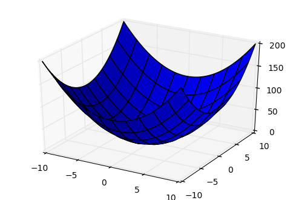

# 机器学习

[TOC]

## 2 课程内容

### 2.1 线性回归

#### 2.1.1 原理

对于一组样本，可以分为两部分，一部分用于训练，一部分用于检验。
$$ {math_1}
h_\theta(x) = \theta_0 +\theta_1x_1+\theta_2x_2+...+\theta_nx_n
$$
当用于训练时，我们已知`X`和`y`，求`theta`。当`y`的值域为连续时，称其为线性回归，若其为离散值集合，则称其为分类。

为了便于表达，设`x_0 = 1`，那么
$$
h_\theta(x) = \theta_0x_0+\theta_1x_1+\theta_2x_2+...+\theta_nx_n\\= \sum_{i=0}^{n}{\theta_ix_i} = \theta^T.X
$$
那么怎么求`theta`呢？如何评价我们求出来的`theta`最好呢？
$$
y_i = \theta^Tx^{(i)}+\xi^{(i)}
$$
上式中的`y`表示真实值，`\xi`表示误差，显然误差`\xi^i`独立且同分布，它们都服从均值为0,方差为`delta^2`的高斯分布。
$$
y_i=h_\theta(x)+\xi^{(i)}
\\p(\xi^{(i)})=\frac{1}{\sqrt{2\pi}\delta}e^{(-\frac{(\xi^{(i)})^2}{2\delta^2})}
$$
可以表示误差为上式，使`y`最成为真实值得概率最大可表示为
$$
p(y^{(i)}|x^{(i)};\theta) =\frac{1}{\sqrt{2\pi}\delta}e^{(-\frac{(y^{(i)}-\theta^Tx^{(i)})^2}{2\delta^2})}
$$
其的似然函数为
$$
L(\theta)=\prod_{i=1}^{m}{p(y^{(i)}|x^{(i)};\theta)}
\\=\prod^{m}_{i=1}{\frac{1}{\sqrt{2\pi}\delta}e^{(-\frac{(y^{(i)}-\theta^Tx^{(i)})^2}{2\delta^2})}}
$$
要使`L\theta`最大，但是连乘比较难以计算，可以使用对数似然函数来代替。
$$
l(\theta)=\log{L(\theta)}
\\=\log{\prod^{m}_{i=1}{\frac{1}{\sqrt{2\pi}\delta}e^{(-\frac{(y^{(i)}-\theta^Tx^{(i)})^2}{2\delta^2})}}}
\\=\sum_{i=0}^{m}{\log{\frac{1}{\sqrt{2\pi}\delta}e^{(-\frac{(y^{(i)}-\theta^Tx^{(i)})^2}{2\delta^2})}}}
\\=m\log{\frac{1}{\sqrt{2\pi}\delta}} - \frac{1}{\delta^2}\cdot\frac{1}{2}
\sum^{m}_{i=1}{(y^{(i)}-\theta^Tx^{(i)})^2}
$$
上述公式的前半部分为固定值，后面部分为减去一个正值。我们在上式的后半部分找到目标函数`J\theta`，使其最小既可。下式也可以这么理解，使我们求出来的值和实际的值误差最小。
$$
J(\theta) =\frac{1}{2}\cdot\sum_{i=1}^{m}{(h_\theta(x^{(i)})-y^{(i)})^2}
\\ =\frac{1}{2}(X\theta-y)^T(X\theta-y)
\\
\\ \frac{\partial J(\theta)}{\partial\theta}=\nabla_{\theta}J(\theta)
\\ = \nabla_\theta(\frac{1}{2}(X\theta-y)^T(X\theta-y))
\\ = \nabla_\theta(\frac{1}{2}(\theta^TX^T-y^T)(X\theta-y))
\\ = \nabla_\theta(\frac{1}{2}(\theta^TX^TX\theta-\theta^TX^Ty-y^TX\theta+y^Ty))
\\ = \frac{1}{2}(2X^TX\theta-X^Ty-(y^TX)^T)
\\ = X^TX\theta-X^Ty
$$
对J求导，找到其极值的点，那么
$$
\mathbf{\theta} =\mathbf{(X^TX)^{-1}X^Ty}
$$
需要注意的是，不是所有的`X`的逆都存在，很多情况下，需要使用迭代方法能求解，例如下面的梯度下降算法。

#### 2.1.2 实现

```python
import matplotlib.pyplot as plt
import numpy as np
from sklearn import datasets

class LinearRegression():
    def __init__(self):
        self.w = None

    def fit(self, X, y):
        X = np.insert(X, 0, 1, axis=1)
        print (X.shape)        
        X_ = np.linalg.inv(X.T.dot(X))
        self.w = X_.dot(X.T).dot(y)
        

    def predict(self, X):
        # Insert constant ones for bias weights
        X = np.insert(X, 0, 1, axis=1)
        y_pred = X.dot(self.w)
        return y_pred

```

使用python的类来定义线性回归算法，w为`theta`，`fit`函数学习、训练，`predict`函数给出预测值。我们使用`mean_squared_error`函数来统计误差。

```python
def mean_squared_error(y_true, y_pred):
    mse = np.mean(np.power(y_true - y_pred, 2))
    return mse
```

下面给出`main`函数：

```python
def main():
    # Load the diabetes dataset
    diabetes = datasets.load_diabetes()

    # Use only one feature
    X = diabetes.data[:, np.newaxis, 2]
    print (X.shape)
    # Split the data into training/testing sets
    x_train, x_test = X[:-20], X[-20:]

    # Split the targets into training/testing sets
    y_train, y_test = diabetes.target[:-20], diabetes.target[-20:]

    clf = LinearRegression()
    clf.fit(x_train, y_train)
    y_pred = clf.predict(x_test)

    # Print the mean squared error
    print ("Mean Squared Error:", mean_squared_error(y_test, y_pred))

    # Plot the results
    plt.scatter(x_test[:,0], y_test,  color='black')
    plt.plot(x_test[:,0], y_pred, color='blue', linewidth=3)
    plt.show()
    
main()
```

数据集采用相同默认的数据集，运行结果如下：

```
(442, 1)
(422, 2)
Mean Squared Error: 2548.072398725972
```


 <p align="center">图2.1-1 Linear Regression</p>

#### 2.1.3 使用逻辑回归进行分类的原理

  利用`Sigmoid`函数进行分类：
$$
g(z)=\frac{1}{1+e^{-z}}\\
=>  g'(x) =(\frac{1}{1+e^{-x}})'\\
=\frac{e^{-x}}{(1+e^{-x})^2} \\
= \frac{1}{1+e^{-x}}\cdot\frac{e^{-x}}{1+e^{-x}} \\
= \frac{1}{1+e^{-x}}\cdot(1-\frac{1}{1+e^{-x}}) \\
= g(x)\cdot(1-g(x))
$$
结合逻辑回归的公式可以得到：
$$
h_\theta(x) = g(\theta^T.X) = \frac{1}{1+e^{-\theta^T.X}}
$$
当我们将其分为两类时，就有：
$$
\begin{equation}
\left\{
\begin{array}{rl}
p(y=1|x;\theta) = h_\theta(x)\\
p(y=0|x;\theta) = 1-h_\theta(x)
\end{array}
\right.
\end{equation}
\\
=>p(y|x;\theta) = (h_\theta(x))^y + (1-h_\theta(x))^{1-y}
$$
同样，为了求其极值，其似然函数如下：
$$
L(\theta) = p(\overrightarrow{y}|X;\theta)\\
=\sum_{i=1}^{m}{p(y^{(i)}|x^{(i)};\theta)} \\
=\sum_{i=1}^{m}{(h_\theta(x^{(i)}))^{y^{(i)}}(1-h_\theta(x^{(i)}))^{1-y^{(i)}}}
$$
对上式求导之后，对数似然函数为：
$$
l(\theta) = \log{L(\theta)} \\
=\sum_{i=1}^{m}{y^{(i)}\log{h(x^{(i)})} +(1-y^{(i)})\log{1-h(x^{(i)})}}
$$
很多时候偏导很难求，我们需要使用下面的算法来解决这个问题。

### 2.2 梯度下降

#### 2.2.1 原理

在对数据进行处理时，一般需要现对数据进行归一化处理，即减去均值然后除以标准差。一组值得均值、方差和标准差计算公式如下：
$$
mean(X) = \frac{1}{n}\sum_{i=1}^{n}{x_i} \\
var(X) = \frac{1}{n}\sum_{i=1}^{n}{(x_i - mean(X))^2} \\
std(X) = \sqrt{var(X)}
$$
梯度：对于一个点L，其偏导函数带入L的值就为该点的梯度。梯度为该点的最大下降方向，矢量，有方向和值。
$$
h_\theta(x) = \theta_1x+\theta_0 \\
J(\theta_0,\theta_1)=\frac{1}{2m}\sum_{i=1}^{m}{(h_\theta(x)-y_i)^2} \\
\frac{\partial J(\theta_0,\theta_1)}{\partial(\theta_0)}=\frac{1}{m}\sum_{i=1}^{m}{(h_\theta(x)-y_i)} \\
\frac{\partial J(\theta_0,\theta_1)}{\partial(\theta_1)}=\frac{1}{m}\sum_{i=1}^{m}{(h_\theta(x)-y_i)*x_i} \\
$$
那么可以给出\theta的步进，迭代公式：
$$
\theta_1=\theta_1-\alpha\cdot\frac{\partial J(\theta_0,\theta_1)}{\partial(\theta_0)} \\
\theta_0=\theta_0-\alpha\cdot\frac{\partial J(\theta_0,\theta_1)}{\partial(\theta_1)}
$$
根据\theta的变换，不断计算cost函数的大小，即J的结果，直至满足一定条件退出。

#### 2.2.2 实现

加载原始数据，做归一化处理：

```python
import pandas
import matplotlib.pyplot as plt

# Read data from csv
pga = pandas.read_csv("pga.csv")


# Normalize the data
pga.distance = (pga.distance - pga.distance.mean()) / pga.distance.std()
pga.accuracy = (pga.accuracy - pga.accuracy.mean()) / pga.accuracy.std()
print(pga.head())

plt.scatter(pga.distance, pga.accuracy)
plt.xlabel('normalized distance')
plt.ylabel('normalized accuracy')
plt.show()

```


 <p align="center">图2.2-1 归一化后的原始数据</p>

使用线性回归做对照试验，其结果如下所示：

```python
# accuracyi=θ1distancei+θ0+ϵ

from sklearn.linear_model import LinearRegression
import numpy as np

# We can add a dimension to an array by using np.newaxis
print("Shape of the series:", pga.distance.shape)  # Shape of the series: (197,)
print("Shape with newaxis:", pga.distance[:, np.newaxis].shape) # Shape with newaxis: (197, 1)

# The X variable in LinearRegression.fit() must have 2 dimensions
lm = LinearRegression()
lm.fit(pga.distance[:, np.newaxis], pga.accuracy)
theta1 = lm.coef_[0]
print (theta1) # -0.607598822715
```

下面给出梯度下降的代码实现，首先给出其`cost` 函数实现，并在给定theta0的前提下，从-3到2给出100个theta1来计算cost结果。

```python
# The cost function of a single variable linear model
def cost(theta0, theta1, x, y):
    # Initialize cost
    J = 0
    # The number of observations
    m = len(x)
    # Loop through each observation
    for i in range(m):
        # Compute the hypothesis 
        h = theta1 * x[i] + theta0
        # Add to cost
        J += (h - y[i])**2
    # Average and normalize cost
    J /= (2*m)
    return J

# The cost for theta0=0 and theta1=1
print(cost(0, 1, pga.distance, pga.accuracy))

theta0 = 100
theta1s = np.linspace(-3,2,100)
costs = []
for theta1 in theta1s:
    costs.append(cost(theta0, theta1, pga.distance, pga.accuracy))

plt.plot(theta1s, costs)
plt.show()
```


 <p align="center">图2.2-2 cost的实现与测试</p>

上面的示例中，我们固定theta0，下面同时在两个区间内观察theta0和theta1对cost值得影响，下图中图一为测试数据。
```python
import numpy as np
from mpl_toolkits.mplot3d import Axes3D

# Example of a Surface Plot using Matplotlib
# Create x an y variables
x = np.linspace(-10,10,100)
y = np.linspace(-10,10,100)

# We must create variables to represent each possible pair of points in x and y
# ie. (-10, 10), (-10, -9.8), ... (0, 0), ... ,(10, 9.8), (10,9.8)
# x and y need to be transformed to 100x100 matrices to represent these coordinates
# np.meshgrid will build a coordinate matrices of x and y
X, Y = np.meshgrid(x,y)
#print(X[:5,:5],"\n",Y[:5,:5])

# Compute a 3D parabola 
Z = X**2 + Y**2 

# Open a figure to place the plot on
fig = plt.figure()
# Initialize 3D plot
ax = fig.gca(projection='3d')
# Plot the surface
ax.plot_surface(X=X,Y=Y,Z=Z)

plt.show()

# Use these for your excerise 
theta0s = np.linspace(-2,2,100)
theta1s = np.linspace(-2,2, 100)
COST = np.empty(shape=(100,100))
# Meshgrid for paramaters 
T0S, T1S = np.meshgrid(theta0s, theta1s)
# for each parameter combination compute the cost
for i in range(100):
    for j in range(100):
        COST[i,j] = cost(T0S[0,i], T1S[j,0], pga.distance, pga.accuracy)

# make 3d plot
fig2 = plt.figure()
ax = fig2.gca(projection='3d')
ax.plot_surface(X=T0S,Y=T1S,Z=COST)
plt.show()
```



 <p align="center">图2.2-3  二维变量对cost的影响</p>

下面给出theta0和theta1沿最大梯度方向步进的算法：
```python
def partial_cost_theta1(theta0, theta1, x, y):
    # Hypothesis
    h = theta0 + theta1*x
    # Hypothesis minus observed times x
    diff = (h - y) * x
    # Average to compute partial derivative
    partial = diff.sum() / (x.shape[0])
    return partial

partial1 = partial_cost_theta1(0, 5, pga.distance, pga.accuracy)

print("partial1 =", partial1)
# Partial derivative of cost in terms of theta0
def partial_cost_theta0(theta0, theta1, x, y):
    # Hypothesis
    h = theta0 + theta1*x
    # Difference between hypothesis and observation
    diff = (h - y)
    # Compute partial derivative
    partial = diff.sum() / (x.shape[0])
    return partial

partial0 = partial_cost_theta0(1, 1, pga.distance, pga.accuracy)

```
即J对theta求偏导。
下面给出关键算法：
```python
# x is our feature vector -- distance
# y is our target variable -- accuracy
# alpha is the learning rate
# theta0 is the intial theta0 
# theta1 is the intial theta1
def gradient_descent(x, y, alpha=0.1, theta0=0, theta1=0):
    max_epochs = 1000 # Maximum number of iterations
    counter = 0      # Intialize a counter
    c = cost(theta1, theta0, pga.distance, pga.accuracy)  ## Initial cost
    costs = [c]     # Lets store each update
    # Set a convergence threshold to find where the cost function in minimized
    # When the difference between the previous cost and current cost 
    #        is less than this value we will say the parameters converged
    convergence_thres = 0.000001  
    cprev = c + 10   
    theta0s = [theta0]
    theta1s = [theta1]

    # When the costs converge or we hit a large number of iterations will we stop updating
    while (np.abs(cprev - c) > convergence_thres) and (counter < max_epochs):
        cprev = c
        # Alpha times the partial deriviative is our updated
        update0 = alpha * partial_cost_theta0(theta0, theta1, x, y)
        update1 = alpha * partial_cost_theta1(theta0, theta1, x, y)

        # Update theta0 and theta1 at the same time
        # We want to compute the slopes at the same set of hypothesised parameters
        #             so we update after finding the partial derivatives
        theta0 -= update0
        theta1 -= update1
        
        # Store thetas
        theta0s.append(theta0)
        theta1s.append(theta1)
        
        # Compute the new cost
        c = cost(theta0, theta1, pga.distance, pga.accuracy)

        # Store updates
        costs.append(c)
        counter += 1   # Count

    return {'theta0': theta0, 'theta1': theta1, "costs": costs}

print("Theta1 =", gradient_descent(pga.distance, pga.accuracy)['theta1'])
# ('Theta1 =', -0.60469831663796081)
descend = gradient_descent(pga.distance, pga.accuracy, alpha=.01)
plt.scatter(range(len(descend["costs"])), descend["costs"])
plt.show()
```
在上面的算法中，我们规定算法的迭代次数最多为max_epochs，或者当前计算的cost和上一次迭代时cost的差值小于convergence_thres时就结束迭代。在每次迭代中，更新(-=，下降；+=上升)theta，重新计算cost,直到推出迭代。


 <p align="center">图2.2-4  梯度下降中cost的变化</p>

### 2.3 决策树

决策树算法是一个分类算法，也可以回归。决策树算法分为两个阶段，构造决策树，即训练阶段，利用决策树决策，即分类阶段。在构造决策树时，为了避免异常值对决策树的影响、构造的决策树过拟合等问题，还需考虑剪枝，剪枝分为预剪枝和后剪枝。

#### 2.3.1 基本概念

##### 2.3.1.1 熵

使用熵来衡量信息的无序性或者不确定。假设事件A的全概率划分为： 
$$
(A_1,A_2,A_3,\cdots,A_n)
$$
每部分发生的概率为：
$$
(p_1,p_2,p_3,\cdots,p_n)
$$
那么信息熵的定义为：
$$
entropy(p_i) = entropy(p_1,p_2,p_3,\cdots,p_n) \\= -p_1\log_2{p_1}-p_2\log_2{p_2}-\cdots-p_n\log_2{p_n} \\
= - \sum_{i=1}^{n}{p_i\ln{p_i}}
$$

Tips： 熵值越大代表集合内的元素越混乱，我们可以考察`y=lnx函数，其中`
$$
x\in[0,1] =>  y\in[-\infty,0]\\
p(x,y) = p(x) \cdot p(y) \ \ \ \ \ 当x,y相互独立时
$$
利用这个函数将概率值转换表达集合混乱程度的熵。

##### 2.3.1.2 Gnin系数CART算法

除了使用信息熵来表示集合的混论程度，还可以使用`Gnin`系数表示。
$$
Gnin(P) = \sum_{i=1}^{n}{p_i(1-p_i)}
\\ = 1- \sum_{i=1}^{n}{p_i^2}
$$
##### 2.3.1.3 信息增益ID3算法

假设我们将集合`A`的元素`a_i`,具有
$$
\{attr_1,attr_2,\cdots,attr_m\}
$$
共`m`个属性，做个划分，一般依赖某个属性进行划分，假设我们按照`attr_s`进行划分。划分之后对每一个A的真子集`A_i`，我们可以计算出其所有的子集针对`attr_t`属性的信息熵的和，记作

$$
\sum_{i\in{\{A[attr_s]\}}}^{}{entropy_{partition}(attr_t|i)}
$$

，原始集合中针对attr_t属性的信息熵记作
$$
entropy_{origin}(attr_t)
$$
，那么其信息增益为
$$
gain(attr_t|attr_s) = entropy_{origin}(attr_t) - \sum_{i\in{\{A[attr_s]\}}}^{}{entropy_{partition}(attr_t|i)}
$$

即按照属性s对集合进行划分之后，信息熵的增加。这里需要说明的当属性s的取值很多时，或者对应的样本个数很少时，(考虑按照ID进行分类，那么划分之后的信息熵为0，信息增益很大，但这样的划分没有意义)。

##### 2.3.1.4 信息增益率C4.5算法

$$
gain_R(attr_t|attr_s) = \frac{gain(attr_t|attr_s)}{entropy(attr_s)}
$$


##### 2.3.1.5 评价函数

评价决策树好坏的评价函数，类似于损失函数，越小越好。
$$
C(T) = \sum_{t\in{leaf}}{N_t\cdot H(t)}
$$
即每个叶子节点元素的个数乘以节点的信息熵或者Gini系数之和，生成的决策树信息熵损失的最好，那么认为构造的决策树较好。
```
dot -Tpdf iris.dot -o iris.pdf
```

##### 2.3.1.6 随机森林模型

利用多棵决策树进行分类和回归。利用原始的训练集，每次随机选择部分样本和部分特征，构造多棵决策树。

Bootstraping:有放回采样。

Bagging:有放回采样n个样本一共建立n个分类器。


每一个决策树队对应一个分类器：
$$
T_1(x)\\
T_2(x)\\
T_B(x)
$$
我们将需要分类的样本送入随机的多个分类器中，利用sign函数将其结果综合得到最终的结论。
$$
sign[\sum{T_b(x)}]
$$
#### 2.3.2 构造决策树

​	对于连续型属性，可先将其离散 化之后，在计算各个分离区间的Giant值。在构造时我们暂时忽略缺失值。

#### 2.3.3 决策树裁剪

​	构造决策树的基本想法是随着树的深度增加，节点的熵迅速降低，熵值降低的速度越快，构造的决策树就越矮。很多时候，构造的决策树的高度过于高，即节点的熵之和很小，但这样的决策树预测的结果并不好，这种情况称为过拟合，即将一些噪音点或者错误点也构造进入了你的决策树中。

##### 2.3.3.1 预剪枝

限制树高，或确定最少节点个数，在构建决策树的过程中提前终止。

##### 2.3.3.2 后剪枝

决策树构建之后再合并一些叶节点。 
$$
C_a(T) = C(T) + a\cdot|T_{leaf}|
$$
将损失函数增加对叶子节点过多时的惩罚，`a`为惩罚系数，T_leaf表示叶子节点个数。分别计算当前这个节点其作为树根节点时的损失函数，和若它本身为叶子节点时的损失函数。
#### 2.3.2 实现

##### 2.3.2.1 数据源介绍和基本知识

导入数据源，由于数据无表头，需要通过第三行语句处理一下。

```python
import pandas as pd

iris_data = pd.read_csv('iris.data')
iris_data.columns = ['sepal_length_cm', 'sepal_width_cm', 'petal_length_cm', 'petal_width_cm', 'class']
iris_data.head()
```
数据如下：
```
sepal_length_cm 	sepal_width_cm 	petal_length_cm 	petal_width_cm 	class
0 	4.9 	3.0 	1.4 	0.2 	Iris-setosa
1 	4.7 	3.2 	1.3 	0.2 	Iris-setosa
2 	4.6 	3.1 	1.5 	0.2 	Iris-setosa
3 	5.0 	3.6 	1.4 	0.2 	Iris-setosa
4 	5.4 	3.9 	1.7 	0.4 	Iris-setosa
```
也可使用如下语句展示原始数据中的统计信息。
```python
iris_data.describe()
````
```
sepal_length_cm 	sepal_width_cm 	petal_length_cm 	petal_width_cm
count 	149.000000 	149.000000 	149.000000 	149.000000
mean 	5.848322 	3.051007 	3.774497 	1.205369
std 	0.828594 	0.433499 	1.759651 	0.761292
min 	4.300000 	2.000000 	1.000000 	0.100000
25% 	5.100000 	2.800000 	1.600000 	0.300000
50% 	5.800000 	3.000000 	4.400000 	1.300000
75% 	6.400000 	3.300000 	5.100000 	1.800000
max 	7.900000 	4.400000 	6.900000 	2.500000
```
可以使用如下语句，展示一副图片：

```python
from PIL import Image
img=Image.open('test.jpg')
plt.imshow(img)
plt.show()
```


 <p align="center">图2.3-1  图片</p>

利用`seaborn`库来展示数据。若系统没有安装`seaborn`，可执行`pip install seanborn`来安装。
```python
%matplotlib inline

import matplotlib.pyplot as plt
import seaborn as sb

sb.pairplot(iris_data.dropna(), hue='class')

plt.figure(figsize=(10, 10))
for column_index, column in enumerate(iris_data.columns):
    if column == 'class':
        continue
    plt.subplot(2, 2, column_index + 1)
    sb.violinplot(x='class', y=column, data=iris_data)
```


 <p align="center">图2.3-2  数据源展示</p>
在图2.3-2中第一幅图为散点图，表示两个属性时类别的分布情况，对角线上位该属性自己的分布；第二部图为小提琴图，展示了不同类别下属性的分布情况。
注意，利用`pairplot`展示数据时，不能存在缺失值，此处我们使用`dropna`函数删除了缺失值，也可以采用数据清洗的方式补全或进行其它处理。

##### 2.3.2.2 使用决策树
**对数据做交叉验证**

```python
from sklearn.cross_validation import train_test_split

all_inputs = iris_data[['sepal_length_cm', 'sepal_width_cm',
                             'petal_length_cm', 'petal_width_cm']].values

all_classes = iris_data['class'].values

(training_inputs,
 testing_inputs,
 training_classes,
 testing_classes) = train_test_split(all_inputs, all_classes, train_size=0.75, random_state=1)
```
train_test_split函数用于将矩阵随机划分为训练子集和测试子集，并返回划分好的训练集测试集样本和训练集测试集标签。

格式：
```python
x_train,x_test, y_train, y_test =cross_validation.train_test_split(train_data,train_target,test_size=0.3, random_state=0)
```
参数解释：
`train_data`：被划分的样本特征集
`train_target`：被划分的样本标签
`test_size`：如果是浮点数，在0-1之间，表示样本占比；如果是整数的话就是样本的数量
`random_state`：是随机数的种子。
随机数种子：其实就是该组随机数的编号，在需要重复试验的时候，保证得到一组一样的随机数。比如你每次都填1，其他参数一样的情况下你得到的随机数组是一样的。但填0或不填，每次都会不一样。
随机数的产生取决于种子，随机数和种子之间的关系遵从以下两个规则：种子不同，产生不同的随机数；种子相同，即使实例不同也产生相同的随机数。
**构造决策树**

```python
from sklearn.tree import DecisionTreeClassifier
#  1.criterion: gini  or  entropy
#用gini系数或熵值构建决策树

#  2.splitter: best or random 
# 前者是在所有特征中找最好的切分点,后者是在部分特征中（数据量大的时候），对连续属性进行离散化

#  3.max_features: None（所有），log2，sqrt，N  
# 特征小于50的时候一般使用所有的,当特征多时，选择使用多少个特征构建决策树

#  4.max_depth  构造决策树使用，最大深度，限制值
# 数据少或者特征少的时候可以不管这个值，如果模型样本量多，特征也多的情况下，可以尝试限制下

#  5.min_samples_split  构造决策树使用，节点最小划分数，限制值
#  如果某节点的样本数少于min_samples_split，则不会继续再尝试选择最优特征来进行划分
#  如果样本量不大，不需要管这个值。如果样本量数量级非常大，则推荐增大这个值。

#  6.min_samples_leaf  构造决策树使用，节点的最小样本数，限制值
#  限制了叶子节点最少的样本数，如果某叶子节点数目小于样本数，则会和兄弟节点一起被
#  剪枝，如果样本量不大，不需要管这个值，大些如10W可是尝试下5

#  7.min_weight_fraction_leaf 
# 限制了叶子节点所有样本权重和的最小值，如果小于这个值，则会和兄弟节点一起
# 被剪枝默认是0，就是不考虑权重问题。一般来说，如果我们有较多样本有缺失值，
# 或者分类树样本的分布类别偏差很大，就会引入样本权重，这时我们就要注意这个值了。

#  8.max_leaf_nodes 构造决策树使用，节点最大划分数，限制值
# 通过限制最大叶子节点数，可以防止过拟合，默认是"None”，即不限制最大的叶子节点数。
# 如果加了限制，算法会建立在最大叶子节点数内最优的决策树。
# 如果特征不多，可以不考虑这个值，但是如果特征分成多的话，可以加以限制
# 具体的值可以通过交叉验证得到。

#  9.class_weight 
# 指定样本各类别的的权重，主要是为了防止训练集某些类别的样本过多
# 导致训练的决策树过于偏向这些类别。这里可以自己指定各个样本的权重
# 如果使用“balanced”，则算法会自己计算权重，样本量少的类别所对应的样本权重会高。

#  10.min_impurity_split 节点的不纯度
# 限制了决策树的增长，如果某节点的不纯度
#(基尼系数，信息增益，均方差，绝对差)小于这个阈值
#则该节点不再生成子节点。即为叶子节点 。

decision_tree_classifier = DecisionTreeClassifier()

# Train the classifier on the training set
decision_tree_classifier.fit(training_inputs, training_classes)

# Validate the classifier on the testing set using classification accuracy
decision_tree_classifier.score(testing_inputs, testing_classes)
# Output:  0.97368421052631582
```
上述参数的作用都是为了防止生成的决策树过拟合，太大太高.过拟合的具体表现为在测试数据中表现很好，实际数据表现很差。

```python
from sklearn.cross_validation import cross_val_score
import numpy as np
decision_tree_classifier = DecisionTreeClassifier()

# cross_val_score returns a list of the scores, which we can visualize
# to get a reasonable estimate of our classifier's performance
cv_scores = cross_val_score(decision_tree_classifier, all_inputs, all_classes, cv=10)
print (cv_scores)
# Output: [ 1.          0.93333333  1.          0.93333333  0.93333333  0.86666667   0.93333333  0.93333333  1.          1.        ]

#kde=False
sb.distplot(cv_scores)
plt.title('Average score: {}'.format(np.mean(cv_scores)))
```


 <p align="center">图2.3-3  默认参数决策树的效果</p>

若调整参数，将决策树的最大深度调整为1：
```python
decision_tree_classifier = DecisionTreeClassifier(max_depth=1)

cv_scores = cross_val_score(decision_tree_classifier, all_inputs, all_classes, cv=10)
print (cv_scores)
# Output: [ 0.66666667  0.66666667  0.66666667  0.66666667  0.66666667  0.66666667   0.66666667  0.66666667  0.66666667  0.64285714]

sb.distplot(cv_scores, kde=False)
plt.title('Average score: {}'.format(np.mean(cv_scores)))
```


 <p align="center">图2.3-4  决策树参数的影响效果</p>

 参数调优，对`max_depth`和`max_features`分别测试最优取值。
 ```python
 from sklearn.grid_search import GridSearchCV
from sklearn.cross_validation import StratifiedKFold

decision_tree_classifier = DecisionTreeClassifier()

parameter_grid = {'max_depth': [1, 2, 3, 4, 5],
                  'max_features': [1, 2, 3, 4]}

cross_validation = StratifiedKFold(all_classes, n_folds=10)

grid_search = GridSearchCV(decision_tree_classifier,
                           param_grid=parameter_grid,
                           cv=cross_validation)

grid_search.fit(all_inputs, all_classes)
print('Best score: {}'.format(grid_search.best_score_))
print('Best parameters: {}'.format(grid_search.best_params_))
# Output: Best score: 0.9664429530201343
# Best parameters: {'max_features': 3, 'max_depth': 5}
 ```
`max_depth`和`max_features`取值对分类效果的影响：
```python
grid_visualization = []

for grid_pair in grid_search.grid_scores_:
    grid_visualization.append(grid_pair.mean_validation_score)
    
grid_visualization = np.array(grid_visualization)
grid_visualization.shape = (5, 4)
sb.heatmap(grid_visualization, cmap='Blues')
plt.xticks(np.arange(4) + 0.5, grid_search.param_grid['max_features'])
plt.yticks(np.arange(5) + 0.5, grid_search.param_grid['max_depth'][::-1])
plt.xlabel('max_features')
plt.ylabel('max_depth')
```


 <p align="center">图2.3-5  调整参数影响的效果</p>
最佳决策树的详细参数：
```python
decision_tree_classifier = grid_search.best_estimator_
decision_tree_classifier
# Output : DecisionTreeClassifier(class_weight=None, criterion='gini', max_depth=5,
# max_features=3, max_leaf_nodes=None, min_impurity_split=1e-07,
#           min_samples_leaf=1, min_samples_split=2,
#            min_weight_fraction_leaf=0.0, presort=False, random_state=None,
#            splitter='best')
```
将生成的决策树导出，之后可利用其他工具将其可视化：
```python
import sklearn.tree as tree
from sklearn.externals.six import StringIO

with open('iris_dtc.dot', 'w') as out_file:
    out_file = tree.export_graphviz(decision_tree_classifier, out_file=out_file)
#http://www.graphviz.org/
```
使用命令行将之前生成的决策树可视化：`dot -Tpdf iris.dot -o iris.pdf`


 <p align="center">图2.3-6  决策树</p>

##### 2.3.2.3 随机森林
```python
from sklearn.ensemble import RandomForestClassifier

random_forest_classifier = RandomForestClassifier()

parameter_grid = {'n_estimators': [5, 10, 25, 50],
                  'criterion': ['gini', 'entropy'],
                  'max_features': [1, 2, 3, 4],
                  'warm_start': [True, False]}

cross_validation = StratifiedKFold(all_classes, n_folds=10)

grid_search = GridSearchCV(random_forest_classifier,
                           param_grid=parameter_grid,
                           cv=cross_validation)

grid_search.fit(all_inputs, all_classes)
print('Best score: {}'.format(grid_search.best_score_))
print('Best parameters: {}'.format(grid_search.best_params_))
# Output: Best score: 0.9664429530201343
# Best parameters: {'criterion': 'gini', 'n_estimators': 5, 'max_features': 1, 'warm_start': True}

grid_search.best_estimator_
# Output: RandomForestClassifier(bootstrap=True, class_weight=None, criterion='gini',
#            max_depth=None, max_features=1, max_leaf_nodes=None,
#            min_impurity_split=1e-07, min_samples_leaf=1,
#            min_samples_split=2, min_weight_fraction_leaf=0.0,
#            n_estimators=5, n_jobs=1, oob_score=False, random_state=None,
#            verbose=0, warm_start=True)
```

### 2.4 贝叶斯

### 2.5 支持向量机

### 2.6 神经网络


### 2.* 机器学习的应用范围

* 模式识别
* 计算机视觉
* 语音识别
* 自然语言处理
* 统计学习
* 数据挖掘

### 2.*+1 方法
1. 训练样本
2. 特征抽取
3. 学习函数
4. 预测