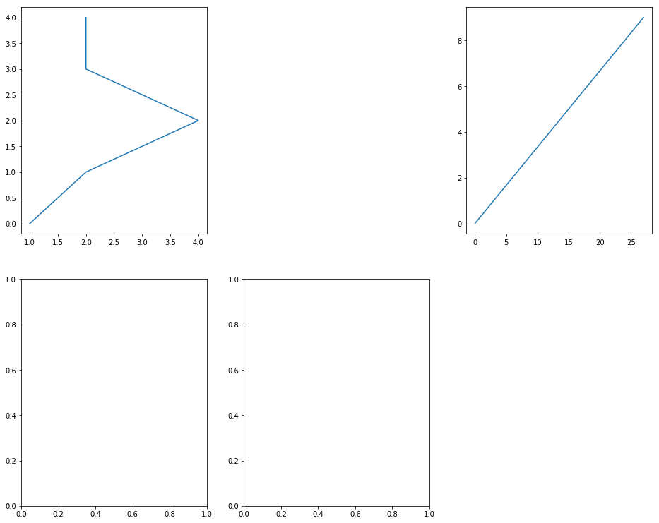
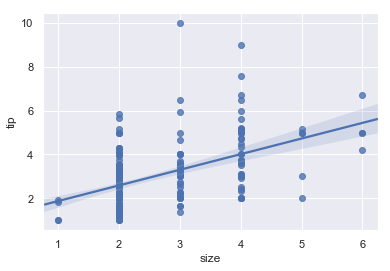

## 1 Python 工具库
### 1.2 科学计算库Numpy
主要完成矩阵运算。
#### 1.2.1 格式化读入数据
```python
import numpy
numpy.genformtxt("filename.txt", delimiter = ".", dtype = str, skip_header = 1)
```

可使用`help(numpy.genformtxt)`来查看该函数的帮助。
#### 1.2.2 构造矩阵、向量
```python
vertor = numpy.array([5,10,15,20])
matrix = numpy.array([[5,10,15],[20,25,30],[35,40,45]])
```

>注意: 内部元素必须为同一数据类型。

可使用`type(vertor)` 或 `type(matrix)`和`vertor.shape` 或 `matrix.shape`来查看数据结构，使用`matrix.dtype`查看数据元素的数据类型。

#### 1.2.3 Numpy中array切片
>注意：索引从0开始。
```python
#matrix[0][1], 10
matrix[0,1]   

#matrix[x:1]
matrix[:,1]    

#matrix[x:y] (x in (0,1) and y in (0,n))
matrix[0:2,:]  
```
####  1.2.4 逻辑判断
```python
equal_to_ten = matrix == 10
equal_to_ten_and_five = (matrix == 10) & (matrix == 5)
equal_to_ten_or_five = (matrix == 10) | (matrix == 5)
```
一个和原矩阵相同结构的布尔类型矩阵，当某个位置元素的值和10相等时，为`True`, 其余是`False`。也可使用`|`和`&`进行逻辑计算。  
返回的结果可以用来索引元素。如可使用上面的`equal_to_ten`矩阵来过滤元素，如`matrix[equal_to_ten]`, 返回一个数组，或者获取某一行或某一列`matrix[equal_to_ten,:]`  
####  1.2.5 元素类型转换
```python
vector  = numpy.array(["1","2","3"])
vector  = vector.astype(float)
```
#### 1.2.5  矩阵处理
求和：
```python
#return the min element in vector
vector.min() 

# The axis dictates which demension we perform the operation on
# 1 means that we want to perform the operation on each row, and 0 means on each column.
matrix = numpy.array([
                    [5,10,15],
                    [20,25,30],
                    [35,40,45]])
                    
#out: array([30,75,120])
matrix.sum(axis = 1) 

#out: array([60,75,90])
matrix.sum(axis = 0) 
```
#### 1.2.5  矩阵变换
矩阵调整:
```python
# a use 'as'
import numpy as np
print(np.arange(15))
a = np.arange(15).reshape(3,5)

#  out: (3,5)
print(a.shape) 

#  the number of axer (dimensions) of the array
print(a.ndim)

#  out: 'int32'
print(a.dtype.name)

#   out: 15
print(a.size)

np.zeros((3,4))

np.ones((2,3,4), dtype = np.int32)

# To create sequences of numbers
np.arange(10, 30, 5)
np.arange(0, 2, .3)
np.arange(12).reshape(3,4)

# Matix.shape is (2,3) and the elemental's type is float which in the range of (0,1)
np.random.rand(2,3)

from numpy  import pi
np.linspace( 0, 2*pi, 100)

```
1.2.5 矩阵计算
```python
# the product operator * operates elementwise is NumPy arrays
import numpy as np

a = np.array([[20,30,40,50],[20,30,40,50]])
b = np.arange(8).reshape(2,4)
print(a)
print(b)
print(a-b)
print(a*b)
print(a**b)
print(a-1)
print(b**2)

# d = [0, 1, 2]
d = np.arange(3)

# e^(d[i])
np.exp(d)
np.sqrt(d)
```
以上都是对元素进行计算，下面是矩阵特有的一些运算。
```python
c = np.arange(8).reshape(2,4)
print(a.dot(c))
# same as the last line
print(np.dot(a, c))

# Return the floor of the input
a = np.floor(10 * np.random.rand((3, 4))
# 
print(a.ravel())
# flatten the array
a.shape = (6,2)
print(a.T)

# If a dimension is given as -1 in a reshaping operation, the other dimensions are automatically calcualted.
```
`a.T`表示`a`的转置。 
```python
a = np.floor(10 * np.random.rand(2,2))
b = np.floor(10 * np.random.rand(2,2))
# c.shape = (2, 4)
c = np.hstack(a, b)
d = np.vstack(a, b)
```
`np.hstack`表示矩阵的横向拼接，`np.vstack`表示矩阵的纵向拼接.  
切分：
```python
A = np.floor(10 * np.random.rand(2,12))
# Three Matrixs with shape of (2,4)
np.hsplit(A,3)
## Split Matrix A after the third and the fourth column
np.hsplit(A, (3,4))

B = np.floor(10 * np.random.rand(12,2))

C = A.T
np.vsplit(B, 3)
np.vsplit(B, (3,4))
```
`np.hsplit(A, (3,4))`指定了横向切分的位置, 其返回一个更高阶的集合。  
索引赋值：
```python
# Simple assignments make no copy of array objects or of their data.
a = np.arange(12)
b = a
# a and b are tow names for the same ndarray object.
a is b             #True
a.id == b.id     #True
​```python
浅复制：修改c可引起a中的值改变, Shape可以不一致。
​```python
#The view method creates a new array object that looks at the same data.
c = a.view()
c.id != a.id   #True
```
复制：
```python
#The copy method makes a complete copy of the array and its data.
d = a.copy()
```
查找：
```python
import numpy as np
data = np.sin(np.arange(20)).reshape(5,4)
index = data.argmax(axis = 0)
index2 = data.argmax(axis = 1)
print(data)
print(index)
print(index2)
data_max = data[index, np.arange(data.shape[1])]
print(data_max)
data_max2 = data[np.arange(data.shape[0]), index2]
print(data_max2)
```
`index` 表示每一列的最大值索引，可通过其来获取最大值的列表。  
扩张：
```python
a = np.arange(0,40,10)
b = np.tile(a , (2,3))
```
` (2,3)`表示行和列扩张的倍数。  
排序：
```python
import numpy as np
a = np.array([[4,3,5],[1,2,1]])
print(a)
b = np.sort(a, axis = 0)
print(b)
#a.sort(axis =1)
print(a)

a= np.array([1,2,3,4,5])
j = np.argsort(a)
print(j)
#print(a[j])
print(a[j])
```
其中，在`numpy.sort()`中排序，`axis`指定维度；
仅当a为一维向量时，才能使用`a[j]`输出排序之后的结果。
### 1.2 数据分析处理库Pandas
对Numpy对功能升级，能够处理文本和矩阵。
#### 1.2.1 导入数据
```python
import pandas
food_info =  pandas.read_csv("food_info.csv")
print(type(food_info))
print(food_info.dtypes)
#print(help(pandas.read_csv))
first_rows = food_info.head()
#print(first_rows)
```
导入数据的方式很多，详细的情况请查询相关资料。

导入的数据类型为`pandas.core.frame.DataFrame`。
#### 1.2.2 访问操作
```python
print(food_info.shape)
#food_info.head(1)
print(food_info.tail(1))
food_info.columns
food_info.shape
food_info.loc[1]
food_info.loc[2:4]
```
在`Jupyter Notebook`中，可以顺序执行，多个块的代码可以衔接完成同一功能。  
`food_info.head`中默认返回5行，可设置返回指定行。`food_info.loc`返回指定行数。
```python
#object - For string values
#int -  For integer values
#datetime -  For time values
#bool - For Boolean values
food_info['NDB_No'][2:4]
food_info[["NDB_No","Water_(g)"]][2:4]
```
通过`[]`操作返回指定列。
#### 1.2.3 访问示例
在给定的数据集中，存在以`g`和`mg`为单位的数据，我们如何区分？
```python
col_names = food_info.columns.tolist()
gram_columns = []
for c in col_names:
	if c.endswith("(g)"):
		gram_columns.append(c)
gram_df =  food_info[gram_columns]
print(gram_df[2:5])

div_1000 =  food_info["Iron_(mg)"] /1000
print(div_1000)
# Adds 100 to each value in the column and returns a Series object
#add_100 = food_info["Iron_(mg)"] + 100
# Subtracts 100 from each value in the column and return a Series object
#sub_100 = food_info["Iron_(mg)"] - 100
# Multiplies each value in the column by 2 and return a Series object
#mult_2 = food_info["Iron_(mg)"] * 2
```
对列进行计算：
```python
#It applies the arithmetic operator to the first value in both columns, the second value in both columns, and so on
water_energy = food_info["Water_(g)"] * food_info["Energ_Kcal"]
water_energy = food_info["Water_(g)"] * food_info["Energ_Kcal"]
iron_grams = food_info["Iron_(mg)"] / 1000  
food_info["Iron_(g)"] = iron_grams
print(water_energy)

#Score=2×(Protein_(g))−0.75×(Lipid_Tot_(g))
weighted_protein = food_info["Protein_(g)"] * 2
weighted_fat = -0.75 * food_info["Lipid_Tot_(g)"]
initial_rating = weighted_protein + weighted_fat
```
其中`food_info["Iron_(g)"] = iron_grams`对数据集增加了一列；
```python
# the "Vit_A_IU" column ranges from 0 to 100000, while the "Fiber_TD_(g)" column ranges from 0 to 79
#For certain calculations, columns like "Vit_A_IU" can have a greater effect on the result, 
#due to the scale of the values
# The largest value in the "Energ_Kcal" column.
max_calories = food_info["Energ_Kcal"].max()
# Divide the values in "Energ_Kcal" by the largest value.
normalized_calories = food_info["Energ_Kcal"] / max_calories
normalized_protein = food_info["Protein_(g)"] / food_info["Protein_(g)"].max()
normalized_fat = food_info["Lipid_Tot_(g)"] / food_info["Lipid_Tot_(g)"].max()
food_info["Normalized_Protein"] = normalized_protein
food_info["Normalized_Fat"] = normalized_fat
```
`normalized_protein = food_info["Protein_(g)"] / food_info["Protein_(g)"].max()`归一化处理。  
按列进行排序：
```python
#By default, pandas will sort the data by the column we specify in ascending order and return a new DataFrame
# Sorts the DataFrame in-place, rather than returning a new DataFrame.
#print food_info["Sodium_(mg)"]
food_info.sort_values("Sodium_(mg)", inplace=True)
print food_info["Sodium_(mg)"]
#Sorts by descending order, rather than ascending.
food_info.sort_values("Sodium_(mg)", inplace=True, ascending=False)
print food_info["Sodium_(mg)"]
```
对缺失值得特殊处理
```python
#The Pandas library uses NaN, which stands for "not a number", to indicate a missing value.
#We can use the pandas.isnull() function which takes a pandas series and return a series of True and False values.

age = titanic["Age"]
print(age.loc[0:10])
age_is_null = pd.isnull(age)
age_null_true = age[age_is_null]
age_null_count = len(age_null_true)
print(age_null_count)

#The result of this that mean_age would be nan. This is because any calculations we do with a null value also result in a null value.
mean_age = sum(titanic["Age"] )/len(titanic["Age"])

#we have to filter out the missing values before we calculate the mean.
good_ages = titanic["Age"][age_is_null == False]
correct_mean_age = sum(good_ages)/ len(good_ages)
print(correct_mean_age)

# missing data is so common that many pandas methods automatically filter for it.
correct_mean_age = titanic["Age"].mean()
print(correct_mean_age)
```
强大的`pivot_table`函数
```python
#mean fare for each class
passenger_classes = [1,2,3]
fares_by_class = {}
for this_class in passenger_classes:
	pclass_rows = titanic[titanic["Pclass"] == this_class]
	pclass_fares = pclass_rows["Fare"]
	fare_for_class = pclass_fares.mean()
	fares_by_class[this_class] = fare_for_class
print(fares_by_class)

#index tells the method which column to group by
#values is thie column that we want to apply the calculation to
#aggfunc specifies the calculation we want to perform
passenger_survival = titanic.pivot_table(index="Pclass", values ="Survived", aggfunc = np.mean)
print(passenger_survival)


passenger_age = titanic.pivot_table(index="Pclass", values ="Age")
print(passenger_age)

port_stats = titanic.pivot_table(index="Embarked", values =["Fare","Survived"],aggfunc = np.sum)
print(port_stats)
```

```python
#specifying axis = 1 or axis='columns' will drop any columns that have null values
#use fillna could fill default values to fix miss values.
drop_na_columns = titanic.dropna(axis = 1)
new_titanic_survival = titanic.dropna(axis =0 ,subset=["Age", "Sex"])
```
`axis = 0` 对一行数据进行操作  
`axis = 1` 对一列数据进行操作  
访问指定位置的数据

```python
row_index_1000_pclass = titanic.loc[1000,"Pcalss"]
print(row_index_83_age)
print(row_index_1000_pclass)
```
排序 重置索引
```python
new_titanic = titanic.sort_values("Age", ascending = False)
print(new_titanic[0:5])
titanic_reindexed =  new_titanic.reset_index(drop = True)
print(titanic_reindexed[0:5])
```
#### 1.2.4 自定义函数
```python
#This function returns the hundredth item from a series
def hundredth_row(column):
    #Extract the hundredth item
    hundredth_item =  column.loc[99]
    return hundredth_item

hundredth_row = titanic.apply(hundredth_row)
print(hundredth_row)
```
利用自定义函数离散化数据
```python
#By passing in the axis=1 argument, we can use the DataFrame.apply() method to iterate over rows instead of columns.
def which_class(row):
    pclass = row['Pclass']
    if pd.isnull(pclass):
        return "Unknown"
    elif pclass == 1:
        return "First Class"
    elif pclass == 2:
        return "Second Class"
    elif pclass == 3:
        return "Third Class"

classes = titanic.apply(which_class, axis=1)
print (classes[0:20])

def is_minor(row):
    if row["Age"] < 18:
        return True
    else:
        return False

minors =  titanic.apply(is_minor, axis = 1)
print(minors[0:10])

def geenerate_age_lable(row):
    age = row["Age"]
    if pd.isnull(age):
        return "unknow"
    elif age <18 :
        return "minor"
    else:
        return "adult"
age_labels = titanic.apply(geenerate_age_lable , axis = 1)
print(age_labels[0:10])

titanic["age_labels"] = age_labels
age_group_survival = titanic.pivot_table(index = "age_labels", values = "Survived")
print(age_group_survival)
```
#### 1.2.5 Pandas 内部数据结构
```python
#Series: Collection of values
#DataFrame: Collection of Series objects

#A Series object can hold many data types, including
#float - for representing float values
#int - for representing integer values
#bool - for representing Boolean values
#datetime64[ns] - for representing date & time, without time-zone
#datetime64[ns, tz] - for representing date & time, with time-zone
#timedelta[ns] - for representing differences in dates & times (seconds, minutes, etc.)
#category  - for representing categorical values
#object - for representing String values
```
数据集介绍
```python
#FILM - film name
#RottenTomatoes - Rotten Tomatoes critics average score
#TorrenTomatoes_User - Rotten Tomatoes user average score
#RT_norm - Rotten Tomatoes crititcs average score (normalized to a 0 to 5 point system)
#RT_user_norm Rotten Tomatoes user average score (normalized to a 0 to 5 point system)
#Metacritic -  Metacritic critecs average score
#Metacritec_User - metacritc user average score

import pandas as pd
fandango = pd.read_csv('fandango_score_comparison.csv')
print(fandango.head())
series_film = fandango['FILM']
a_row = fandango.loc[0]
print(type(series_film))
print(series_film)
print(type(a_row))
print(a_row)
print(series_film[0:5])
series_rt = fandango['RottenTomatoes']
print (series_rt[0:5])
```
构建新的Series 排序
```python
# Import the Series object from pandas
from pandas import Series

film_names = series_film.values
#print(type(film_names))
#print(film_names)
rt_scores = series_rt.values
print(rt_scores[0:10])
series_custom = Series(rt_scores , index=film_names)
series_custom[['Minions (2015)', 'Leviathan (2014)']]

# int index is also aviable
fiveten = series_custom[5:10]
print(fiveten)

original_index = series_custom.index.tolist()
#print original_index
sorted_index = sorted(original_index)
sorted_by_index = series_custom.reindex(sorted_index)
print(series_custom)
print("-------------------------------------------")
print(sorted_by_index)
#print sorted_by_index
```
按照键或者值进行排序
```python
sc2 = series_custom.sort_index()
sc3 = series_custom.sort_values()
print(sc2[0:10])
print(sc3[0:10])
```
对值可进行运算，当主键一致时，可进行复合运算
```python
#The values in a Series object are treated as an ndarray, the core data type in NumPy
import numpy as np
# Add each value with each other
print(np.add(series_custom, series_custom))
# Apply sine function to each value
print(np.sin(series_custom))
# Return the highest value (will return a single value not a Series)
print(np.max(series_custom))

#data alignment same index
rt_critics = Series(fandango['RottenTomatoes'].values, index=fandango['FILM'])
rt_users = Series(fandango['RottenTomatoes_User'].values, index=fandango['FILM'])
rt_mean = (rt_critics + rt_users)/2

print(rt_mean)
```
对值进行逻辑运算
```python
#will actually return a Series object with a boolean value for each film
series_custom > 50
series_greater_than_50 = series_custom[series_custom > 50]

criteria_one = series_custom > 50
criteria_two = series_custom < 75
both_criteria = series_custom[criteria_one & criteria_two]
print(both_criteria)
```
我们可以在`DataFrame`中添加`Index`，这样既可以通过下标，也可以通过索引来访问某一行。
```python
import pandas as pd
fandango = pd.read_csv('fandango_score_comparison.csv')
print(type(fandango))
print(fandango.head())
print(fandango.index)
#It will return a new DataFrame that is indexed by the values in the specified column
#and will drop the column which the FILM column's vlaus is missing from the DataFrame
fandango_films = fandango.set_index("FILM", drop = False)
print(fandango_films.index)
```
利用索引来切片，需要注意的返回多行数据是为`DataFrame`结构，单行则为`Series`结构
```python
#Slice using either bracket notation or loc[]
fandango_films["Avengers: Age of Ultron (2015)":"Hot Tub Time Machine 2 (2015)"]
fandango_films[0:5]

#specific movie
fandango_films.loc["Avengers: Age of Ultron (2015)":"Hot Tub Time Machine 2 (2015)"]

#Selecting list of movies
movies = ['Kumiko, The Treasure Hunter (2015)','Two Days, One Night (2014)','Serena (2015)']
print(fandango_films.loc[movies])

#When selecting multiple rows, a DataFrame is returned,
#But when selecting an individual row, a Series object is returned instead.
```
对特殊的数值类型的列我们可以做一些特殊处理，比如对`float`类型的列我们可以统计其标准差.  
标准差定义为`std = sqrt(mean(abs(x - x.mean())**2))`.
```python
#The apply() method in Pandas allows us to specify Python logic
#The apply() method requires you to pass in a vectorized operation
#that can be applied over each Series object.
import numpy as np

#Return the data types as a Series
types = fandango_films.dtypes
print(types)
#filter data types to just floats, index attributes return just column names
float_columns = types[types.values == 'float64'].index
float_df = fandango_films[float_columns]
print(float_df)
#`x` is a Series object representing a column
deviations =  float_df.apply(lambda x:np.std(x))
print(deviations)
```
按列进行标准差计算
```python
rt_mt_user =  float_df[['RT_user_norm','Metacritic_user_nom']]
#print(rt_mt_user)
rt_mt_user.apply(lambda x: np.std(x), axis = 1)
```
### 1.3 数据可视化Matplotlib
数据图表的展示。
#### 1.3.1 折线图
一般利用`numpy` 或`pandas`加载数据集，使用`Matplotlib`来显示。
```python
import pandas as pd
unrate = pd.read_csv("unrate.csv")
unrate["DATE"] = pd.to_datetime(unrate["DATE"])
print(unrate.head(12))
```
可以使用`plt.plot`和`plt.show`显示一个空图，也可以在填充数据构建折线图。其中可以使用`plt.xticks(rotation=45)`来旋转X轴label的显示。
```python
import matplotlib.pyplot as plt
#%matplotlib inline
plt.plot()
plt.show()

first_twelve = unrate[0:102]
plt.plot(first_twelve['DATE'], first_twelve['VALUE'])
plt.show()

#While the y_axis looks fine, the x-axis tick labels are too close together and are unreadable
#We can rotate the x-axis tick labels by 90 degrees so they donot overlap
#We can specify degrees of rotation using a float or integer value.
plt.plot(first_twelve['DATE'], first_twelve['VALUE'])
plt.xticks(rotation=45)
plt.show()
```

 <p align="center">图1.3-1 Matplotlib测试图</p>


 <p align="center">图1.3-2 旋转X轴图释</p>

使用`plt.xlabel`设置X轴的标题    
`plt.ylabel` 设置Y轴的标题    
`plt.title`设置图的标题    

```python
first_twelve = unrate
plt.plot(first_twelve['DATE'], first_twelve['VALUE'])
plt.xticks(rotation=90)
plt.xlabel('Year')
plt.ylabel('Unemployment Rate')
plt.title('Yearly Unemployment Trands, 1948~ 1957')
plt.show()
```


<p align="center">图1.3-3 添加图释</p>

折线图中绘制多条折线

```python
unrate['MONTH'] = unrate['DATE'].dt.month
fig = plt.figure(figsize = (6,3))
plt.plot(unrate[0:12]['MONTH'], unrate[0:12]['VALUE'], c ='red')
plt.plot(unrate[12:24]['MONTH'], unrate[12:24]['VALUE'], c ='blue')
plt.show()
```


 <p align="center">图1.3-4  多折线</p>
多条折线时，如何添加图释区分。具体图释的位置可参见`help(plt.legend)`.

```python
fig = plt.figure(figsize=(10,6))
unrate['MONTH'] = unrate['DATE'].dt.month
colors = ['red','blue','green','orange','black']
for i in range(5):
    start_index = i*12
    end_index = (i+1)*12
    subset = unrate[start_index:end_index]
    label = str(1948+i)
    plt.plot(subset['MONTH'], subset['VALUE'], c =colors[i],label = label)
plt.legend(loc='best')
plt.xlabel('Month, Integer')
plt.ylabel('Unemployment Rate, Percent')
plt.title('Monthly Unemployment Trands, 1948~ 1952')
plt.show()
#Can find more help in help(plt.legend)
```

 <p align="center">图1.3-5  多折线示例</p>
#### 1.3.2 子图
```python
#fig.add_subplot(x,y, positionid) x:rows counter, y Columns counter,position: 1 ~ x*y
fig = plt.figure(figsize=(16,13)) 
ax1 = fig.add_subplot(2,3,1)
ax2 = fig.add_subplot(2,3,3)
ax3 = fig.add_subplot(2,3,4)
ax5 = fig.add_subplot(2,3,5)
import numpy as np
ax1.plot(np.random.randint(1,5,5), np.arange(5))
ax2.plot(np.arange(10)*3, np.arange(10))
plt.show()
```

 <p align="center">图1.3-6  子图</p>
`add_subplot`的第一二个参数标准子图总共有多少行，每行有多少个子图，第三个参数表示该子图在这个字子图矩阵中的位置。
#### 1.3.3 条形图
```python
import pandas as pd
reviews = pd.read_csv('fandango_scores.csv')
cols = ['FILM', 'RT_user_norm', 'Metacritic_user_nom', 'IMDB_norm', 
        'Fandango_Ratingvalue', 'Fandango_Stars']
norm_reviews = reviews[cols]
print(norm_reviews[0:5])

import matplotlib.pyplot as plt
from numpy import arange
#The Axer.bar() method has 2 required parameters, left and right.
#We use the left parameter to specify the x coordinates of the left sides of the bar.
#We usr the height parameter to specify the height of each bar.
num_cols = ['RT_user_norm', 'Metacritic_user_nom', 'IMDB_norm', 
        'Fandango_Ratingvalue', 'Fandango_Stars']

bar_heights = norm_reviews.loc[0, num_cols].values
print(bar_heights)
bar_positions = arange(5) + 0.75
print(bar_positions)

fig, ax = plt.subplots()
ax.bar(bar_positions,bar_heights,0.05)
plt.show()
```

 <p align="center">图1.3-7  柱状图</p>
需要明确柱状图的高度，在X轴的位置和形状的宽度。
```python
#By default, matplotlib sets the x-axis tick labels to the integer values the bars
#spanned on the x-axis (from 0 to 6). we only need tick labels on the x-axis where the
#bars are positioned. We can use Axes.set_xticks() to change the positions of the 
#ticks to [1, 2, 3, 4, 5, 6]:

tick_positions = range(1,6)
bar_positions = arange(5) + 1.25

fig, ax = plt.subplots()
ax.bar(bar_positions,bar_heights,0.5)
ax.set_xticks(tick_positions)
ax.set_xticklabels(num_cols, rotation = 65)

ax.set_xlabel('Rating Source')
ax.set_ylabel('Average Rating')
ax.set_title('Average User Rating for Avergers: Age of Ultron (2015)')

plt.show()
```

 <p align="center">图1.3-8  柱状图</p>

设置坐标轴的标题，可设置坐标轴标题旋转。
```python
tick_positions = range(1,6)
bar_positions = arange(5) + 1.25

bar_widths = bar_heights
fig, ax = plt.subplots()
ax.barh(bar_positions,bar_widths,0.5)

ax.set_yticks(tick_positions)
ax.set_yticklabels(num_cols, rotation = 0)

ax.set_ylabel('Rating Source')
ax.set_xlabel('Average Rating')
ax.set_title('Average User Rating for Avergers: Age of Ultron (2015)')

plt.show()
```
也可绘制横向的条状图：


 <p align="center">图1.3-9  柱状图</p>

#### 1.3.4 散点图
```python
#Let's  look at a plot that can help us visualize many points
fig,ax = plt.subplots(figsize=(10,5))
ax.scatter(norm_reviews['Fandango_Ratingvalue'], norm_reviews['RT_user_norm'])
ax.set_xlabel('Fandango')
ax.set_ylabel('Rotten Tomatoes')
#fig.figsize((10,5))
plt.show()
```


 <p align="center">图1.3-10  散点图</p>

两个媒体对一部影片的评分。
```python
#Switching Axes
fig = plt.figure(figsize=(10,5))
ax1 = fig.add_subplot(1,2,1)
ax2 = fig.add_subplot(1,2,2)

ax1.scatter(norm_reviews['Fandango_Ratingvalue'], norm_reviews['RT_user_norm'])
ax1.set_xlabel('Fandango')
ax1.set_ylabel('Rotten Tomatoes')

ax2.scatter(norm_reviews['RT_user_norm'], norm_reviews['Fandango_Ratingvalue'])
ax2.set_ylabel('Fandango')
ax2.set_xlabel('Rotten Tomatoes')

plt.show()
```
也可交换坐标轴绘制散点图。


 <p align="center">图1.3-11  散点图</p>

#### 1.3.5 图细节调整
```python
import pandas as pd
import matplotlib.pyplot as plt

women_degrees = pd.read_csv('percent-bachelors-degrees-women-usa.csv')
plt.plot(women_degrees['Year'], women_degrees['Biology'])
plt.legend(loc = 'upper right')
plt.title('Precentage of Biology Degrees Awarded By Gender')
plt.show()
```


 <p align="center">图1.3-12  调整图细节</p>

其中`plt.legend(loc = 'upper right')`设置图标识位置，`plt.title`定义图的标题。


 <p align="center">图1.3-13 调整图细节</p> 

```python
fig,ax = plt.subplots()
plt.show()
#Add your code here.
fig,ax = plt.subplots()
ax.plot(women_degrees['Year'], women_degrees['Biology'],label ='Women')
ax.plot(women_degrees['Year'], 100-women_degrees['Biology'],label ='Men')
ax.tick_params(bottom='true', top='False', left='False', right = 'False')
ax.set_title('Precentage of Biology Degrees Awarded By Gender')
ax.legend(loc='upper right')
plt.show()


fig,ax = plt.subplots()
ax.plot(women_degrees['Year'], women_degrees['Biology'],label ='Women')
ax.plot(women_degrees['Year'], 100-women_degrees['Biology'],label ='Men')
ax.tick_params(bottom='true', top='False', left='False', right = 'False')
ax.set_title('Precentage of Biology Degrees Awarded By Gender')

for key,spine in ax.spines.items():
    spine.set_visible(False)
#End solution code.
ax.legend(loc='upper right')
plt.show()
```

 <p align="center">图1.3-14 边框调整-A</p>


 <p align="center">图1.3-15  边框调整-B</p>

`ax.tick_params`设置四个方向坐标轴上刻度是否显示。  
`spine.set_visible`设置四边的边线是否显示。  
`ax.spines`为字典结构，也可通过以下方式访问:

```python
spine = ax.spines['bottom']
spine.set_visible(True)
spine = ax.spines['left']
spine.set_visible(True)
```
`c = cb_dark_blue`设置曲线颜色  
`label = 'Women'`设置曲线名称  
 `linewidth = 8`设置曲线宽度  
综合示例：

```python
major_cats =['Biology', 'Computer Science', 'Engineering', 'Math and Statistics']
fig = plt.figure(figsize=(12,12))

for sp in range(0,4):
    ax = fig.add_subplot(2, 2, sp + 1)
    ax.plot(women_degrees['Year'], women_degrees[major_cats[sp]], c = 'blue', label = 'Women')
    ax.plot(women_degrees['Year'], 100 - women_degrees[major_cats[sp]], c = 'green', label = 'Men')
    #plt.legend(loc='upper right')
    plt.legend(loc='best')
    #Can add your code here.
#Calling pyplot.legend() here will add the legend to the last subplot that was created.
plt.show()


fig = plt.figure(figsize=(12,12))

cb_dark_blue=(0/255,107/255,164/255)
cb_orange=(255/255,128/255,14/255)
           
for sp in range(0,4):
    ax = fig.add_subplot(2, 2, sp + 1)
    ax.plot(women_degrees['Year'], women_degrees[major_cats[sp]], c = cb_dark_blue, label = 'Women' , linewidth=8)
    ax.plot(women_degrees['Year'], 100 - women_degrees[major_cats[sp]], c = cb_orange, label = 'Men')
    #plt.legend(loc='upper right')
    plt.legend(loc='best')
    #Can add your code here.
    for key,spine in ax.spines.items():
        spine.set_visible(False)
        #print(key)
        #print(spine)
    #print(ax.spines)
    spine = ax.spines['bottom']
    spine.set_visible(True)
    spine = ax.spines['left']
    spine.set_visible(True)
    ax.set_xlim(1968,2011)
    ax.set_ylim(-5,105)
    ax.set_title(major_cats[sp])
    ax.tick_params(bottom='true', top='False', left='False', right = 'False')
    
#Calling pyplot.legend() here will add the legend to the last subplot that was created.
#plt.legend(loc='upper right')
plt.show()
```


 <p align="center">图1.3-16 综合示例</p>

`cb_dark_blue=(0/255,107/255,164/255)`可以通过RGB自定义颜色，不推荐使用这种方法来绘制曲线。  
可以自定图释,需指定坐标轴位置和文字内容：
```python
major_cats =['Engineering', 'Computer Science', 'Psychology','Biology',
             'Physical Sciences','Math and Statistics']
fig = plt.figure(figsize=(18,3))

for sp in range(0,6):
    ax = fig.add_subplot(1, 6, sp + 1)
    ax.plot(women_degrees['Year'], women_degrees[major_cats[sp]], c = 'blue', label = 'Women', linewidth =3)
    ax.plot(women_degrees['Year'], 100 - women_degrees[major_cats[sp]], c = 'green', label = 'Men', linewidth =3)
    #plt.legend(loc='upper right')
    for key,spine in ax.spines.items():
        spine.set_visible(False)
    ax.set_xlim(1968,2011)
    ax.set_ylim(-5,105)
    ax.set_title(major_cats[sp])
    ax.tick_params(bottom='true', top='False', left='False', right = 'False')
    
    if sp ==0:
        ax.text(2005,87,'Women')
        ax.text(2005,8,'Men') 
    if sp ==5:
        ax.text(2005,62,'Women')
        ax.text(2005,25,'Men') 
#plt.legend(loc='best')
plt.show()
```


 <p align="center">图1.3-17 显示颜色调整</p>

### 1.4 可视化库Seaborn
在Matplotlib上封装的一层。  
tip: 可使用`help(packagename.functionname)`来查看该函数的帮助。  
声明头文件，自定义画图函数，方便观察seaborn对画图的影响。
```python
import seaborn as sns
import numpy as np
import matplotlib as mpl
import matplotlib.pyplot as plt
%matplotlib inline

def sinplot(flip = 2):
    x = np.linspace(0,14,100)
    for i in range(1,7):
        plt.plot(x,np.sin(x +i*.5)*(7-i)*flip)
sinplot()
```


 <p align="center">图1.4-1 Seaborn测试图</p>

#### 1.4.1 样式style

在绘图时，可指定画图样式，也可使用默认样式。

```python
sns.set()
sinplot()
plt.show()

#5 styles: 
# darkgrid whitegrid dark white ticks
sns.set_style('whitegrid')
sinplot()
plt.show()
```

 
 <p align="center">图1.4-2  Seaborn默认样式和指定样式</p>

以盒图为例：
```python
sns.set_style('whitegrid')
data = np.random.normal(size = (20,6)) + np.arange(6)/2
sns.boxplot(data=data)
plt.show()
```

<p align="center">图1.4-3 盒图</p>

可以在应用样式的前提下，设置画图的细节，如去掉上和右边的图边框。
 ```python
sns.set_style('ticks')
sinplot()
plt.show()

sinplot()
sns.despine()
plt.show()
 ```

  
 <p align="center">图1.4-4 seaborn样式修改</p>


设置图形距边框的距离，也可单独设置左/下坐标轴不显示：
``` python
#f,ax = plt.subplots()
sns.set_style('darkgrid')
sns.violinplot(data)
sns.despine(offset=2)
plt.show()

sns.set_style('ticks')
sns.boxplot(data =data, palette='deep')
sns.despine(left=True)
```
  
 <p align="center">图1.4-5 seaborn样式修改</p>

使用`with`语句可以指定子图应用某类型样式，以实现更好的显示效果。
```
with sns.axes_style('darkgrid'):
    plt.subplot(211)
    sinplot()
plt.subplot(212)
sinplot(-1)
```


 <p align="center">图1.4-6 在子图中应用指定样式</p>

#### 1.4.2 布局context

不同context下画图的区别，也可以调整画图的参数。

```python
#context : dict, None, or one of {paper, notebook, talk, poster}
#        A dictionary of parameters or the name of a preconfigured set.
sns.set()
sns.set_context('paper')
plt.figure(figsize=(8,24))
plt.subplot(511)
sinplot()

sns.set_context('talk')
plt.subplot(512)
sinplot()

sns.set_context('poster')
plt.subplot(513)
sinplot()

sns.set_context('notebook')
plt.subplot(514)
sinplot()

sns.set_context('notebook', font_scale=1.5,rc={"lines.linewidth":2.5})
plt.subplot(515)
sinplot()
```

 <p align="center">图1.4-7 利用context指定样式</p>

#### 1.4.3 调色板ColorPalette
解决画图中调整颜色的问题。很多情况下，利用颜色名称取出的颜色并不能很好的区分或者表示数据之间的关系，调色板能够按照线性或者指定的方式取出适合的指定数量的颜色，如均分的颜色空间(线性或环形等)、颜色对等。
```python
import numpy as np
import seaborn as sns
import matplotlib.pyplot as plt
%matplotlib inline
sns.set(rc = {'figure.figsize':(6,9)})

'''Possible values are: Accent, Accent_r, Blues, Blues_r, 
BrBG, BrBG_r, BuGn, BuGn_r, BuPu, BuPu_r, CMRmap, 
CMRmap_r, Dark2, Dark2_r, GnBu, GnBu_r, Greens, Greens_r, 
Greys, Greys_r, OrRd, OrRd_r, Oranges, Oranges_r, PRGn, 
PRGn_r, Paired, Paired_r, Pastel1, Pastel1_r, Pastel2, 
Pastel2_r, PiYG, PiYG_r, PuBu, PuBuGn, PuBuGn_r, PuBu_r, 
PuOr, PuOr_r, PuRd, PuRd_r, Purples, Purples_r, RdBu, 
RdBu_r, RdGy, RdGy_r, RdPu, RdPu_r, RdYlBu, RdYlBu_r, 
RdYlGn, RdYlGn_r, Reds, Reds_r, Set1, Set1_r, Set2, 
Set2_r, Set3, Set3_r, Spectral, Spectral_r, Wistia, 
Wistia_r, YlGn, YlGnBu, YlGnBu_r, YlGn_r, YlOrBr, 
YlOrBr_r, YlOrRd, YlOrRd_r, afmhot, afmhot_r, autumn, 
autumn_r, binary, binary_r, bone, bone_r, brg, brg_r, 
bwr, bwr_r, cividis, cividis_r, cool, cool_r, coolwarm, 
coolwarm_r, copper, copper_r, cubehelix, cubehelix_r, 
flag, flag_r, gist_earth, gist_earth_r, gist_gray, 
gist_gray_r, gist_heat, gist_heat_r, gist_ncar, 
gist_ncar_r, gist_rainbow, gist_rainbow_r, gist_stern, 
gist_stern_r, gist_yarg, gist_yarg_r, gnuplot, gnuplot2, 
gnuplot2_r, gnuplot_r, gray, gray_r, hot, hot_r, hsv, 
hsv_r, icefire, icefire_r, inferno, inferno_r, jet, 
jet_r, magma, magma_r, mako, mako_r, nipy_spectral, 
nipy_spectral_r, ocean, ocean_r, pink, pink_r, plasma, 
plasma_r, prism, prism_r, rainbow, rainbow_r, rocket, 
rocket_r, seismic, seismic_r, spring, spring_r, summer, 
summer_r, tab10, tab10_r, tab20, tab20_r, tab20b, 
tab20b_r, tab20c, tab20c_r, terrain, terrain_r, viridis, 
viridis_r, vlag, vlag_r, winter, winter_r'''
# name 和 name_r 只是次序为反而已
current_palette =  sns.color_palette('nipy_spectral',8)
sns.palplot(current_palette)
#print(help(sns.palplot))
sns.palplot(sns.color_palette('vlag',13))
```
利用`sns.palplot(current_palette)`打印当前调色板中的颜色，也可指定那个调色板样式和颜色数量，调色板的样式在上述的代码的注释中。  

 


 <p align="center">图1.4-8 调色板</p>


按照需要取出指定数量的颜色用于绘图：
```python
plt.figure(figsize=(8,5))
data = np.random.normal(size=(20,8)) + np.arange(8)/2
sns.boxplot(data =data, palette = sns.color_palette('nipy_spectral',12))
plt.show()
```


 <p align="center">图1.4-9 调色板的应用</p>

```python
#hls_palette()函数来控制颜色的亮度的饱和度
#l 亮度    lightness
#s 饱和度  stauration
sns.palplot(sns.hls_palette(8, l  = .7,s =0.8))
sns.palplot(sns.color_palette("Paired",8))
```


 <p align="center">图1.4-10 调色板的参数设置</p>

```python
import numpy as np
import seaborn as sns
import matplotlib.pyplot as plt
%matplotlib inline
#分类色板
current_palette =  sns.color_palette()
sns.palplot(current_palette)
#六种默认的颜色循环主题：deep, muted, pastel, bright, dark, colorblind

#圆形画板
#在一个圆形颜色空间中均匀的取出n个颜色来。最常用的是使用hls默认颜色空间，
#这个RGB值的一个简单转换。
sns.palplot(sns.color_palette('hls',8))
```


 <p align="center">图1.4-11 分类色板和颜色空间</p>

### 1.5 机器学习库Scikit-learn

机器学习的算法。

#### 1.5.1 分布
```python
%matplotlib inline
import numpy as np
import pandas as pd
from scipy import stats, integrate
import matplotlib.pyplot as plt

import seaborn as sns
sns.set(color_codes = True)
np.random.seed(sum(map(ord,'distributions')))

plt.plot()
plt.show()
```
以上为通过的头文件，`np.random`提供的伪随机数，需要初始化，这里的初始化`sum(map(ord,'distributions'))`种子暂时不理解。

```python
x = np.random.normal(size =100)
#kde 表示是否需要核密度估计
sns.distplot(x,kde=False)
plt.show()
#bins 表示划分多少个单元
sns.distplot(x,bins =20,kde=False)
plt.show()

#stats.gamma 统计指标
sns.distplot(x,bins =20,kde=False,fit =stats.gamma)
plt.show()
```
 


 <p align="center">图1.5-1 单维度数据分布</p>

多维度的数据，可以先观察两两维度之间的关系，这里先使用均值和协方差生产模拟数据。观察两个变量之间的分布关系最好使用散点图。
```python
mean,  cov = [0,1],[(1,.5),(.5,1)]
data = np.random.multivariate_normal(mean, cov, 200)
df = pd.DataFrame(data, columns=['x','y'])

sns.jointplot(x='y',y='x',data =df)
plt.show()

x, y = np.random.multivariate_normal(mean, cov, 1000).T
with sns.axes_style('white'):
    sns.jointplot(x=x,y=y, kind='hex', color ='k')
```


 <p align="center">图1.5-2 双维度数据分布</p>
使用`pairplot`观察多维数据分布。
```python
iris = sns.load_dataset('iris')
sns.pairplot(iris)
```

 <p align="center">图1.5-3 多维度数据分布</p>
sepal 花萼
petal 花瓣

#### 1.5.2 回归分析

先准备环境，加载数据集。

```python
%matplotlib inline
import numpy as np
import pandas as pd
import matplotlib as mpl
import matplotlib.pyplot as plt
import seaborn as sns
from scipy import stats, integrate

sns.set(color_codes = True)
np.random.seed(sum(map(ord,'regression')))

tips = sns.load_dataset('tips')
print(tips.head())
```

`regplot()`和`lmplot()`都可以绘制回归关系，推荐使用`regplot()`。

```python
sns.regplot(x='total_bill',y='tip',data=tips)
sns.lmplot(x='total_bill',y='tip',data=tips)
```


 <p align="center">图1.5-4 回归关系</p>

绘制回归关系，当数值在某些值比较集中，不方便展示时，可在原始数据中加入扰动。
```python
sns.regplot(data=tips, x='size',y='tip')
sns.regplot(data=tips, x='size',y='tip',x_jitter=.05)
```


 <p align="center">图1.5-5 添加数据扰动</p>

#### 1.5.3 分类
加载数据集。
```python
%matplotlib inline
import numpy as np
import pandas as pd
import matplotlib as mpl
import matplotlib.pyplot as plt
import seaborn as sns
from scipy import stats, integrate

sns.set(style='whitegrid', color_codes = True)
np.random.seed(sum(map(ord,'categorical')))


tips = sns.load_dataset('tips')
iris = sns.load_dataset('iris')
titanic =  sns.load_dataset('titanic')
```
数据点重叠是很常见的现象，但是重叠影响我们观察数据。
```python
#默认是添加了抖动的，实际上数据不会重叠的很厉害，为了展示数据重叠，我们将数据抖动关闭
plt.figure(figsize=(8,30))
plt.subplot(511)
sns.stripplot(x='day', y='total_bill', data = tips, jitter=False)

#打开数据抖动
plt.subplot(512)
sns.stripplot(x='day', y='total_bill', data = tips, jitter=True)

#使用另外一种数据展现方式
plt.subplot(513)
sns.swarmplot(x='day', y='total_bill', data = tips)

#添加第三种需要关心的属性
plt.subplot(514)
sns.swarmplot(x='day', y='total_bill',hue='sex', data = tips)
plt.subplot(515)
#交换数据XY轴
sns.swarmplot(y='day', x='total_bill',hue='time', data = tips)
plt.show()
```

 <p align="center">图1.5-6 数据分类展示</p>

#### 1.5.4 更多画图类型

##### 1.5.4.1 树状图
```python
sns.swarmplot(x='day', y='total_bill',hue='sex', data = tips)
```
如图1.5-6所示。
##### 1.5.4.2 盒图
* IQR即统计学概念中四分位距，第一/四分位与第三/四分位之间的距离；
* N = 1.5IQR 如果一个值 > Q3+N 或者 < Q1-N，则为离群点。
盒子的上下为1/4和3/4位，中间为1/2位置，在其上下分别为最大最小位置。
```python
sns.boxplot(x='day', y = 'total_bill', hue='time', data = tips)
plt.show()
sns.boxplot(y='day', x = 'total_bill', hue='time', data = tips, orient='h')
plt.show()
```


 <p align="center">图1.5-7 盒图</p>

##### 1.5.4.3 小提琴图

```python
#sns.violinplot(y='day', x = 'total_bill', hue='time', data = tips)
#plt.show()
#sns.violinplot(x='day', y = 'total_bill', hue='time', data = tips, split=True)
#plt.show()
#sns.violinplot(x='day', y = 'total_bill', hue='sex', data = tips, split=True)
#plt.show()


plt.figure(figsize=(8,24))
plt.subplot(311)
sns.violinplot(y='day', x = 'total_bill', hue='time', data = tips)
#plt.show()
plt.subplot(312)
sns.violinplot(x='day', y = 'total_bill', hue='time', data = tips, split=True)
#plt.show()
plt.subplot(313)
sns.violinplot(x='day', y = 'total_bill', hue='sex', data = tips, split=True)
plt.show()
```

 <p align="center">图1.5-8 小提琴图</p>

##### 1.5.4.5 其它展示数据集的方法
将两种图形结合起来，其中`alpha`指定透明度。
```python
sns.violinplot(x='day', y='total_bill', data = tips, inner =None)
sns.swarmplot(x='day', y='total_bill', data = tips, color='w', alpha=.5)
```

 <p align="center">图1.5-9 小提琴图和蜂群图</p>
```python
#显示值的集中趋势可以展示使用条形图
sns.barplot(x='sex', y='survived', hue='class',data=titanic)
```

 <p align="center">图1.5-10 条形图</p>
```python
#点图能更好的描述变化差异
plt.figure(figsize=(7,5))
sns.pointplot(x='sex', y='survived', hue='class',data=titanic)
```

 <p align="center">图1.5-11 点图</p>
```python
plt.figure(figsize=(7,5))
sns.pointplot(x='class', y='survived', hue='sex',data=titanic,
             palette={"male":"g", "female":"m"},
             markers=["^","o"], linestyles=['-','--'])
#print(help(sns.pointplot))
```

 <p align="center">图1.5-12 自定义点图</p>

```python
#盒图旋转XY轴
plt.figure(figsize=(5,10))
plt.subplot(211)
sns.boxplot(data=iris)
plt.subplot(212)
sns.boxplot(data=iris, orient='h')
```

 <p align="center">图1.5-13 旋转盒图</p>
#### 1.5.5 多层面板分类图catplot
```python
#多层面板分类图 factorplot
#python已经推荐使用catplot代替该函数了
sns.catplot(x='day', y='total_bill', hue='smoker', data=tips)
sns.catplot(x='day', y='total_bill', hue='smoker', data=tips, kind='bar')
sns.catplot(x='day', y='total_bill', hue='smoker',
               col='time', data=tips, kind='swarm')
```


 <p align="center">图1.5-14 多层面板分类图</p>

```python
 #aspect = width/high
sns.catplot(x='time', y='total_bill', hue='smoker',
               col='day', data=tips, kind='box',
               size=4, aspect=.5)
```

 <p align="center">图1.5-15 多层面板分类图-盒图</p>
```python
#catplot函数定义：
seaborn.catplot(x=None, y=None, hue=None, data=None, row=None, col=None, col_wrap=None, estimator=<function mean at 0x000001396AA49400>, ci=95, n_boot=1000, units=None, order=None, hue_order=None, row_order=None, col_order=None, kind='strip', height=5, aspect=1, orient=None, color=None, palette=None, legend=True, legend_out=True, sharex=True, sharey=True, margin_titles=False, facet_kws=None, **kwargs)
```

**Parameters:**

| * | name | desc  |
|---|:-----------------:|:----------------:|
| 1 | x,y,hue| 数据集变量，变量名|
|2 |data      |数据集，数据集名|
|3|row,col |  更多分类变量进行平铺显示，变量名|
|4|col_wrap|每行的最高平铺数，整数|
|5|estimator|在每个分类中进行矢量到标量的映射,矢量|
|6|ci|置信区间，浮点数或者None|
|7|n_boot|计算置信区间时使用的引导迭代次数，整数|
|8|units|采样单元的标识符，用于执行多级引导和重新测量设计，数据变量或者向量数据|
|9|order,hue_order|对应排序列表，字符串列表|
|10|row_order,col_order|对应排序列表名，字符串列表|
|11|kind|可选：point(默认，点图)，bar(柱形图), count(频次), box(盒图), violin(提琴), strip(散点), swarm(分散点)|
|12|size|每个面的高度（英寸）,标量|
|13|aspect|纵横比，标量|
|14|orient|方向，'v'/'h'|
|15|color|颜色，matplotlib颜色|
|16|palette|调色板，seaborn颜色色板或字典|
|17|legend|hue的信息面板，True/False|
|18|legend_out|是否扩展图形并将信息框绘制到中心右边，True/False|
|19|share{x,y}|共享轴线，True/False|

#### 1.5.6 数据可视化函数FacetGrid
准备环境，加载数据集。
```python
%matplotlib inline
import numpy as np
import pandas as pd
import matplotlib as mpl
import matplotlib.pyplot as plt
import seaborn as sns
from scipy import stats, integrate

sns.set(style='whitegrid', color_codes = True)
np.random.seed(sum(map(ord,'axis_grids')))

tips = sns.load_dataset('tips')
```
当不知道需要绘制什么数据时，使用`FacetGrid`.
```python
g = sns.FacetGrid(tips,col='time', hue='smoker') 
g.map(plt.hist,'total_bill')
g.add_legend()
```

 <p align="center">图1.5-16 FacetGrid-条形图</p>

 ```python
g=sns.FacetGrid(tips, col='sex', hue='smoker')
g.map(plt.scatter, 'total_bill', 'tip', alpha=.7)
#g.map(plt.hist, 'tip', alpha=.7)
g.add_legend() 
 ```

 <p align="center">图1.5-17 FacetGrid-点图</p>
```python
g=sns.FacetGrid(tips, row='smoker', col='time', margin_titles=True)
#fit_reg 是否显示回归线
#color 颜色深度
g.map(sns.regplot, 'size', 'total_bill', color='.3',
      fit_reg=False, x_jitter=.1)
#g.map(plt.hist, 'tip', alpha=.7)
```

 <p align="center">图1.5-18 FacetGrid-regplot</p>

 ```python
g=sns.FacetGrid(tips, col='day',size = 4, aspect=.5)
g.map(sns.boxplot, 'sex', 'total_bill')
 ```

 <p align="center">图1.5-19 FacetGrid-boxplot</p>

 ```python
from pandas import Categorical
ordered_days = tips.day.value_counts().index
#顺序和我们需要使用的不一致，我们重新定义
ordered_days = Categorical(['Thur',  'Fri','Sat', 'Sun'])
#print(ordered_days)
g = sns.FacetGrid(tips, row='day', row_order = ordered_days, size=1.7, aspect=4)
g.map(sns.boxplot, 'total_bill')
 ```

 <p align="center">图1.5-20 对分类属性进行排序</p>

### 1.6 环境搭建
利用Anaconda集成环境来完成。
* `Notebook` 网页版的Python测试环境，文档保存在本地 Shift + Enter 换号
* `Anaconda Prompt` 命令行环境，修改配置

|命令|功能|
|----|:---|
|`conda list`| 列举当前环境下安装的python开发库|
|`anaconda [-t conda] name`|查询开发工具|
|`anaconda show full_name`|从上一个命令中查找具体包的安装方式|
| `conda install --channel url name`|安装|

* `Spyder` Python IDE

## 2 课程内容
### 2.1 机器学习的应用范围
* 模式识别
* 计算机视觉
* 语音识别
* 自然语言处理
* 统计学习
* 数据挖掘

### 2.2 方法
1. 训练样本
2. 特征抽取
3. 学习函数
4. 预测